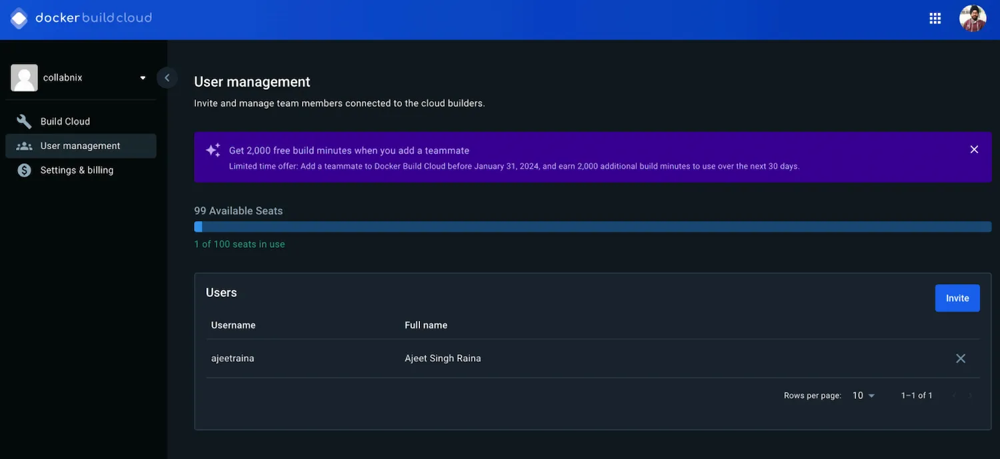
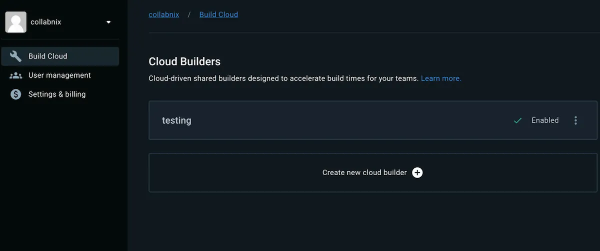
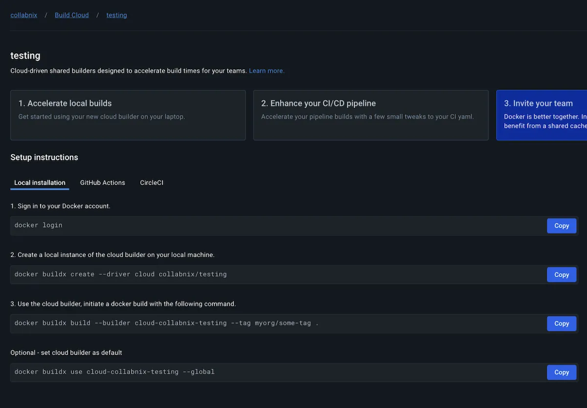
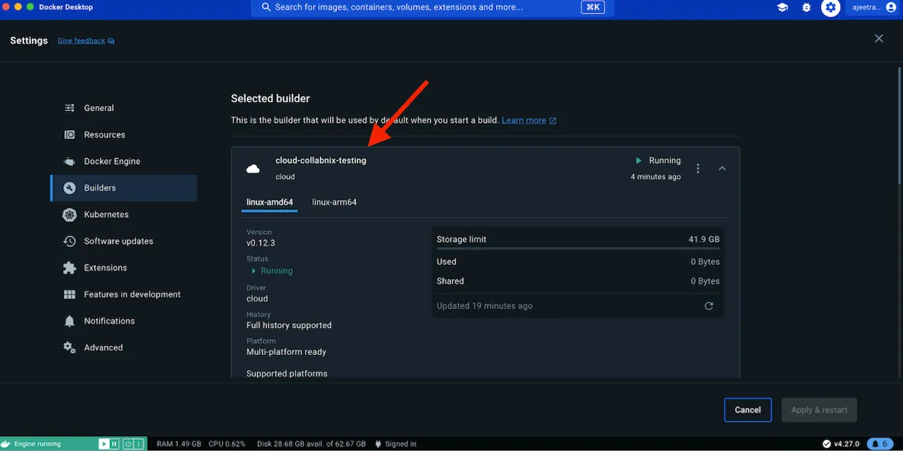

<iframe width="650" height="365" src="https://www.youtube.com/embed/nsWWQ1xoEy0?rel=0" title="YouTube video player" frameborder="0" allow="accelerometer; autoplay; clipboard-write; encrypted-media; gyroscope; picture-in-picture; web-share" allowfullscreen></iframe>

## Explanation

In this concept, you will learn the following:

- Using remote builder like Docker Build Cloud

Docker Build Cloud is a service that lets you build your container images faster, both locally and in CI. Builds run on cloud infrastructure optimally dimensioned for your workloads, no configuration required. The service uses a remote build cache, ensuring fast builds anywhere and for all team members.

[Using Docker Build Cloud in CI ](https://docs.docker.com/build/cloud/ci/)can speed up your build pipelines, which means less time spent waiting and context switching. You control your CI workflows as usual, and delegate the build execution to Docker Build Cloud.


[Docker Cloud Build](https://docs.docker.com/build/cloud/) offers a powerful and scalable solution for building container images for multiple architectures, leveraging dedicated remote builders and a shared cache for efficiency. Depending on your specific needs and build complexity, it can be an excellent choice for streamlining your multi-arch workflow


## Try it out

In this hands-on, you will learn how to use Docker Build Cloud to build your container images faster.

Here are the prerequsities:


* Ensure that you have Docker Hub account
* Ensure that you have the latest version of Docker Desktop installed.


### Step 1. Login to Docker Cloud Build

Open [this link](https://build.docker.com) to access Docker Build dashboard.

You can use your own Docker Hub credentials to access your Hub organization.


### Step 2.  Ensure that your Docker Hub namespace ID is added to the right organization





### Step 3. Click “Create a New Builder”.

For our demonstration, we have created a new builder called `testing`.




### Step 4.  Click the new Builder to open up the instructions




### Step 5. Open up the terminal and sign-in with your Docker account

Please do note that while password, you need to provide PAT credentials.

```console
 docker login
```


### Step 6.  Verifying the new Buildx driver for Docker Build Cloud

You can verify the `buildx` driver for Cloud using `–-help in the latest release.`

```console
 docker buildx create --help

Usage:  docker buildx create [OPTIONS] [CONTEXT|ENDPOINT]

Create a new builder instance

Options:
      --append                   Append a node to builder instead of changing it
      --bootstrap                Boot builder after creation
      --buildkitd-flags string   Flags for buildkitd daemon
      --config string            BuildKit config file
      --driver string            Driver to use (available: "cloud", "docker-container", "kubernetes", "remote")
      --driver-opt stringArray   Options for the driver
      --leave                    Remove a node from builder instead of changing it
      --name string              Builder instance name
      --node string              Create/modify node with given name
      --platform stringArray     Fixed platforms for current node
      --use                      Set the current builder instance

```


### Step 7. Create a local instance of the cloud builder on your local machine.

```console
 docker buildx create --driver cloud collabnix/testing cloud-collabnix-testing
```

As a result, you will see `cloud-collabnix-testing` as the output.


### Step 8. Cloning a sample Node application

```console
 git clone https://github.com/docker/getting-started-todo-app
 cd getting-started-todo-app
 git checkout -b build-image-from-scratch
```
### Step 9. Use the cloud builder, initiate a docker build with the following command


```console
 docker buildx build --builder cloud-collabnix-testing --tag collabnix/myapp .
[+] Building 15.4s (12/12) FINISHED                                                                       cloud:cloud-collabnix-testing
 => [internal] connected to docker build cloud service                                                                             0.0s
 => [internal] load build definition from Dockerfile                                                                               0.8s
 => => transferring dockerfile: 162B                                                                                               0.8s
 => [internal] load metadata for docker.io/library/python:3.8-alpine                                                               1.8s
 => [auth] library/python:pull token for registry-1.docker.io                                                                      0.0s
 => [internal] load .dockerignore                                                                                                  0.8s
 => => transferring context: 704B                                                                                                  0.8s
 => [1/4] FROM docker.io/library/python:3.8-alpine@sha256:aeb77f60b4b197c265fc02b305753343da6155b065faa2e60671be83fc830d46         0.9s
 => => resolve docker.io/library/python:3.8-alpine@sha256:aeb77f60b4b197c265fc02b305753343da6155b065faa2e60671be83fc830d46         0.0s
 => => sha256:7d9ad5bef1ba2feda5813a1782ef3c5928c96a6e68a1f0ad0c5dd20261eb6132 242B / 242B                                         0.1s
 => => sha256:e853c0f38ea7ee895b324be2572635fb61172c5bb439c16909ff93c5626bf9e3 624.72kB / 624.72kB                                 0.1s
 => => sha256:eec00664afa31f69b26cc60ba44e42614a54b49d50e40788a58d4bc8c8d01c7d 2.85MB / 
....                                                                                                           0.0s
 => exporting to image                                                                                                             7.1s
 => => exporting layers                                                                                                            0.1s
 => => exporting manifest sha256:39106056d11441d55923ad8d9e715052a97c909382521d549bf40ce56e316f9c                                  0.0s
 => => exporting config sha256:6523acd5efbc62da343d3e0d2755d599f95c162130e4be1a2a3bdbc7d4324387                                    0.0s
 => cloud pull                                                                                                                     6.7s
 => => pulling layer c30352492317 3.35MB / 3.35MB                                                                                  1.3s
 => => pulling layer e853c0f38ea7 624.72kB / 624.72kB                                                                              1.6s
 => => pulling layer 27a15cb4da4a 13.52MB / 13.52MB                                                                                4.9s
 => => pulling layer 7d9ad5bef1ba 242B / 242B                                                                                      4.9s
 => => pulling layer eec00664afa3 2.85MB / 2.85MB                                                                                  5.0s
 => => pulling layer 53334f970416 93B / 93B                                                                                        5.0s
 => => pulling layer 345cee3065f4 1.03kB / 1.03kB                                                                                  5.1s
 => => pulling layer 4f4fb700ef54 32B / 32B                                                                                        5.1s

View build details: docker-desktop://dashboard/build/cloud-collabnix-testing/linux-arm64/xok5kto13y8ut1gkehwt0yjl2

```

### Step  10. Set cloud builder as default(Optional)

```console
 docker buildx use cloud-collabnix-testing --global
```


### Step 11. Viewing the Builder on Docker Desktop




### Step 12. Running Multi-platform Builds

In order to run multi-platform builds, you can run the following command specifying all of the platforms that you want to build as shown:


```console
 docker buildx build --platform linux/amd64,linux/arm64 -t ajeetraina/mypyapp  --push .
```

Note: If you don't specify the platform, Docker Build Cloud automatically builds for the architecture matching your local environment.


### Step 14. Unsetting Docker Build Cloud as the default builder

```console
 docker context use default
```

## Additional resources

- [Overview of Docker Build Cloud](https://docs.docker.com/build/cloud/)
- [Use Docker Build Cloud in CI](https://docs.docker.com/build/cloud/ci/)
- [Optimize for building in the cloud](https://docs.docker.com/build/cloud/optimization/)


Now that you have learned how to use remote builder like Docker Build Cloud, it's time to see how to inject secrets during the build.



