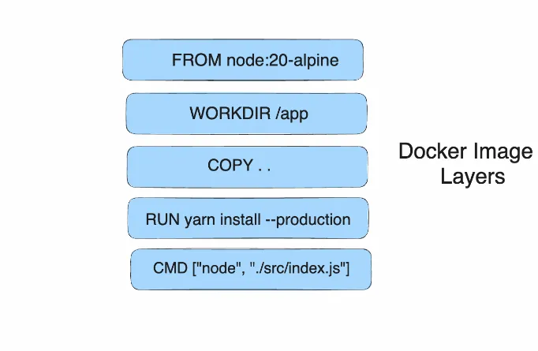

<iframe width="650" height="365" src="https://www.youtube.com/embed/nsWWQ1xoEy0?rel=0" title="YouTube video player" frameborder="0" allow="accelerometer; autoplay; clipboard-write; encrypted-media; gyroscope; picture-in-picture; web-share" allowfullscreen></iframe>

## Explanation

In this concept, you will learn the following:

- Understanding the Docker Image Layers
- How to make Docker builds faster 
- How to use Cache efficiently

Building Docker images shouldn't take forever. Ideally, the process should be swift and resource-conscious. Luckily, Docker's layered approach plays a crucial role in achieving this objective.


### Understanding the Image Layers

Think of a Docker image as a cake. Each layer represents a step in the recipe, like adding flour, sugar, and eggs. Each layer builds upon the previous one, creating a final "image" you can use. Importantly, these layers are immutable, meaning you can't modify them once created.

Docker images are built using layers, and each command in a Dockerfile results in a new layer. These layers are cached and can be reused if the command and its context haven't changed since the last build. However, changes in dependencies or source code can invalidate the cache for subsequent commands. The layered approach makes it efficient to share and distribute Docker images. If someone has already pulled the layers you need, Docker only needs to pull the new or changed layers when you fetch the image.


## Try it out

Node.js applications often require dependencies to be installed using package managers like npm or yarn. Leveraging Docker's build cache efficiently can significantly speed up the Docker image building process.

This tutorial will guide you through utilizing the Docker build cache effectively for Node.js applications.

Let us consider the following sample Dockerfile:

```console
FROM node:20-alpine
WORKDIR /app
COPY . .
RUN yarn install --production
CMD ["node", "./src/index.js"]
```



Let's break down each line of this Dockerfile:


* **FROM node:20-alpine:** This line specifies the base image for your Docker container. It instructs Docker to use an Alpine-based image tagged with version 20 of Node.js from the official Node.js Docker Hub repository. 
* **WORKDIR /app:** This line sets the working directory inside the container where subsequent commands will be run. In this case, it sets the working directory to /app, which means that all commands executed within the Dockerfile will be relative to this directory.
* **COPY . .:** This line copies the contents of the current directory (where the Dockerfile is located) into the /app directory inside the container. The first . represents the source directory on the host machine (where the Dockerfile is), and the second . represents the destination directory inside the container (/app).
* **RUN yarn install --production:** This line executes the yarn install --production command inside the container. This command installs the dependencies listed in the package.json file of your Node.js application. The --production flag tells Yarn to only install production dependencies, excluding development dependencies. This is typically done to minimize the size of the Docker image.
* **CMD ["node", "./src/index.js"]:** This line specifies the default command to run when the container starts. It tells Docker to run the Node.js application by executing the node ./src/index.js command. This assumes that your Node.js application's entry point is located at ./src/index.js relative to the working directory (/app). Adjust this command according to the structure of your application and the location of your entry file.

Execute the following command to build the Docker image:

```console
 docker build -t node-app .
```

The command is used to build a Docker image tagged as "node-app" from the Dockerfile located in the current directory (.).

Here's a breakdown of the command:


* **docker build:** This command initiates the building of a Docker image.
* **-t node-app:** The -t flag is used to specify a tag for the image being built. In this case, the tag is "node-app", which allows for easier identification of the image.
* **The dot (.)** at the end of the command represents the build context. It indicates that the Dockerfile and any other resources needed for building the image are located in the current directory.

Here’s the result of the build process:

```console
 docker build -t node-app:1.0 .
 [+] Building 20.0s (10/10) FINISHED  
```


The first line indicates that the entire build process took **20.0 seconds**. 


<table>
  <tr>
   <td>Steps 
   </td>
   <td>Description
   </td>
   <td>Time Taken
   </td>
  </tr>
  <tr>
   <td>1
   </td>
   <td>Load build definition from Dockerfile
   </td>
   <td>0.0 seconds
   </td>
  </tr>
  <tr>
   <td>2
   </td>
   <td>Load metadata for docker.io/library/node:20-alpine
   </td>
   <td>2.7 seconds
   </td>
  </tr>
  <tr>
   <td>3
   </td>
   <td>Load .dockerignore
   </td>
   <td>0.0 seconds
   </td>
  </tr>
  <tr>
   <td>4
   </td>
   <td>Load build context
<p>
(Context size: 4.60MB)
   </td>
   <td>0.1 seconds
   </td>
  </tr>
  <tr>
   <td>5
   </td>
   <td>Set the working directory (WORKDIR)
   </td>
   <td>0.1 seconds
   </td>
  </tr>
  <tr>
   <td>6
   </td>
   <td>Copy the local code into the container
   </td>
   <td>0.0 seconds
   </td>
  </tr>
  <tr>
   <td>7
   </td>
   <td>Run yarn install --production
   </td>
   <td>10.0 seconds
   </td>
  </tr>
  <tr>
   <td>8
   </td>
   <td>Exporting layers
   </td>
   <td>2.2 seconds
   </td>
  </tr>
  <tr>
   <td>9
   </td>
   <td>Exporting the final image
   </td>
   <td>3.0 seconds
   </td>
  </tr>
</table>


The first build may take some time as it installs dependencies. 

Let’s re-run the `docker build` command without making any change in the source code or Dockerfile as shown:

```console
 docker build -t node-app:1.0 .
 [+] Building 1.0s (9/9) FINISHED
```

You might notice that the subsequent builds after the initial one will be faster due to the caching mechanism, as long as the commands and context remain unchanged.

Docker caches the intermediate layers generated during the build process. When you rebuild the image without making any changes to the Dockerfile or the source code, Docker can reuse the cached layers, significantly speeding up the build process. This is especially noticeable for steps like installing dependencies, where the dependencies are already installed and cached from the previous build.

```console
 [+] Building 1.0s (9/9) FINISHED                                                                            docker:desktop-linux
 => [internal] load build definition from Dockerfile                                                                        0.0s
 => => transferring dockerfile: 187B                                                                                        0.0s
 ...
 => [internal] load build context                                                                                           0.0s
 => => transferring context: 8.16kB                                                                                         0.0s
 => CACHED [2/4] WORKDIR /app                                                                                               0.0s
 => CACHED [3/4] COPY . .                                                                                                   0.0s
 => CACHED [4/4] RUN yarn install --production                                                                              0.0s
 => exporting to image                                                                                                      0.0s
 => => exporting layers                                                                                                     0.0s
 => => exporting manifest 
```


In the output, the subsequent build completed in just 1.0 second, indicating that Docker was able to leverage the cached layers and did not need to repeat the time-consuming steps like installing dependencies.


<table>
  <tr>
   <td>Steps 
   </td>
   <td>Description
   </td>
   <td>Time Taken(1st Run)
   </td>
   <td>Time Taken (2nd Run)
   </td>
  </tr>
  <tr>
   <td>1
   </td>
   <td>Load build definition from Dockerfile
   </td>
   <td>0.0 seconds
   </td>
   <td>0.0 seconds
   </td>
  </tr>
  <tr>
   <td>2
   </td>
   <td>Load metadata for docker.io/library/node:20-alpine
   </td>
   <td>2.7 seconds
   </td>
   <td>0.9 seconds
   </td>
  </tr>
  <tr>
   <td>3
   </td>
   <td>Load .dockerignore
   </td>
   <td>0.0 seconds
   </td>
   <td>0.0 seconds
   </td>
  </tr>
  <tr>
   <td>4
   </td>
   <td>Load build context
<p>
(Context size: 4.60MB)
   </td>
   <td>0.1 seconds
   </td>
   <td>0.0 seconds
   </td>
  </tr>
  <tr>
   <td>5
   </td>
   <td>Set the working directory (WORKDIR)
   </td>
   <td>0.1 seconds
   </td>
   <td>0.0 seconds
   </td>
  </tr>
  <tr>
   <td>6
   </td>
   <td>Copy the local code into the container
   </td>
   <td>0.0 seconds
   </td>
   <td>0.0 seconds
   </td>
  </tr>
  <tr>
   <td>7
   </td>
   <td>Run yarn install --production
   </td>
   <td>10.0 seconds
   </td>
   <td>0.0 seconds
   </td>
  </tr>
  <tr>
   <td>8
   </td>
   <td>Exporting layers
   </td>
   <td>2.2 seconds
   </td>
   <td>0.0 seconds
   </td>
  </tr>
  <tr>
   <td>9
   </td>
   <td>Exporting the final image
   </td>
   <td>3.0 seconds
   </td>
   <td>0.0 seconds
   </td>
  </tr>
</table>


## How to use cache efficiently

Using the cache efficiently in Docker builds is crucial for optimizing build times. Here are some strategies to make the most out of Docker's caching mechanism:


### 1. **Order your layers**

Arrange the commands in your Dockerfile logically. Place expensive steps, such as installing dependencies, near the beginning of the Dockerfile. Steps that change frequently should come later to avoid unnecessary rebuilds of unchanged layers. For example, separate the copying of package management files from the copying of project source code.

To optimize caching, let's reorder the Dockerfile to take advantage of Docker's layer caching mechanism:

```console
 FROM node:20-alpine

 WORKDIR /app

 COPY package.json yarn.lock ./

 RUN yarn install --production

 COPY . .

 CMD ["node", "./src/index.js"]
```

Here's what we've changed:

Moved the COPY instruction for package.json and yarn.lock to a separate step before running yarn install. This ensures that if the dependencies haven't changed, Docker can reuse the cached layer containing the installed dependencies, saving time during subsequent builds.


### 2. **Keep Layers Small**

To keep the layers small, ensure only necessary files are included. You can create a .dockerignore file to exclude unnecessary files and directories from the build context.

Example .dockerignore:

```console
 node_modules
 .git
```


This file instructs Docker to exclude the node_modules directory and .git directory from the build context, preventing them from being copied into the image.


### 3. **Minimize the Number of Layers**

Lastly, ensure that the Dockerfile has a minimal number of layers by combining commands wherever possible. For example, instead of using multiple RUN commands, you can combine them into a single RUN instruction:

```console 
 RUN set -e \
    && apk add --no-cache --virtual .build-deps \
        build-base \
        python \
    && npm install \
    && apk del .build-deps
```


In this example, the && operator allows multiple commands to be executed sequentially within a single RUN instruction, reducing the number of layers.

## Additional resources

- [Optimizing builds with cache management](https://docs.docker.com/build/cache/)

By following these optimization techniques, you can make your Docker builds faster and more efficient, leading to quicker iteration cycles and improved development productivity. 


