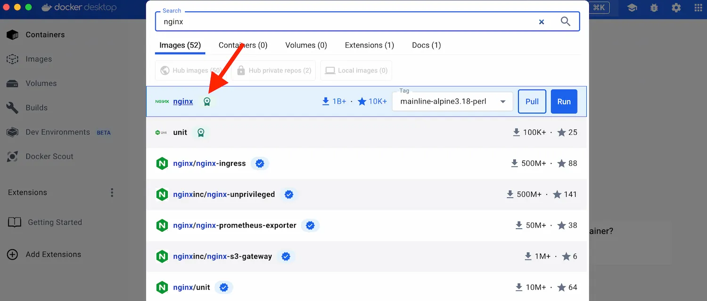

<iframe width="650" height="365" src="https://www.youtube.com/embed/nsWWQ1xoEy0?rel=0" title="YouTube video player" frameborder="0" allow="accelerometer; autoplay; clipboard-write; encrypted-media; gyroscope; picture-in-picture; web-share" allowfullscreen></iframe>

## Explanation

Imagine you’re developing an online pizza ordering web application. It has three main parts, like separate apps on your phone:


- The Ordering App (`Frontend`): This is where users browse menus, choose their pizzas, and place orders. 
- The Order Processing Engine (`Backend`): This part works behind the scenes, just like the app that sends your order to the kitchen.
- The Pizza Database (`Database`): This part stores all the important information, like customer details, pizza types, and maybe even past orders. 

Traditionally, these parts would all be jumbled together on one server, kind of like throwing all your phone apps in one big folder. It might work, but it's messy and can be confusing.

Containers are like magic boxes for your app's parts! Each component - the ordering app, the order processing engine, and the database - gets its own secure container, just like each app on your phone has its own space. Here's what makes them awesome:

- `Self-Contained`: Each container has everything it needs to function perfectly, like an app with all its features built-in.
- `Isolated`: Containers are like separate sandboxes on the server. They don't see or influence each other, so even if one part malfunctions (like a buggy ordering app), it won't affect the others (like the database).
- `Independent`: You can manage each container independently, just like installing, updating, or deleting apps on your phone. Deleting one container (like the ordering app) won't affect the others.

Plus, these magic boxes (containers) are super portable! You can easily move them from your development machine (your personal phone) to a bigger server (a giant restaurant with multiple phones for orders) without worrying about anything getting messed up. This ensures consistent performance - "It just works!" -  because the container with your app will function the same way on any server, regardless of the underlying software.

> Containers basically makes developer life easier by keeping things organized and independent. No more compatibility headaches! You can develop, test, and deploy your web app like a pro, with each part running smoothly – just like having separate, well-functioning apps on your phone!


## Try it now

In this hands-on, you will see how to run a simple `Nginx` container using Docker Desktop as well as CLI.

### Run a container





Follow the instructions in order to run a Nginx container using Docker Desktop.

1. [Download and install Docker Desktop](https://www.docker.com/products/docker-desktop/)
2. Open Docker Desktop and click "Search" on the top menu of the dashboard.
3. Specify `nginx` in the search and then select **Run**.

    

4. Expand the **Optional settings**.
5. In **Container name**, specify `nginx`.
6. In **Host port**, specify `80`.

   

7. Click **Run**.

###  View your container

You just ran a container! You can view it in the **Containers** tab of the Docker Desktop GUI.


This container runs a simple web server that displays a simple website.
When working with more complex projects, you'll run different parts in different
containers. For example, a different container for the frontend, backend, and
database. In this walkthrough, you only have a simple frontend container.

###  Access the frontend

The frontend is accessible on port `80` of your local host. Select the link in
the **Port(s)** column of your container, or visit
[http://localhost:80](http://localhost:80) in your browser to view it.


### Explore your container

Docker Desktop lets you easily view and interact with different aspects of your
container. Try it out yourself. Select your container and then select **Files**
to explore your container's isolated file system.


### Stop your container

The `nginx` container continues to run until you stop it. To stop
the container in Docker Desktop, go to the **Containers** tab and select the
**Stop** icon in the **Actions** column of your container.





Follow the instructions to to run Nginx container using your CLI terminal:


1. [Download and install Docker Desktop](https://www.docker.com/products/docker-desktop/)
2. Open a terminal and run the following command:


```console
 docker run -d -p 80:80 nginx
```

Congratulations! You just fired up your first container! 

Let's break down the command:

> Don't worry if you forget the exact words, we'll break it down piece by piece.  These flags are like instructions for Docker CLI. 

- `-d (detached mode)`: This flag tells Docker to run the container in the background, like a tireless worker. You can keep using your terminal for other tasks while the container runs in the shadows.
- `-p 80:80 (port publishing)`: Imagine a doorway (port) that lets traffic flow between your computer (host) and the container. This flag maps port `80` on your host machine (often used for web traffic) to port `80` inside the container. This creates a bridge for you to access the container's magic (like a website) from your web browser.
- `nginx (image)`: This specifies the blueprint (image) used to build the container. Here, we're using the official `nginx` image from Docker Hub, a vast library of pre-made containers.


3. Verify if the container is running on your system:

Run the following command to display the running `containers` on your system.


```console
 docker ps
```

You might see something like this:

```console
CONTAINER ID   IMAGE         COMMAND                  CREATED          STATUS          PORTS                    NAMES
a1f7a4bb3a27   nginx         "/docker-entrypoint.…"   11 seconds ago   Up 11 seconds   0.0.0.0:80->80/tcp       gracious_keldysh
```

This output is the result of running the `docker ps` command. It shows you information about the containers currently running on your Docker engine. Let's break down what each column means:

- `CONTAINER ID`: This is a unique identifier assigned to each container. It's a long string of characters that helps Docker distinguish between different containers.
- `IMAGE`: This shows the name of the Docker image used to create the container. In this case, the image name is `nginx`.
- `COMMAND`: This column displays the main command that the container is running. Here, it shows /docker-entrypoint.sh nginx -g 'daemon off;' which is the default startup command for the Nginx image.
- `CREATED`: This indicates how long ago the container was created. In this example, it was created "11 seconds ago".
- `STATUS`: This column shows the current state of the container. Here, it says "Up 11 seconds", meaning the container is running and has been up for 11 seconds. Other possible statuses include "Exited", "Created", or "Restarting".
- `PORTS`: This section displays the ports that are mapped between the container and the host machine. In this case, it shows `0.0.0.0:80->80/tcp`. This means that port `80` on the host machine (your computer) is forwarded to port 80 inside the container. This allows you to access the web server running inside the container by visiting `http://localhost:80` in your web browser.
- `NAMES`: This is an optional column that shows the user-assigned name for the container. Here, the container has been assigned the name gracious_keldysh. However, it's more common to identify containers using their container ID.

> You can stop a container using a single Docker command. For example: `docker stop >the-container-id>`. In order to remove a container, you can use `docker rm <the-container-id>`




Now that you have learned the basics of a Docker container, it's time to learn about Docker image and it's layered architecture.

## Additional resources

- [What is a container](https://docs.docker.com/guides/walkthroughs/what-is-a-container/)
- [Overview of container](https://www.docker.com/resources/what-container/)
- [Why Docker?](https://www.docker.com/why-docker/)


