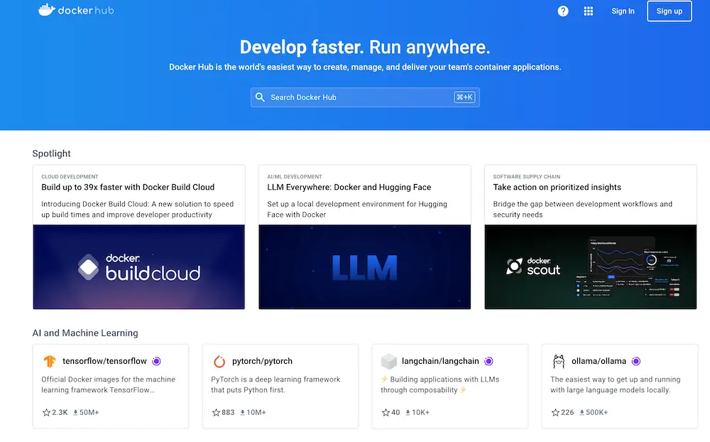
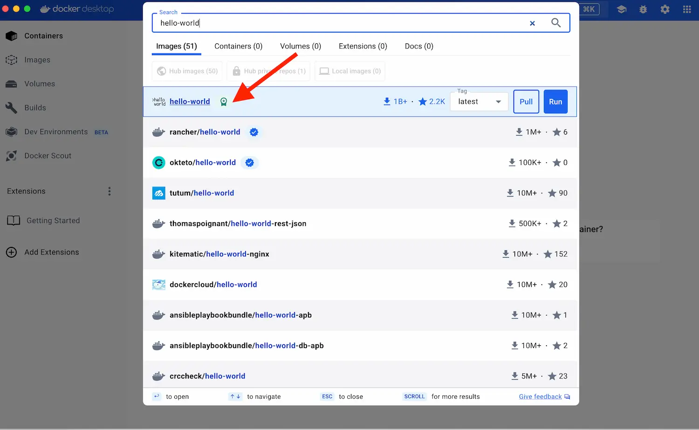
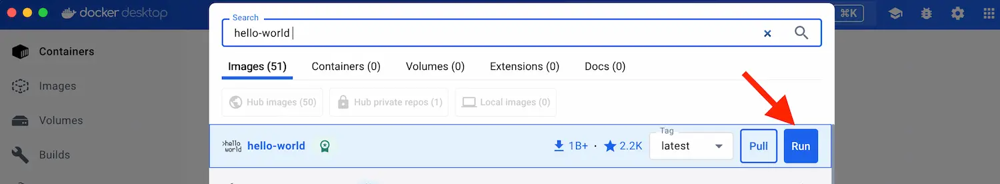
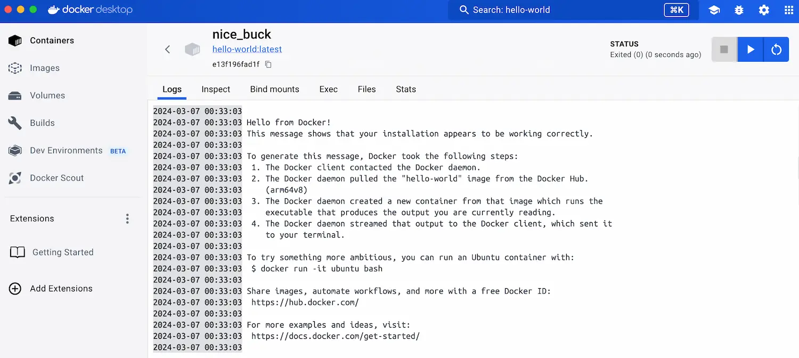

<iframe width="650" height="365" src="https://www.youtube.com/embed/nsWWQ1xoEy0?rel=0" title="YouTube video player" frameborder="0" allow="accelerometer; autoplay; clipboard-write; encrypted-media; gyroscope; picture-in-picture; web-share" allowfullscreen></iframe>

## Explanation

A container registry is a service that lets you store, share, and manage container images. You can think of container registry like a central repository where developers can find pre-built images for various software, upload their own creations, and collaborate with others.

[Docker Hub](https://hub.docker.com) is the default and most popular container registry with content from community developers, open source projects, and independent software vendors (ISV). While Docker Hub is a popular option, there's a whole world of container registries available today, including:

- Amazon Elastic Container Registry (ECR)
- Azure Container Registry (ACR)
- Google Container Registry (GCR)
- JFrog Artifactory
- Quay.io (for open-source projects)

### Key features of Docker Hub

- [Repositories](https://docs.docker.com/docker-hub/repos/): Push and pull container images.
- [Builds](https://docs.docker.com/docker-hub/builds/): Automatically build container images from GitHub and Bitbucket and push them to Docker Hub.
- [Webhooks](https://docs.docker.com/docker-hub/webhooks/): Trigger actions after a successful push to a repository to integrate Docker Hub with other services.
- [Docker Hub CLI tool](https://github.com/docker/hub-tool#readme)  and an API that allows you to interact with Docker Hub.
- Browse through [the Docker Hub API](https://docs.docker.com/docker-hub/api/latest/) documentation to explore the supported endpoints.

## Try it now

### Step 1: Sign up for a free Docker account

Start by creating a [Docker ID](https://hub.docker.com/signup).

A Docker Hub id grants you access to Docker Hub repositories and lets you explore available images from the community and verified publishers. You also need a Docker ID to share images on Docker Hub.

### Step 2: Create your first repository

To create a repository:

1. Sign in to [Docker Hub](https://hub.docker.com).

2. On the Repositories page, select **Create repository**.
3. Name it **&lt;your-username&gt;/my-private-repo**.
4. Set the visibility to **Private**.
5. Select **Create**.

You've created your first repository.

### Step 3: Download and install Docker Desktop

You need to [download Docker Desktop](https://www.docker.com/products/docker-desktop/) to build, push, and pull container images.

1. Download and install Docker Desktop

2. Sign in to Docker Desktop using the Docker ID you created in step one.

### Step 4: Search for `hello-world` Docker image 

Open Docker Desktop Dashboard and click Search on the top menu.

It will display all the existing Docker images available in the Docker Hub that matches the "hello-world" pattern.

### Step 5: Run Hello world container

 

### Step 6. Verify the logs

This image consists of nothing but a single static binary which prints some text to standard output and exits.

>**Note**
>
> You must be signed in to Docker Hub through Docker Desktop or the command line, and you must also name your images correctly, as per the above steps.

In this guide, you learned how to sign up for a Docker Hub account, created your first Docker Hub repository, pulled an existing "hello world" image using Docker Dashboard.

## Additional resources

- [Hello World Docker Image](https://hub.docker.com/_/hello-world)
- [Docker Hub Quickstart](https://docs.docker.com/docker-hub/quickstart/)
- [Manage Docker Hub Repositories](https://docs.docker.com/docker-hub/repos)


