This guide introduces connecting Claude Code to Docker MCP Toolkit so Claude can securely use containerized MCP servers (e.g., Filesystem, GitHub, Atlassian/Jira) from your local machine—without dependency . In this guide, you’ll learn how to:

- Connect Claude Code to the Docker MCP Gateway (one-click or CLI)

- Enable Atlassian (Jira), GitHub, and Filesystem MCP servers

- Verify MCP connectivity from inside Claude Code

- Run a realistic workflow: scan TODO/FIXME, blame authors, prioritize, and create Jira issues

---
# How to Add MCP Servers to Claude Code with Docker MCP Toolkit  

AI coding assistants have grown fast. What started as simple autocomplete now feels like a real teammate. Still, even the most advanced tools, including Claude Code, cannot interact directly with your computer. Claude Code can suggest a SQL query but cannot run it. It can write a GitHub issue but cannot create it. It can draft a Slack update but cannot send it. You keep switching tabs and copying text.

This is where the Model Context Protocol, or MCP, changes everything. MCP connects Claude Code to your tools, databases, APIs, browsers, and repositories. The [Docker MCP Toolkit](https://www.docker.com/products/mcp-catalog-and-toolkit/) takes this idea and makes it easy to use. With one click inside Docker Desktop, Claude Code becomes a fully connected client.

This walkthrough shows how to:

- Set up Claude Code and link it with Docker MCP Toolkit  
- Configure the Atlassian MCP server to work directly with Jira  
- Configure the GitHub MCP server so you can explore repo history and run git operations  
- Configure the Filesystem MCP server so Claude Code can read your project files  
- Automatically turn TODO comments into Jira issues  
- Watch Claude Code take git history, categorize tasks, and create tickets inside your workspace 

With more than 200 pre-built, [containerized MCP servers](https://hub.docker.com/mcp?_gl=1*1u1kt41*_gcl_au*MjEyODc5MTk5NS4xNzU3NTQ5MTA5*_ga*OTQ5NjAzMjcyLjE3NTc1NDkwNjQ.*_ga_XJWPQMJYHQ*czE3NjMwNzEyODMkbzEyJGcxJHQxNzYzMDcxMzY3JGo2MCRsMCRoMA..), one-click deployment in Docker Desktop, and automatic credential handling, developers can connect Claude Code to trusted environments in minutes — not hours. No dependency issues, no manual configuration, just a consistent, secure workflow across Mac, Windows, and Linux.

## Why Claude Code and Docker MCP Toolkit work well together

MCP gives you the protocol, but the Docker MCP Toolkit makes it practical. Running MCP servers manually means handling Node versions, Python dependencies, scattered credentials, and different setups across machines. A simple setup often turns into hours of fixing environment issues.

Docker MCP Toolkit removes all that frustration.

You get:

- More than 200 ready-to-use MCP servers  
- One-click launch inside Docker Desktop  
- Secure credential handling  
- The same setup on Mac, Windows, and Linux  
- Automatic updates when new versions arrive  

If you already use Docker Desktop, this feels natural. Connecting Claude Code to your tools becomes quick and painless.


## Setting up Claude Code with Docker MCP Toolkit

### Prerequisites

- [Install Docker Desktop](https://www.docker.com/products/docker-desktop/) 4.40 or later  
- [MCP Toolkit enabled](https://docs.docker.com/ai/mcp-catalog-and-toolkit/get-started/?_gl=1*e0exvl*_gcl_au*MjEyODc5MTk5NS4xNzU3NTQ5MTA5*_ga*OTQ5NjAzMjcyLjE3NTc1NDkwNjQ.*_ga_XJWPQMJYHQ*czE3NjMwNzEyODMkbzEyJGcxJHQxNzYzMDcxMzY3JGo2MCRsMCRoMA..#enable-docker-mcp-toolkit)  

## Step 1. Install Claude Code

```bash
# Install Claude Code
curl -fsSL https://claude.ai/install.sh | sh

# Verify installation
claude --version  # Should show 2.0.5+
```
## Step 2. Connect Claude Code to Docker MCP Toolkit

### Option 1: One-Click Connection

1. Open Docker Desktop  
2. Open MCP Toolkit  
3. Go to the Clients tab  
4. Find “Claude Code”  
5. Click Connect  

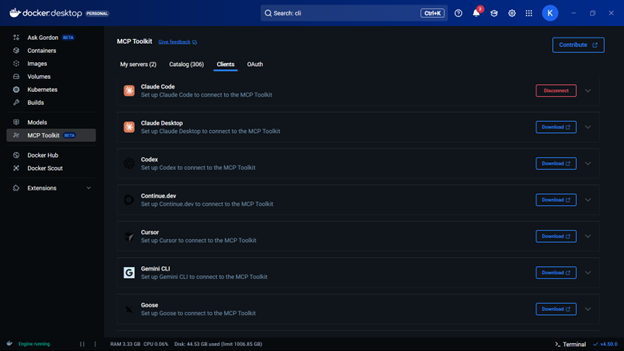


Docker Desktop handles the MCP Gateway connection automatically.

### Option 2: Manual CLI Setup

In your project folder:

```bash
docker mcp client connect claude-code
```
You’ll see output like this:
```bash
=== Project-wide MCP Configurations (/your/project/path) ===
 ● claude-code: connected
   MCP_DOCKER: Docker MCP Catalog (gateway server) (stdio)
 ● cursor: no mcp configured
 ● vscode: no mcp configured
You might have to restart 'claude-code'.
Tip: Your client is now connected! Use docker mcp tools ls to see your available tools

```
The ```connected``` status confirms Claude Code is linked to the Docker MCP Gateway.

What’s happening under the hood?
The connection command creates a ```.mcp.json``` file in your project directory


``` json
{
  "mcpServers": {
    "MCP_DOCKER": {
      "command": "docker",
      "args": ["mcp", "gateway", "run"],
      "type": "stdio"
    }
  }
}

```
This configuration tells Claude Code to use Docker’s MCP Gateway for all MCP server access. The gateway handles routing to your containerized servers.

## Step 3. Restart Claude Code
```bash 
# Exit Claude Code if running, then restart
claude code
```
Step 4. Verify the Connection
Inside Claude Code, type ```/mcp``` to see available MCP servers
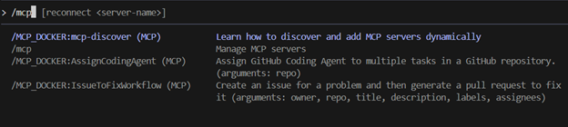

You should see the Docker MCP Gateway listed, which provides access to all enabled MCP servers. The ```/MCP_DOCKER``` tools indicate a successful connection. As you enable more MCP servers in Docker Desktop, they’ll appear here automatically.


## First Run: What to Expect
When you start Claude Code for the first time after connecting to Docker MCP Toolkit, you’ll see a prompt about the new MCP server:
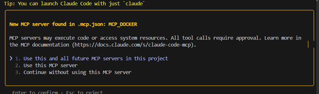


Choose Option 1 (recommended). This configures your project to automatically use Docker MCP Toolkit and any MCP servers you enable in Docker Desktop. You won’t need to approve MCP servers individually each time.

After confirming, you’ll see the Claude Code home screen:
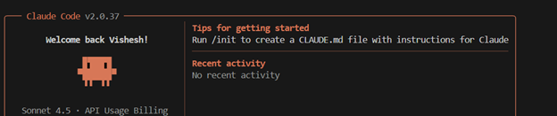


You’re now ready to use Claude Code with MCP servers from Docker Desktop.

## Real-World Demo: TODO-to-Ticket Automation Demo
Now that you’ve connected Claude Code to Docker MCP Toolkit, let’s see it in action with a practical example. We’ll automatically convert TODO comments in a real codebase into tracked Jira tickets — complete with git history, priority categorization, and proper linking.

### Configuring the required MCP Servers
For this automation, we’ll orchestrate three MCP servers:

- [Filesystem MCP](https://hub.docker.com/mcp/server/filesystem/overview?_gl=1*1ox3o1q*_gcl_au*MjEyODc5MTk5NS4xNzU3NTQ5MTA5*_ga*OTQ5NjAzMjcyLjE3NTc1NDkwNjQ.*_ga_XJWPQMJYHQ*czE3NjMwNDIwODQkbzExJGcwJHQxNzYzMDQyMDg0JGo2MCRsMCRoMA..) – to scan your codebase and read source files
- [GitHub MCP](https://hub.docker.com/mcp/server/github-official/overview?_gl=1*th0unk*_gcl_au*MjEyODc5MTk5NS4xNzU3NTQ5MTA5*_ga*OTQ5NjAzMjcyLjE3NTc1NDkwNjQ.*_ga_XJWPQMJYHQ*czE3NjMwNzEyODMkbzEyJGcwJHQxNzYzMDcxMjgzJGo2MCRsMCRoMA..) – to run git blame and extract author information
- [Atlassian (Jira)](https://hub.docker.com/mcp/server/atlassian/overview?_gl=1*th0unk*_gcl_au*MjEyODc5MTk5NS4xNzU3NTQ5MTA5*_ga*OTQ5NjAzMjcyLjE3NTc1NDkwNjQ.*_ga_XJWPQMJYHQ*czE3NjMwNzEyODMkbzEyJGcwJHQxNzYzMDcxMjgzJGo2MCRsMCRoMA..) MCP – to create and manage Jira issues

We’ll walk through enabling and configuring all three MCP servers

### What makes this realistic?

This workflow uses real tools and a real codebase. Nothing here is mocked. You are watching Claude Code coordinate multiple MCP servers to solve a practical problem end to end.

Here is why this demo feels close to real production work:

- Uses an actual Node.js codebase (`catalog-service-node`)
- Extracts git blame information to identify authors
- Categorizes tasks based on real business priority keywords
- Creates proper Jira issues with the Atlassian MCP server
- Adds comments with direct links to the exact file and line number
- Shows a complete, traceable flow you can reuse in your own projects

**Time investment comparison:**

- Doing it manually: around 20 to 30 minutes  
- Doing it with Claude Code + MCP servers: about 2 minutes

Now let’s walk through the setup.


## 1. Configure the Atlassian MCP Server (Jira)

Open Docker Desktop and do the following:

1. Go to MCP Toolkit → Catalog  
2. Search for **Atlassian**  
3. Click **Add**  
4. Open the **Configuration** tab  
5. Enter your Jira credentials:
   - `atlassian.jira.url`: your Jira workspace URL  
   - `atlassian.jira.username`: your Atlassian email  
6. Add your API token in the **Secrets** section  
7. Click **Save**
   
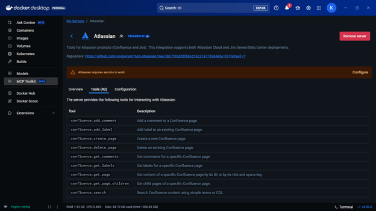


The Atlassian MCP server comes with 37 useful tools, including:

- `jira_create_issue`  
- `jira_add_comment`  
- `jira_batch_create_issues`

For this demo, create a Jira project:

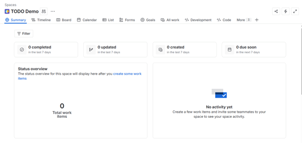


- **Name:** TODO Demo  
- **Key:** TD


## 2. Configure GitHub MCP Server

The GitHub MCP server supports both OAuth and Personal Access Tokens.

### Option A: OAuth Authentication (recommended)

1. Open Docker Desktop → MCP Toolkit → Catalog  
2. Search for **GitHub Official**  
3. Click **Add**  
4. Go to the **Configuration** tab  
5. Select **OAuth**  
6. Click the authorization link  
7. Approve access on GitHub
   
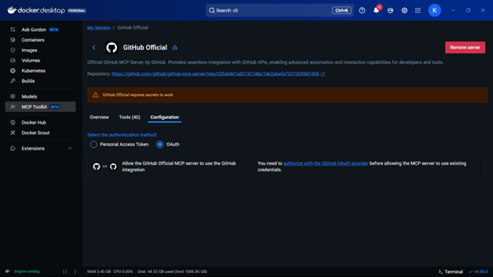


**Advantage:** No manual token creation needed. Authorization happens through GitHub’s secure OAuth flow.


### Option B: Personal Access Token (PAT)

If you prefer to use a Personal Access Token or need more granular control, follow these steps.

#### Step 1: Create a GitHub Personal Access Token

1. Go to **GitHub.com** and sign in  
2. Click your profile picture in the top-right corner  
3. Select **Settings**  
4. Scroll down to **Developer settings**  
5. Click **Personal access tokens** → **Tokens (classic)**  
6. Click **Generate new token** → **Generate new token (classic)**  
7. Give the token a descriptive name such as **Docker MCP GitHub Access**  
8. Select the following scopes:
   - `repo` (Full control of private repositories)  
   - `workflow` (If you need workflow operations)  
   - `read:org` (If you need organization access)  
9. Click **Generate token**  
10. Copy the token immediately (you will not see it again)

#### Step 2: Configure in Docker Desktop

1. Open **Docker Desktop**  
2. Go to **MCP Toolkit** → **Catalog**  
3. Find **GitHub Official** and click **+ Add**  
4. Open the **Configuration** tab  
5. Choose **Personal Access Token** as the authentication method  
6. Paste your PAT into the token field  

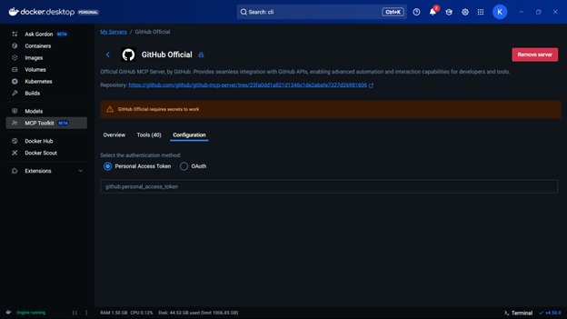


Alternatively, you can set the token from the CLI:

```bash
docker mcp secret set GITHUB.PERSONAL_ACCESS_TOKEN=your_token_here
```
This gives users the flexibility to choose the method that works best for their workflow, with OAuth being the simpler path for most users.

## 3. Configure Filesystem MCP Server

The Filesystem MCP server allows Claude Code to read files from your local system. You must specify which directories it can access.

### Step 1: Enable Filesystem MCP Server

1. Open **Docker Desktop**  
2. Go to **MCP Toolkit → Catalog**  
3. Search for **Filesystem**  
4. Find **Filesystem (Reference)** and click **+ Add**

### Step 2: Configure Allowed Paths

1. Open the **Configuration** tab  
2. Under `filesystem.paths`, add the directories Claude Code should be allowed to access  
3. For this demo, add your project directory (example: `/Users/your_username/your_project`)  
4. You can add multiple paths with the **+** button  
5. Click **Save**  

**Important:** Only grant access to directories you are comfortable with Claude Code reading. The Filesystem MCP server is restricted to these paths for safety.


## Run the Automation

1. Clone the repository:

```bash
git clone https://github.com/ajeetraina/catalog-service-node
```
2. Change directory to catalog-service-node and run the following command:
```bash
claude code
```

3. Paste this instruction into Claude Code:
```bash 
Scan this codebase for all TODO and FIXME comments.
For each one:
1. Extract the comment and surrounding code context (5 lines before/after)
2. Use git blame to identify who wrote it and when
3. Determine priority based on keywords:
   - High: "race condition", "data loss", "security", "failure", "crash"
   - Medium: "performance", "slow", "cache", "optimization"
   - Low: "documentation", "refactor", "cleanup"
4. Create a Jira issue with:
   - Project: TD
   - Issue Type: Task
   - Summary: Extract from the TODO/FIXME comment
   - Description: Include code context and explanation
   - Priority: Based on categorization above (use additional_fields: {"priority": {"name": "High"}})
   - Labels: ["tech-debt"]
   - Add a comment with link to exact GitHub file and line number
 
Provide a summary showing:
- Total TODOs/FIXMEs found
- Breakdown by priority (High/Medium/Low)
- List of created Jira issues with links
```

## Watch Claude Code Work

Claude Code will orchestrate multiple MCP servers to complete this workflow:

- Filesystem MCP to scan your `src/` directory  
- GitHub MCP to run `git blame` and extract author information  
- Atlassian MCP to create Jira issues in your **TODO Demo** project  

Here is what the output looks like:

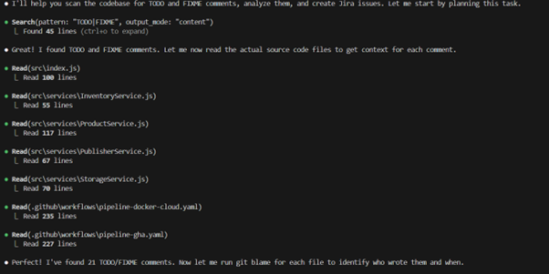


Next, Claude Code runs git blame to identify who created each TODO:

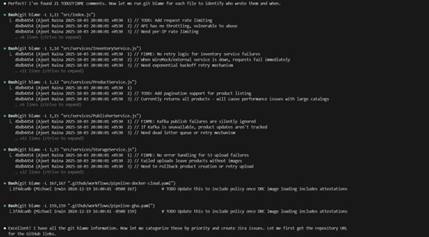


Claude Code then categorizes issues by priority and creates Jira tickets:

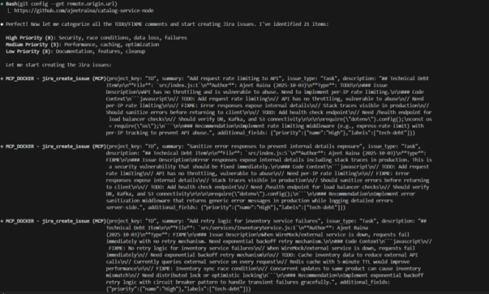


In under 2 minutes, Claude Code has:

- Scanned the entire codebase
- Identified 15+ TODO/FIXME comments
- Retrieved git history for each one
- Categorized them by business priority
- Created properly formatted Jira issues with full context
- Linked each issue back to the exact file and line number

 What would have taken 20-30 minutes of manual work is now automated and consistent. This Jira automation is just one example. Here’s how MCP transforms other common development workflows:

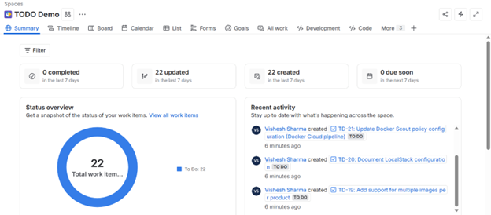

 From 15 minutes of context switching to 2-3 minutes of continuous flow.


## Conclusion

You’ve just seen how the Docker [MCP Toolkit](https://www.docker.com/products/mcp-catalog-and-toolkit/) turns Claude Code into more than a stand-alone coding helper. It becomes a fully connected development partner. Tasks that once required jumping between terminals, browsers, and documentation now happen in one smooth, uninterrupted workflow.

### Next steps

- Explore the 220+ MCP servers available in the [Docker MCP catalog](https://hub.docker.com/mcp)
- Connect Claude Code to your databases, internal APIs, and team tools  
- Share your MCP setup with your team so everyone works consistently  

The future of development is not about switching between tools. It is about tools working together in a simple, safe, and predictable way. The Docker MCP Toolkit brings that future into your everyday workflow.


## Learn more
- **[Explore the MCP Catalog](https://hub.docker.com/mcp):** Discover containerized, security-hardened MCP servers  
- **[Get started with MCP Toolkit in Docker Desktop](https://hub.docker.com/open-desktop?url=https://open.docker.com/dashboard/mcp):** Requires version 4.48 or newer to launch automatically  
- **[Read the MCP Horror Stories series](https://www.docker.com/blog/mcp-horror-stories-the-supply-chain-attack/):** Learn about common MCP security pitfalls and how to avoid them  