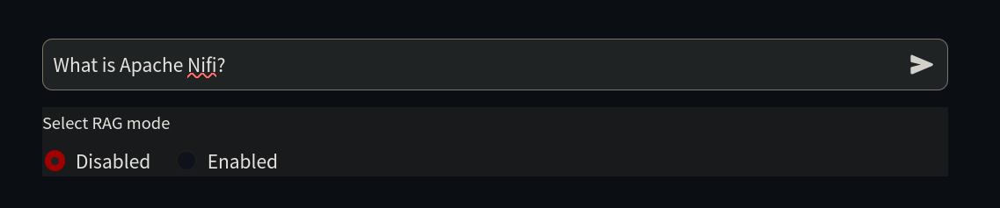
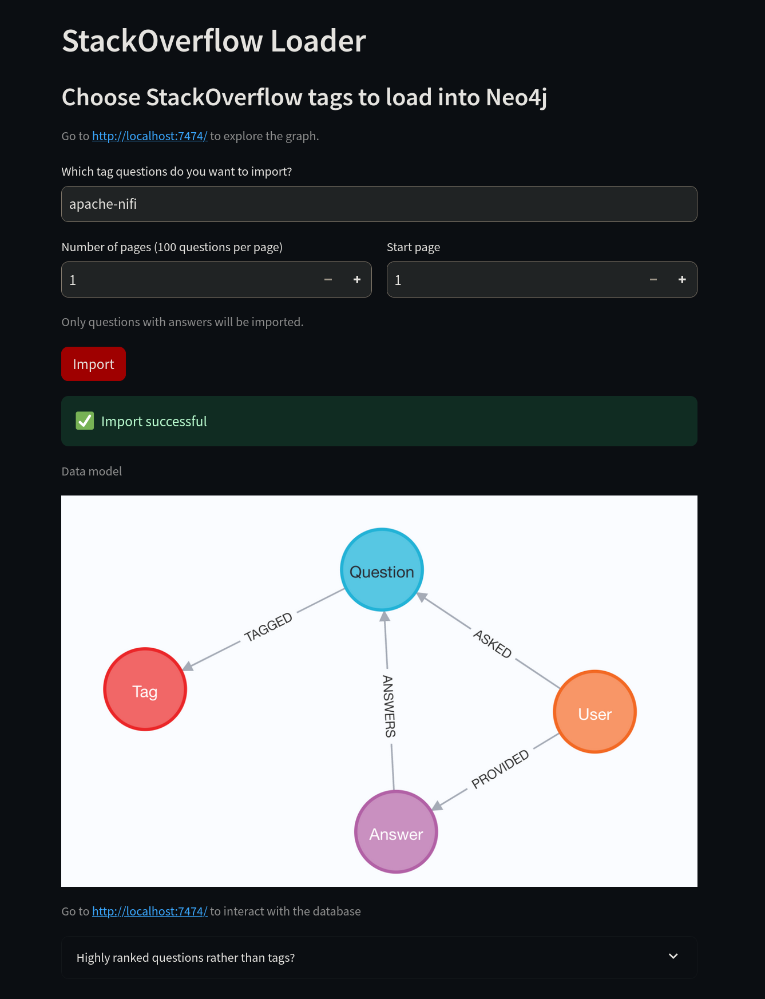
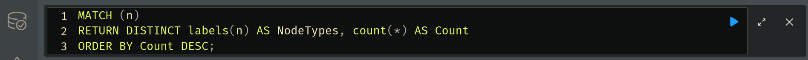
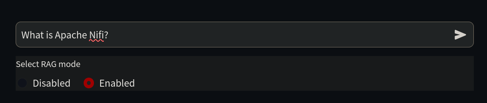

## Introduction

Retrieval-Augmented Generation (RAG) is a powerful framework that enhances large language models (LLMs) by integrating information retrieval from external knowledge sources. This guide focuses on a specialized RAG implementation using graph databases like Neo4j, which excel in managing highly connected, relational data. Unlike traditional RAG setups with vector databases, combining RAG with graph databases offers better context-awareness and relationship-driven insights, making it ideal for domains like recommendation systems, compliance tracking, and social networks.

In this guide, you will:

- Understand the benefits of integrating graph databases into a RAG system.
- Set up a GenAI stack using Docker, including Neo4j and an AI model.
- Explore a case study demonstrating the system’s effectiveness with real-world queries.


## Understanding RAG (Retrieval-Augmented Generation) 

RAG (Retrieval-Augmented Generation) is a hybrid framework that enhances the capabilities of large language models by integrating information retrieval. It combines three core components:  

- **Information retrieval** from an external knowledge base  
- **Large Language Model (LLM)** for generating responses  
- **Vector embeddings** to enable semantic search  

In a Retrieval-Augmented Generation (RAG) system, vector embeddings are used to represent the semantic meaning of text in a way that a machine can understand and process. For instance, the words "dog" and "puppy" will have similar embeddings because they share similar meanings. By integrating these embeddings into the RAG framework, the system can combine the generative power of large language models with the ability to pull in highly relevant, contextually-aware data from external sources.

The system operates as follows:  
1. Queries are transformed into vector embeddings to capture semantic meaning.  
2. Relevant information is retrieved from the knowledge base using these embeddings.  
3. The retrieved data is used to augment the input prompt for the LLM.  
4. The LLM generates responses that blend the model's inherent knowledge with the retrieved context.  

To hold this vector information in a efficient manner, we need a special type of database.


## Introduction to Graph Databases 

Graph databases, such as Neo4j, are specifically designed for managing highly connected data. Unlike traditional relational databases, graph databases prioritize both the entities and the relationships between them, making them ideal for tasks where connections are as important as the data itself.

In the broader landscape of NoSQL databases, there are four main categories:

* Document-based databases
* Key-value stores
* Column-oriented databases
* Graph-based databases

As one of these core categories, graph databases stand out for their unique approach to data storage and querying. They use nodes (or vertices) to represent entities and edges to represent the relationships between these entities. This structure allows for efficient handling of highly connected data and complex queries, which are difficult to manage in traditional database systems.

### Graph Databases vs SQL Databases 

1. Data Model:
   - SQL: Uses tables with rows and columns, relationships expressed through foreign keys
   - Graph: Uses nodes and edges, relationships are much more flexible

2. Schema Flexibility:
   - SQL: Rigid schema, changes require extra steps
   - Graph: Flexible schema, can add new relationships without migrations

3. Use Cases:
   - SQL: Structured data with fixed relationships
   - Graph: Social networks, recommendation engines, knowledge graphs


## Practical Implementation: A Case Study in RAG Effectiveness

To illustrate the power of RAG systems in practice, let's examine a real-world implementation using Apache NiFi as our subject matter. This case study demonstrates how RAG can enhance an AI's ability to provide accurate, contextual information about specialized technical topics.


## A Case Study in RAG Implementation 

### Teaching AI About New Technologies

Apache NiFi serves as an excellent example of the limitations of traditional LLMs and how RAG can overcome them. As a relatively recent technology, many LLMs have limited or outdated knowledge about it, making it a perfect candidate for demonstrating RAG's capabilities.

Without RAG, the LLM may provide broad responses or acknowledge its limited knowledge when asked about information that is beyond its cutoff date.


## Setting Up GenAI Stack with GPU Acceleration on Linux 

To set up and run the GenAI stack on a Linux host, execute the following command:

### GPU powered

```bash
git clone https://github.com/docker/genai-stack
docker compose --profile linux-gpu up -d
mv env.example .env
nano .env
```
Make sure following lines are commented out. Set your own credentials for security

    NEO4J_URI=neo4j://database:7687
    NEO4J_USERNAME=neo4j
    NEO4J_PASSWORD=password
    OLLAMA_BASE_URL=http://llm-gpu:11434


### CPU powered

```bash
git clone https://github.com/docker/genai-stack
docker compose --profile linux up -d
mv env.example .env
nano .env
```
Make sure following lines are commented out. Set your own credentials for security

    NEO4J_URI=neo4j://database:7687
    NEO4J_USERNAME=neo4j
    NEO4J_PASSWORD=password
    OLLAMA_BASE_URL=http://llm:11434


### Setting Up on Other Platforms 

For instructions on how to set up the stack on other platforms, refer to [this page](https://github.com/docker/genai-stack). 

---
### Initial Startup

The first startup may take some time because the system needs to download a large language model (LLM).

### Monitoring Progress
We can monitor the download and initialization progress by viewing the logs. Run the following command to view the logs:

```bash
docker compose logs
```

Wait for specific lines in the logs indicating that the download is complete and the stack is ready. These lines typically confirm successful setup and initialization.

    pull-model-1 exited with code 0
    database-1    | 2024-12-29 09:35:53.269+0000 INFO  Started.
    pdf_bot-1     |   You can now view your Streamlit app in your browser.
    loader-1      |   You can now view your Streamlit app in your browser.
    bot-1         |   You can now view your Streamlit app in your browser.


    You can now access the interface at [http://localhost:8501/](http://localhost:8501/) to ask questions. For example, you can try the sample question:


When we see those lines in the logs, web apps are ready to be used.

Since our goal is to teach AI about things it does not yet know, we begin by asking it a simple question about Nifi at 
[http://localhost:8501/](http://localhost:8501/).



    Question: What is Apache Nifi? 
    RAG: Disabled

    Hello! I'm here to help you with your question about Apache NiFi. Unfortunately, I don't know the answer to that question. I'm just an AI and my knowledge cutoff is December 2022, so I may not be familiar with the latest technologies or software. Can you please provide more context or details about Apache NiFi? Maybe there's something I can help you with related to it.


As we can see, AI does not know anything about this subject because it did not exist during the time of its training, also known as the information cutoff point.

Now it's time to teach the AI some new tricks. First, connect to [http://localhost:8502/](http://localhost:8502/). Instead of using the "neo4j" tag, change it to the "apache-nifi" tag, then click the **Import** button. 





After the import is successful, we can access Neo4j to verify the data. 

After logging in to [http://localhost:7474/](http://localhost:7474/) using the credentials from the `.env` file, you can run queries on Neo4j. Using the Neo4j Cypher query language, you can check for the data stored in the database.

To count the data, run the following query:


```cypher
MATCH (n)
RETURN DISTINCT labels(n) AS NodeTypes, count(*) AS Count
ORDER BY Count DESC;
```

To execute this query, write in the box on the top and click the blue run button.



Results will appera below. What we are seeing here is the information system downloaded from Stack Overflow and saved in the graph database. RAG will utilize this information to enhance its responses.

You can also run the following query to visualize the data:

```cypher
CALL db.schema.visualization()
```

To check the relationships in the database, run the following query:

```cypher
CALL db.relationshipTypes()
```


Now, we are ready to enable our LLM to use this information. Go back to [http://localhost:8501/](http://localhost:8501/), enable the **RAG** checkbox, and ask the same question again. The LLM will now provide a more detailed answer.



The system delivers comprehensive, accurate information by pulling from current technical documentation.

    Question: What is Apache Nifi? 
    RAG: Enabled

    Answer:

    Apache NiFi is an open-source, distributed data processing system that allows you to collect, transform, and transport data across various sources and sinks. It provides a graphical user interface for designing and managing data flows, as well as a set of APIs for integrating with other systems.

    According to this Stack Overflow question, the free Neo4J JDBC driver doesn't understand SQL, only Cypher, so you would need to use a non-free BI Connector to connect to Neo4j from Apache Drill.

    Additionally, this Stack Overflow question suggests that Apache POI does work in a Neo4j User Defined Function. However, there may be an unknown glitch in the standalone UDF mentioned in the initial question.

    To export data from Neo4j to Excel using APOC Extended procedures, you can use apoc.export.xls.query which takes a Cypher query and exports the results to an Excel file.

    References:

    How to connect and query Neo4j Database on Apache Drill?
    Is a Neo4j UDF compatible with Apache POI?

Keep in mind that new questions will be added to Stack Overflow, and due to the inherent randomness in most AI models, the answers may vary and won't be identical to those in this example.

Feel free to start over with another [Stack Overflow tag](https://stackoverflow.com/tags). To drop all data in Neo4j, you can use the following command in the Neo4j Web UI:


```cypher
MATCH (n)
DETACH DELETE n;
```

For optimal results, choose a tag that the LLM is not familiar with.


### When RAG is Effective 

1. Knowledge Limitations:
   - LLMs have fixed knowledge cutoffs
   - Cannot access real-time or specialized information
   - May hallucinate or provide outdated information

2. Business Requirements:
   - Need for accurate, up-to-date information
   - Compliance and auditability
   - Domain-specific knowledge integration

3. Cost Efficiency:
   - Reduced need for model fine-tuning
   - Smaller models can perform well with good context
   - Lower computational requirements

