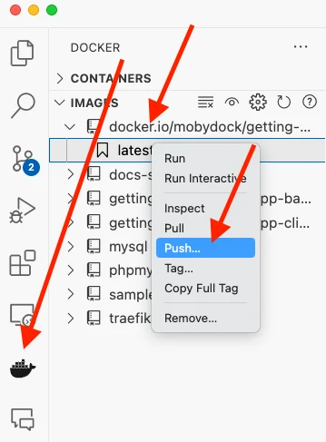

Now that you've updated the to-do app, let's create a container image for the application and share it on Docker Hub! To do so, we will need to do the following:

1. Sign in with your Docker account
2. Create an image repository on Docker Hub
3. Build the container image
4. Push it to Docker Hub

VIDEO WILL GO HERE


## Intro to Docker Hub

To share your Docker images, you need a place to host them. This is where registries come in. While there are many registries, Docker Hub is the default and go-to registry for images.

**Docker Hub** is a marketplace where developers share their Docker images, making it easier for anyone to find and use containerized software. From official images for programming languages like Python and Node.js to specialized applications and services, Docker Hub has it all.

In the last step, we used the following images that came from Docker Hub, each of which are [Docker Official Images](/trusted-content/official-images/):

- [node](https://hub.docker.com/_/node) - provides a Node environment and is used as the base of our development efforts. This image is also used as the base for the final application image.
- [mysql](https://hub.docker.com/_/mysql) - provides a MySQL database to store the to-do list items
- [phpmyadmin](https://hub.docker.com/_/phpmyadmin) - provides phpMyAdmin, a web-based interface to the MySQL database
- [traefik](https://hub.docker.com/_/traefik) - provides Traefik, a modern HTTP reverse proxy and load balancer that routes requests to the appropriate container based on routing rules

Explore the full catalog of [Docker Official Images](https://hub.docker.com/search?image_filter=official&q=), [Docker Verified Publishers](https://hub.docker.com/search?q=&image_filter=store), and [Docker Sponsored Open Source Software](https://hub.docker.com/search?q=&image_filter=open_source) images to see more of what there is to run and build on.


## Sign in with your Docker account

In order to push images to Docker Hub, you will need to sign in with a Docker account.

1. Open the Docker Desktop dashboard.

2. Click on the **Sign in** button in the top-right corner.

3. If needed, create an account and then complete the login flow.

When you're done, you should see the **Sign in** button turn into a profile picture.

## Create an image repository

Now that you have an account, let's create an image repository. Just as a git repo holds source code, an image repository stores container images.

1. Go to [Docker Hub](https://hub.docker.com).

2. Click the **Create repository** button.

3. On the **Create repository** page, enter the following information:

    - **Repository name** - `getting-started-todo-app`
    - **Short description** - feel free to enter a description if you'd like
    - **Visibility** - select **Public** to allow others to pull your customized to-do app

4. Click the **Create** button to create the repository.


## Build and push the image

Now that you have a repository, you are ready to build and push your image. An important note is that the image we are building _extends_ the Node image, meaning we don't need to install or configure Node, yarn, etc. We can simply focus on what makes our application unique.

> **What is an image/Dockerfile?**
>
> Without going to deep yet, think of a container image as a single package that contains
> everything needed to run a process. In this case, it will contain a Node environment,
> the backend code, and the compiled React code. 
>
> Anywhere a container is run using the image, it will then be able to run the application as 
> it was built without needing anything else pre-installed on their machine. 
>
> A `Dockerfile` is a text-based script that provides the instruction set on how to build
> the image. For this quick start, we're providing you with the Dockerfile.





1. Open a terminal to the root of the project.

2. Build the project by running the following command, swapping out `DOCKER_USERNAME` with your username.

    ```bash
    docker build -t <DOCKER_USERNAME>/getting-started-todo-app .
    ```

    For example, if my Docker username was `mobydock`, I would run the following:

    ```bash
    docker build -t mobydock/getting-started-todo-app .
    ```

3. To verify the image exists locally, you can use the `docker image ls` command:

    ```plaintext
    > docker image ls
    REPOSITORY                          TAG       IMAGE ID       CREATED          SIZE
    mobydock/getting-started-todo-app   latest    1543656c9290   2 minutes ago    1.12GB
    ...
    ```

4. To push the image, use the `docker push` command. Be sure to replace `<DOCKER_USERNAME>` with your username:

    ```bash
    docker push <DOCKER_USERNAME>/getting-started-todo-app
    ```

    Depending on your upload speeds, this may take a moment to push.




1. Right-click on the `Dockerfile` and select the **Build Image...** menu item.

    

2. In the dialog that appears, enter a name of `DOCKER_USERNAME/getting-started-todo-app`, replacing `DOCKER_USERNAME` with your Docker username. 

3. After pressing **Enter**, you'll see a terminal appear where the build will occur. Once it's completed, feel free to close the terminal.

4. Open the Docker extension for VS Code by clicking on the Docker logo in the left nav menu.

5. Find the image you created. It'll have a name of `docker.io/DOCKER_USERNAME/getting-started-todo-app`. 

6. Expand the image to view the tags (or different versions) of the image. You should see a tag named `latest`, which is the default tag given to an image.

7. Right-click on the **latest** item and select the **Push...** option.

    

8. Press **Enter** to confirm and then watch as your image is pushed to Docker Hub! Depending on your upload speeds, it might take a moment to push the image.

    Once the upload is finished, feel free to close the terminal.





## Recap

Before we move on, let's take a moment and reflect on what happened here. Within a few moments, you were able to:

- **Docker Hub is the go-to registry for finding trusted content.** Docker provides a collection of trusted content, composed of Docker Official Images, Docker Verified Publishers, and Docker Sponsored Open Source Software, to use directly or as bases for your own images.

- **Docker Hub provides a marketplace to distribute your own applications.** Anyone can create an account and distribute images. While we are publicly distributing the image we created, private repositories can ensure your images are accessible to only authorized users.

> **Usage of other registries**
>
> While Docker Hub is the default registry, registries are standardized and made 
> interoperable through the [Open Container Initiative](https://opencontainers.org/). This allows companies and 
> organizations to run their own private registries. Quite often, trusted content 
> is mirrored (or copied) from Docker Hub into these private registries.
>
> Features such as [Registry Access Management](/security/for-admins/registry-access-management/) give organizational admins the ability to choose 
> the authorized registries developers can pull from in Docker Desktop, ensuring only vetted and approved images are used.


## Next steps

Now that we've built an image, it's time to explore how Docker Scout can help ensure the newly created image meets organizational policies and helps build a secure software supply chain.


