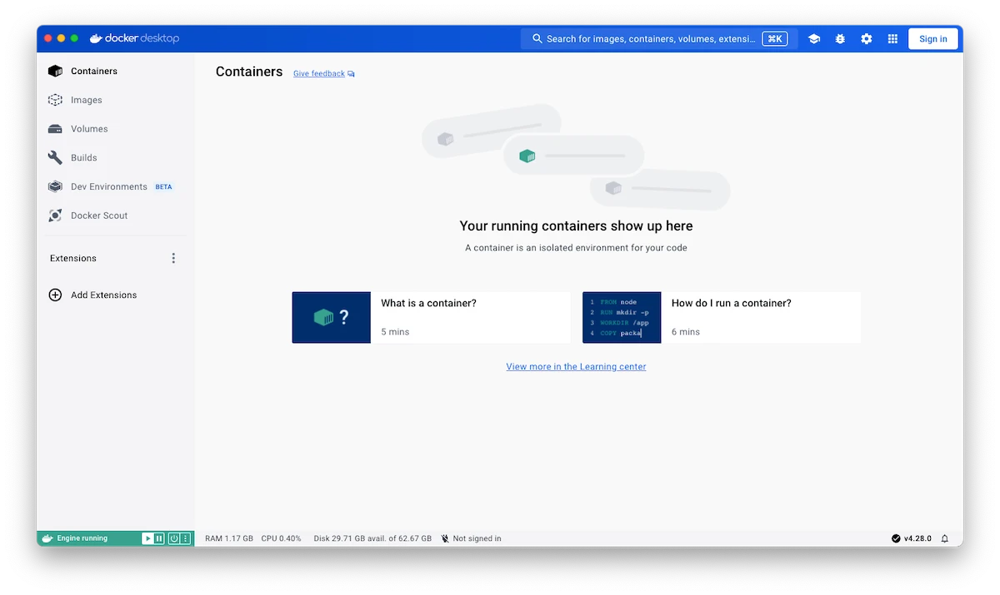

Docker Desktop is the all-in-one package to build images, run containers, and so much more!
Let's get it installed and then experience it for yourself.

> **Docker Desktop terms**
>
> Commercial use of Docker Desktop in larger enterprises (more than 250
> employees OR more than $10 million USD in annual revenue) requires a paid
> subscription.



 



 



Once it's installed, complete the setup process and you should arrive at a screen that looks similar to the following:

## What's next?

Now that you have Docker Desktop installed, let's start a containerized project and do some development!

