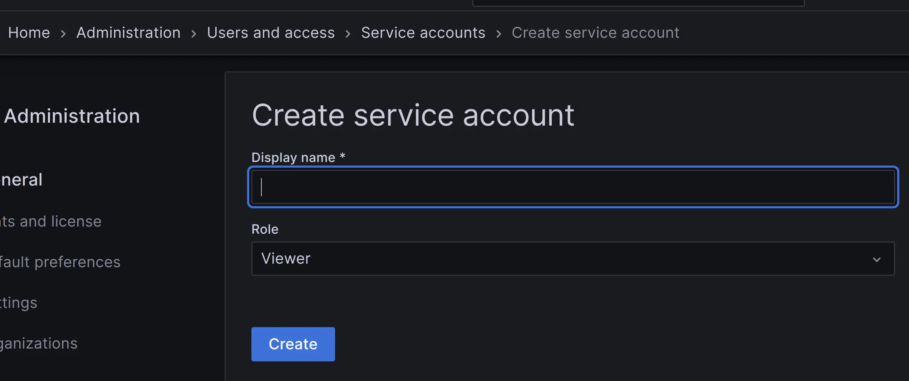
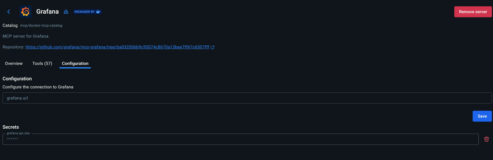
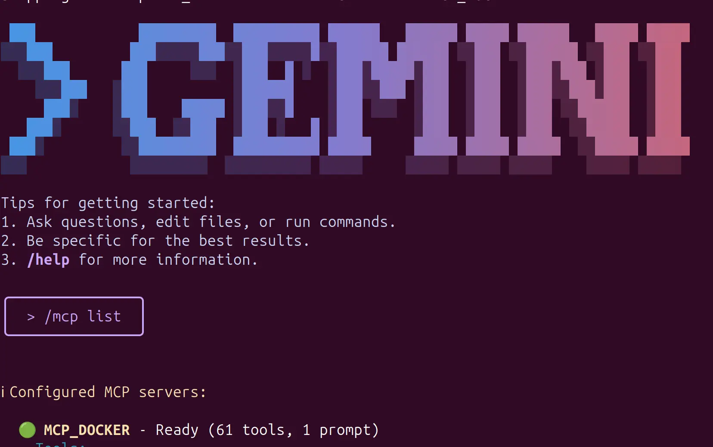
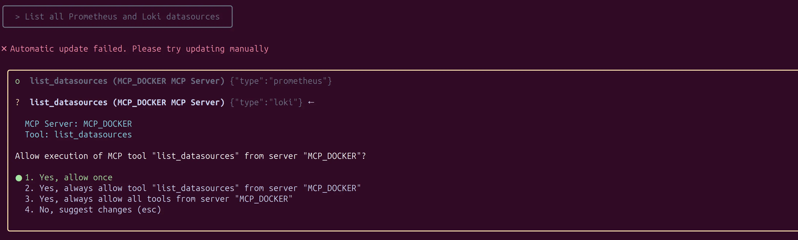
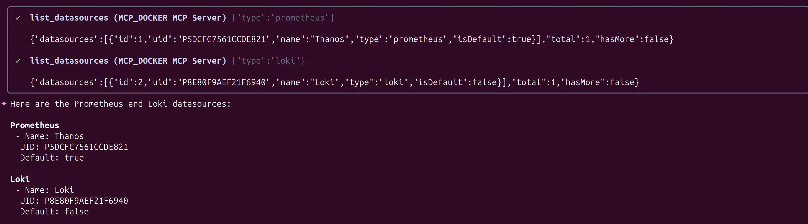
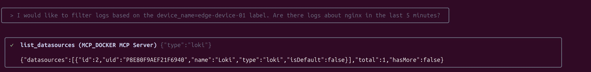
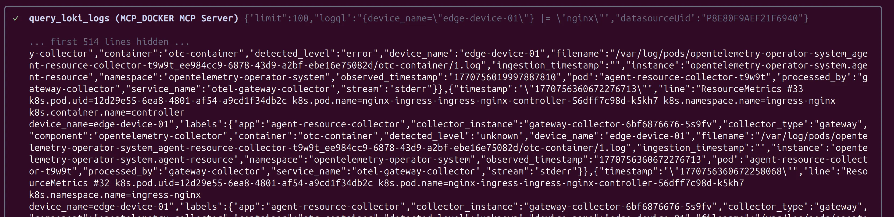
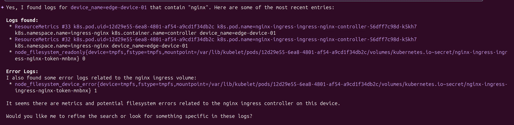
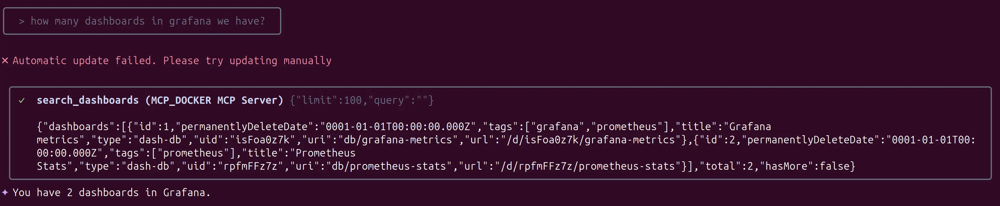
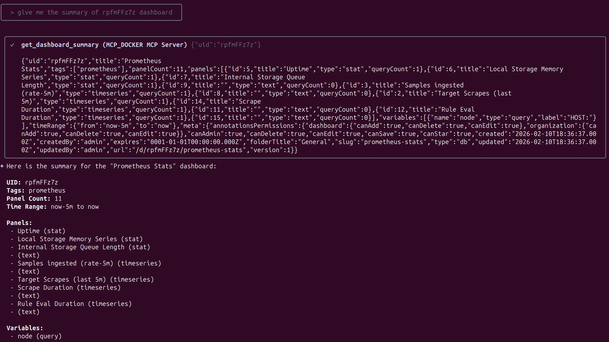

# Integrating Gemini CLI with Grafana via Docker MCP Toolkit

This guide outlines the process of connecting Gemini CLI to a Grafana instance using the **Docker MCP Toolkit**. By leveraging the Model Context Protocol (MCP), we enable natural language querying of observability data directly from the terminal.

## Prerequisites

* **Gemini CLI** installed and authenticated.
* **Docker Desktop** with the **MCP Toolkit** extension enabled.
* An active **Grafana** instance.


## 1. Provisioning Grafana Access

The MCP server requires a **Service Account Token** to interact with the Grafana API. Using a personal API key is discouraged for security best practices.

1. Navigate to **Administration > Users and access > Service accounts** in your Grafana dashboard.
2. Create a new Service Account (e.g., `gemini-mcp-connector`).
3. Assign the **Viewer** role (or **Editor** if you require alert management capabilities).
4. Generate a new token. **Copy the token value immediately**; it will not be displayed again.




## 2. MCP Server Configuration

The Docker MCP Toolkit provides a pre-configured Grafana catalog item. This acts as the bridge between the LLM and the Grafana API.

1. Open the **MCP Toolkit** in Docker Desktop.
2. Locate **Grafana** in the Catalog and add it to your active servers.
3. In the **Configuration** view, define the following:
* **Grafana URL:** The endpoint or URL of your instance.
* **Service Account Token:** The token generated in the previous step.




## 3. Gemini CLI Integration

To register the Docker MCP gateway within Gemini, update your global configuration file located at `~/.gemini/settings.json`.

Ensure the `mcpServers` object includes the following entry:

```json
{
  "mcpServers": {
    "MCP_DOCKER": {
      "command": "docker",
      "args": [
        "mcp",
        "gateway",
        "run"
      ]
    }
  }
}

```


## 4. Operational Validation

Restart your Gemini CLI session to load the new configuration. Verify the status of the MCP tools by running:

```bash
> /mcp list

```



A successful connection will show `MCP_DOCKER` as **Ready**, exposing over 61 tools for data fetching, dashboard searching, and alert inspection.

## Use Cases

### Datasource Discovery

_List all Prometheus and Loki datasources._







### Logs Inspection

The sequence initiates with the User Prompt: "I would like to filter logs based on the device_name=edge-device-01 label. Are there logs about nginx in the last 5 minutes?". At this stage, the Gemini model performs intent parsing. It identifies the specific metadata required—a label (device_name) and a keyword (nginx)—and realizes it needs external data to fulfill the request. This triggers the list_datasources tool through the MCP Server to locate the telemetry backend.



Once the system identifies Loki as the active datasource, it translates the human intent into a precise technical command. The AI autonomously constructs a LogQL `query: {device_name="edge-device-01"} |= "nginx"`. This query targets the specific Kubernetes pod logs, extracting raw OpenTelemetry (OTel) data that includes pod UIDs and container metadata. Instead of the user writing complex syntax, the prompt acts as the bridge to pull structured data from the containerized environment




In the final step, Gemini performs reasoning over the raw data. It filters through hundreds of lines of telemetry to confirm that Nginx logs exist, but it goes beyond the original prompt by identifying a critical anomaly. It flags a `node_filesystem_device_error`, alerting the DevOps engineer to a potential hardware or volume mounting issue on the edge node. The process concludes by turning a simple question into an actionable incident report.




### Dashboard Navigation 

_How many dashboards we have?_




_Tell me the summary of X dashboard_




### Other scenarios

Imagine you get a page that an application is slow. You could:

   1. Use list_alert_rules to see which alert is firing.
   2. Use search_dashboards to find the relevant application dashboard.
   3. Use get_panel_image on a key panel to see the performance spike visually.
   4. Use query_loki_logs to search for "error" or "timeout" messages during the time of the spike.
   5. If you find the root cause, use create_incident to start the formal response and add_activity_to_incident to log your findings.

## Next steps?

This use case demonstrates the future of Operational Intelligence: moving away from manual dashboard hunting and complex query syntax toward a conversational, proactive troubleshooting experience.

By bridging the gap between your terminal and Grafana's telemetry via the Docker MCP Toolkit, you empower your DevOps team to detect silent failures—like the filesystem error identified in our example—before they escalate into full-scale outages.

Don't let critical logs get buried under layers of infrastructure noise. Start automating your incident response and log analysis today.

Take the next step:

- Deploy the connector: Follow the 15-minute guide above to link your local Gemini CLI to your production Grafana instance.

- Scale the solution: Explore how to share these MCP configurations across your SRE team for unified troubleshooting.

- Optimize your queries: Experiment with advanced LogQL prompts to create automated health reports.

Need help setting up your Docker MCP environment or customizing your Gemini prompts? Let's know.
