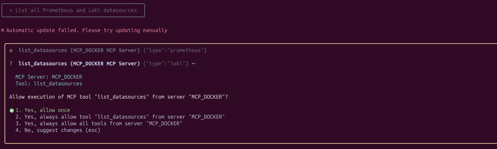
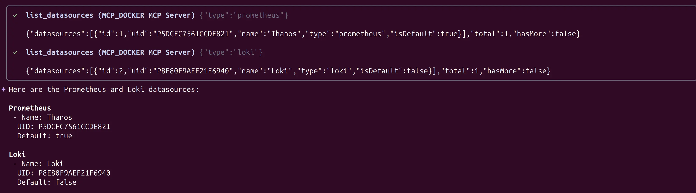
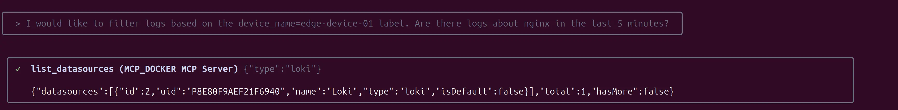
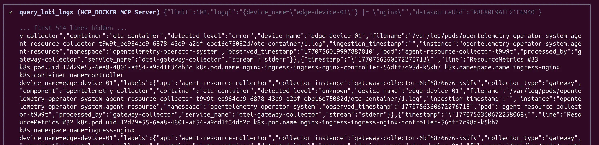
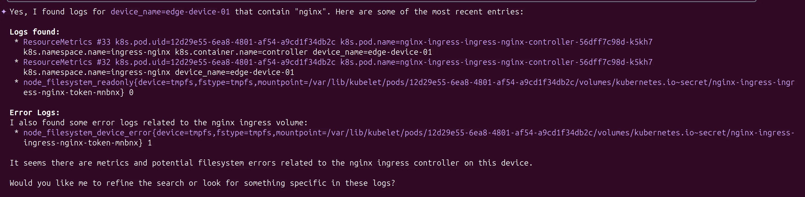
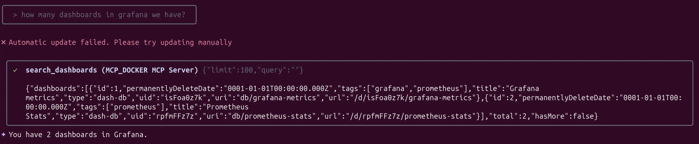
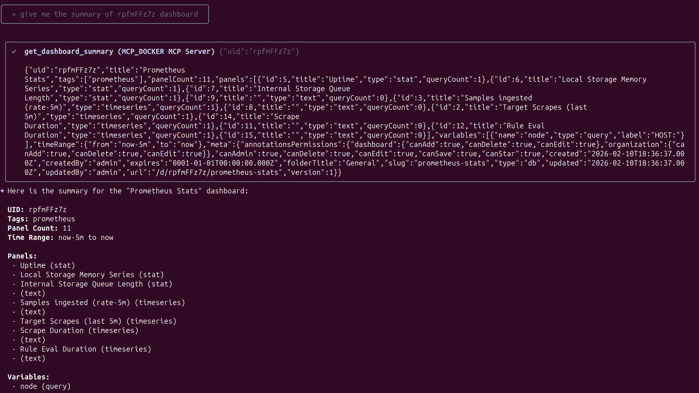

This guide shows how to connect Gemini CLI to a Grafana instance using the **Docker MCP Toolkit**.

## Prerequisites

- **Gemini CLI** installed and authenticated.
- **Docker Desktop** with the **MCP Toolkit** extension enabled.
- An active **Grafana** instance.

## Step 1: Provision Grafana access

The MCP server requires a **Service Account Token** to interact with the Grafana API. Service Account Tokens are preferred over personal API keys because they can be revoked independently without affecting user access, and permissions can be scoped more narrowly.

1. Navigate to **Administration > Users and access > Service accounts** in your Grafana dashboard.
2. Create a new Service Account (e.g., `gemini-mcp-connector`).
3. Assign the **Viewer** role (or **Editor** if you require alert management capabilities).
4. Generate a new token. Copy the token immediately — you won't be able to view it again.


## Step 2: Configure the MCP server

The Docker MCP Toolkit provides a pre-configured Grafana catalog item. This connects the LLM to the Grafana API.

1. Open the **MCP Toolkit** in Docker Desktop.
2. Locate **Grafana** in the Catalog and add it to your active servers.
3. In the **Configuration** view, define the following:

- **Grafana URL:** The endpoint or URL of your instance.
- **Service Account Token:** The token generated in the previous step.

## Step 3: Integrate Gemini CLI

To register the Docker MCP gateway within Gemini, update your global configuration file located at `~/.gemini/settings.json`.

Ensure the `mcpServers` object includes the following entry:

```json
{
  "mcpServers": {
    "MCP_DOCKER": {
      "command": "docker",
      "args": ["mcp", "gateway", "run"]
    }
  }
}
```

## Step 4: Validate the setup

Restart your Gemini CLI session to load the new configuration. Verify the status of the MCP tools by running:

```bash
> /mcp list

```

A successful connection will show `MCP_DOCKER` as **Ready**, exposing dozens tools for data fetching, dashboard searching, and alert inspection.

## Use Cases

###  Data source Discovery

_List all Prometheus and Loki data sources._





### Logs Inspection

Gemini performs intent parsing and translates the user's request into a precise LogQL query: `{device_name="edge-device-01"} |= "nginx"`. Once the system identifies Loki as the active datasource, the AI autonomously constructs this command to bridge the gap between human intent and complex syntax. This query targets specific Kubernetes pod logs, extracting raw OpenTelemetry (OTel) data—including pod UIDs, container metadata, and system labels—which Gemini then uses to identify the root cause of the issue within the containerized environment.






In the final step, Gemini performs reasoning over the raw telemetry. After filtering through hundreds of lines to confirm the existence of Nginx logs, Gemini extracts a specific node_filesystem_device_error buried within the stream. By surfacing this critical event, it alerts the DevOps engineer to a volume mounting issue on the edge node, transforming raw data into an actionable incident report.



### Dashboard Navigation

_How many dashboards do we have?_



_Tell me the summary of X dashboard_



### Other scenarios

Imagine you get a page that an application is slow. You could:

1.  Use `list_alert_rules` to see which alert is firing.
2.  Use `search_dashboards` to find the relevant application dashboard.
3.  Use `get_panel_image` on a key panel to see the performance spike visually.
4.  Use `query_loki_logs` to search for "error" or "timeout" messages during the time of the spike.
5.  If you find the root cause, use create_incident to start the formal response and `add_activity_to_incident` to log your findings.

## Next steps

- Learn about [Advanced LogQL queries](https://grafana.com/docs/loki/latest/query/log_queries/)
- Set up [Team-wide MCP configurations](https://modelcontextprotocol.io/docs/develop/connect-local-servers)
- Explore [Grafana alerting with MCP](https://github.com/grafana/mcp-grafana)
- Get help in the [Docker Community Forums](https://forums.docker.com)

Need help setting up your Docker MCP environment or customizing your Gemini prompts? Visit the [Docker Community Forums](https://forums.docker.com) or see the [Get Started Guide](https://docs.docker.com/ai/mcp-catalog-and-toolkit/get-started/).
