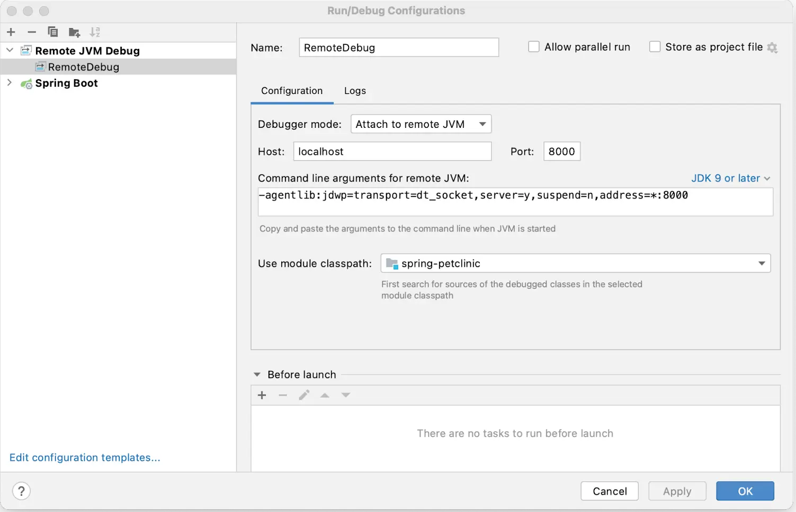
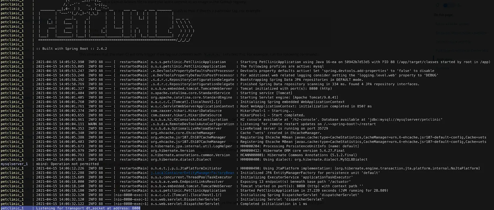
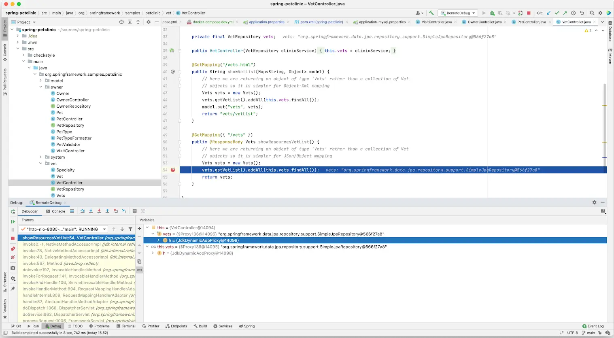

The Java getting started guide teaches you how to create a containerized Spring Boot application using Docker. In this module, you’ll learn how to:

- Containerize and run a Spring Boot application with Maven
- Set up a local development environment to connect a database to the container, configure a debugger, and use Compose Watch for live reload
- Run your unit tests inside a container

After completing the Java getting started modules, you should be able to containerize your own Java application based on the examples and instructions provided in this guide.

Get started containerizing your first Java app.

## Containerize a Java application

### Prerequisites

- You have installed the latest version of [Docker Desktop](/get-started/get-docker.md).
  Docker adds new features regularly and some parts of this guide may
  work only with the latest version of Docker Desktop.

* You have a [Git client](https://git-scm.com/downloads). The examples in this
  section use a command-line based Git client, but you can use any client.

### Overview

This section walks you through containerizing and running a Java
application.

### Get the sample applications

Clone the sample application that you'll be using to your local development machine. Run the following command in a terminal to clone the repository.

```console
$ git clone https://github.com/spring-projects/spring-petclinic.git
```

The sample application is a Spring Boot application built using Maven. For more details, see `readme.md` in the repository.

### Create Docker assets

Now that you have an application, you can create the necessary Docker assets to
containerize your application.

> [!TIP]
>
> [Gordon](/ai/gordon/), Docker's AI assistant, can generate Docker assets for your project. Ask Gordon to create a Dockerfile, Compose file, and `.dockerignore` tailored to your application.

Create a file named `Dockerfile` with the following contents.

```dockerfile {collapse=true,title=Dockerfile}
# syntax=docker/dockerfile:1

# Comments are provided throughout this file to help you get started.
# If you need more help, visit the Dockerfile reference guide at
# https://docs.docker.com/go/dockerfile-reference/

################################################################################

# Create a stage for resolving and downloading dependencies.
FROM eclipse-temurin:21-jdk-jammy as deps

WORKDIR /build

# Copy the mvnw wrapper with executable permissions.
COPY --chmod=0755 mvnw mvnw
COPY .mvn/ .mvn/

# Download dependencies as a separate step to take advantage of Docker's caching.
# Leverage a cache mount to /root/.m2 so that subsequent builds don't have to
# re-download packages.
RUN --mount=type=bind,source=pom.xml,target=pom.xml \
    --mount=type=cache,target=/root/.m2 ./mvnw dependency:go-offline -DskipTests

################################################################################

# Create a stage for building the application based on the stage with downloaded dependencies.
# This Dockerfile is optimized for Java applications that output an uber jar, which includes
# all the dependencies needed to run your app inside a JVM. If your app doesn't output an uber
# jar and instead relies on an application server like Apache Tomcat, you'll need to update this
# stage with the correct filename of your package and update the base image of the "final" stage
# use the relevant app server, e.g., using tomcat (https://hub.docker.com/_/tomcat/) as a base image.
FROM deps as package

WORKDIR /build

COPY ./src src/
RUN --mount=type=bind,source=pom.xml,target=pom.xml \
    --mount=type=cache,target=/root/.m2 \
    ./mvnw package -DskipTests && \
    mv target/$(./mvnw help:evaluate -Dexpression=project.artifactId -q -DforceStdout)-$(./mvnw help:evaluate -Dexpression=project.version -q -DforceStdout).jar target/app.jar

################################################################################

# Create a stage for extracting the application into separate layers.
# Take advantage of Spring Boot's layer tools and Docker's caching by extracting
# the packaged application into separate layers that can be copied into the final stage.
# See Spring's docs for reference:
# https://docs.spring.io/spring-boot/docs/current/reference/html/container-images.html
FROM package as extract

WORKDIR /build

RUN java -Djarmode=layertools -jar target/app.jar extract --destination target/extracted

################################################################################

# Create a new stage for running the application that contains the minimal
# runtime dependencies for the application. This often uses a different base
# image from the install or build stage where the necessary files are copied
# from the install stage.
#
# The example below uses eclipse-turmin's JRE image as the foundation for running the app.
# By specifying the "17-jre-jammy" tag, it will also use whatever happens to be the
# most recent version of that tag when you build your Dockerfile.
# If reproducibility is important, consider using a specific digest SHA, like
# eclipse-temurin@sha256:99cede493dfd88720b610eb8077c8688d3cca50003d76d1d539b0efc8cca72b4.
FROM eclipse-temurin:21-jre-jammy AS final

# Create a non-privileged user that the app will run under.
# See https://docs.docker.com/go/dockerfile-user-best-practices/
ARG UID=10001
RUN adduser \
    --disabled-password \
    --gecos "" \
    --home "/nonexistent" \
    --shell "/sbin/nologin" \
    --no-create-home \
    --uid "${UID}" \
    appuser
USER appuser

# Copy the executable from the "package" stage.
COPY --from=extract build/target/extracted/dependencies/ ./
COPY --from=extract build/target/extracted/spring-boot-loader/ ./
COPY --from=extract build/target/extracted/snapshot-dependencies/ ./
COPY --from=extract build/target/extracted/application/ ./

EXPOSE 8080

ENTRYPOINT [ "java", "org.springframework.boot.loader.launch.JarLauncher" ]
```

> [!NOTE]
> The sample repository includes a `docker-compose.yml` file. The following instructions use the preferred `compose.yaml` filename — both are supported by Docker Compose.

Create a file named `compose.yaml` with the following contents.

```yaml {collapse=true,title=compose.yaml}
# Comments are provided throughout this file to help you get started.
# If you need more help, visit the Docker Compose reference guide at
# https://docs.docker.com/go/compose-spec-reference/

# Here the instructions define your application as a service called "server".
# This service is built from the Dockerfile in the current directory.
# You can add other services your application may depend on here, such as a
# database or a cache. For examples, see the Awesome Compose repository:
# https://github.com/docker/awesome-compose
services:
  server:
    build:
      context: .
    ports:
      - 8080:8080
# The commented out section below is an example of how to define a PostgreSQL
# database that your application can use. `depends_on` tells Docker Compose to
# start the database before your application. The `db-data` volume persists the
# database data between container restarts. The `db-password` secret is used
# to set the database password. You must create `db/password.txt` and add
# a password of your choosing to it before running `docker compose up`.
#     depends_on:
#       db:
#         condition: service_healthy
#   db:
#     image: postgres:18
#     restart: always
#     user: postgres
#     secrets:
#       - db-password
#     volumes:
#       - db-data:/var/lib/postgresql
#     environment:
#       - POSTGRES_DB=example
#       - POSTGRES_PASSWORD_FILE=/run/secrets/db-password
#     expose:
#       - 5432
#     healthcheck:
#       test: [ "CMD", "pg_isready" ]
#       interval: 10s
#       timeout: 5s
#       retries: 5
# volumes:
#   db-data:
# secrets:
#   db-password:
#     file: db/password.txt
```

Create a file named `.dockerignore` with the following contents.

```text {collapse=true,title=".dockerignore"}
# Include any files or directories that you don't want to be copied to your
# container here (e.g., local build artifacts, temporary files, etc.).
#
# For more help, visit the .dockerignore file reference guide at
# https://docs.docker.com/go/build-context-dockerignore/

**/.classpath
**/.dockerignore
**/.env
**/.git
**/.gitignore
**/.project
**/.settings
**/.toolstarget
**/.vs
**/.vscode
**/.next
**/.cache
**/*.*proj.user
**/*.dbmdl
**/*.jfm
**/charts
**/docker-compose*
**/compose.y*ml
**/target
**/Dockerfile*
**/node_modules
**/npm-debug.log
**/obj
**/secrets.dev.yaml
**/values.dev.yaml
**/vendor
LICENSE
README.md
```

You should now have the following three files in your `spring-petclinic`
directory.

- [Dockerfile](/reference/dockerfile/)
- [.dockerignore](/reference/dockerfile/#dockerignore-file)
- [compose.yaml](/reference/compose-file/_index.md)

### Run the application

Inside the `spring-petclinic` directory, run the following command in a
terminal.

```console
$ docker compose up --build
```

The first time you build and run the app, Docker downloads dependencies and builds the app. It may take several minutes depending on your network connection.

Open a browser and view the application at [http://localhost:8080](http://localhost:8080). You should see a simple app for a pet clinic.

In the terminal, press `ctrl`+`c` to stop the application.

#### Run the application in the background

You can run the application detached from the terminal by adding the `-d`
option. Inside the `spring-petclinic` directory, run the following command
in a terminal.

```console
$ docker compose up --build -d
```

Open a browser and view the application at [http://localhost:8080](http://localhost:8080). You should see a simple app for a pet clinic.

In the terminal, run the following command to stop the application.

```console
$ docker compose down
```

For more information about Compose commands, see the
[Compose CLI reference](/reference/cli/docker/compose/).

## Use containers for Java development

### Prerequisites

Work through the steps to containerize your application in [Containerize your app](./).

### Overview

In this section, you’ll walk through setting up a local development environment
for the application you containerized in the previous section. This includes:

- Adding a local database and persisting data
- Creating a development container to connect a debugger
- Configuring Compose to automatically update your running Compose services as
  you edit and save your code

### Add a local database and persist data

You can use containers to set up local services, like a database. In this section, you'll update the `docker-compose.yaml` file to define a database service and a volume to persist data. Also, this particular application uses a system property to define the database type, so you'll need to update the `Dockerfile` to pass in the system property when starting the app.

In the cloned repository's directory, open the `docker-compose.yaml` file in an IDE or text editor. Your Compose file has an example database service, but it'll require a few changes for your unique app.

In the `docker-compose.yaml` file, you need to do the following:

- Uncomment all of the database instructions. You'll now use a database service
  instead of local storage for the data.
- Remove the top-level `secrets` element as well as the element inside the `db`
  service. This example uses the environment variable for the password rather than secrets.
- Remove the `user` element from the `db` service. This example specifies the
  user in the environment variable.
- Update the database environment variables. These are defined by the Postgres
  image. For more details, see the
  [Postgres Official Docker Image](https://hub.docker.com/_/postgres).
- Update the healthcheck test for the `db` service and specify the user. By
  default, the healthcheck uses the root user instead of the `petclinic` user
  you defined.
- Add the database URL as an environment variable in the `server` service. This
  overrides the default value defined in
  `spring-petclinic/src/main/resources/application-postgres.properties`.

The following is the updated `docker-compose.yaml` file. All comments have been removed.

```yaml {hl_lines="7-29"}
services:
  server:
    build:
      context: .
    ports:
      - 8080:8080
    depends_on:
      db:
        condition: service_healthy
    environment:
      - POSTGRES_URL=jdbc:postgresql://db:5432/petclinic
  db:
    image: postgres:18
    restart: always
    volumes:
      - db-data:/var/lib/postgresql
    environment:
      - POSTGRES_DB=petclinic
      - POSTGRES_USER=petclinic
      - POSTGRES_PASSWORD=petclinic
    ports:
      - 5432:5432
    healthcheck:
      test: ["CMD", "pg_isready", "-U", "petclinic"]
      interval: 10s
      timeout: 5s
      retries: 5
volumes:
  db-data:
```

Open the `Dockerfile` in an IDE or text editor. In the `ENTRYPOINT` instruction,
update the instruction to pass in the system property as specified in the
`spring-petclinic/src/resources/db/postgres/petclinic_db_setup_postgres.txt`
file.

```diff
- ENTRYPOINT [ "java", "org.springframework.boot.loader.launch.JarLauncher" ]
+ ENTRYPOINT [ "java", "-Dspring.profiles.active=postgres", "org.springframework.boot.loader.launch.JarLauncher" ]
```

Save and close all the files.

Now, run the following `docker compose up` command to start your application.

```console
$ docker compose up --build
```

Open a browser and view the application at [http://localhost:8080](http://localhost:8080). You should see a simple app for a pet clinic. Browse around the application. Navigate to **Veterinarians** and verify that the application is connected to the database by being able to list veterinarians.

In the terminal, press `ctrl`+`c` to stop the application.

### Dockerfile for development

The Dockerfile you have now is great for a small, secure production image with
only the components necessary to run the application. When developing, you may
want a different image that has a different environment.

For example, in the development image you may want to set up the image to start
the application so that you can connect a debugger to the running Java process.

Rather than managing multiple Dockerfiles, you can add a new stage. Your
Dockerfile can then produce a final image which is ready for production as well
as a development image.

Replace the contents of your Dockerfile with the following.

```dockerfile {hl_lines="22-29"}
# syntax=docker/dockerfile:1

FROM eclipse-temurin:21-jdk-jammy as deps
WORKDIR /build
COPY --chmod=0755 mvnw mvnw
COPY .mvn/ .mvn/
RUN --mount=type=bind,source=pom.xml,target=pom.xml \
    --mount=type=cache,target=/root/.m2 ./mvnw dependency:go-offline -DskipTests

FROM deps as package
WORKDIR /build
COPY ./src src/
RUN --mount=type=bind,source=pom.xml,target=pom.xml \
    --mount=type=cache,target=/root/.m2 \
    ./mvnw package -DskipTests && \
    mv target/$(./mvnw help:evaluate -Dexpression=project.artifactId -q -DforceStdout)-$(./mvnw help:evaluate -Dexpression=project.version -q -DforceStdout).jar target/app.jar

FROM package as extract
WORKDIR /build
RUN java -Djarmode=layertools -jar target/app.jar extract --destination target/extracted

FROM extract as development
WORKDIR /build
RUN cp -r /build/target/extracted/dependencies/. ./
RUN cp -r /build/target/extracted/spring-boot-loader/. ./
RUN cp -r /build/target/extracted/snapshot-dependencies/. ./
RUN cp -r /build/target/extracted/application/. ./
ENV JAVA_TOOL_OPTIONS -agentlib:jdwp=transport=dt_socket,server=y,suspend=n,address=*:8000
CMD [ "java", "-Dspring.profiles.active=postgres", "org.springframework.boot.loader.launch.JarLauncher" ]

FROM eclipse-temurin:21-jre-jammy AS final
ARG UID=10001
RUN adduser \
    --disabled-password \
    --gecos "" \
    --home "/nonexistent" \
    --shell "/sbin/nologin" \
    --no-create-home \
    --uid "${UID}" \
    appuser
USER appuser
COPY --from=extract build/target/extracted/dependencies/ ./
COPY --from=extract build/target/extracted/spring-boot-loader/ ./
COPY --from=extract build/target/extracted/snapshot-dependencies/ ./
COPY --from=extract build/target/extracted/application/ ./
EXPOSE 8080
ENTRYPOINT [ "java", "-Dspring.profiles.active=postgres", "org.springframework.boot.loader.launch.JarLauncher" ]
```

Save and close the `Dockerfile`.

In the `Dockerfile` you added a new stage labeled `development` based on the `extract` stage. In this stage, you copy the extracted files to a common directory, then run a command to start the application. In the command, you expose port 8000 and declare the debug configuration for the JVM so that you can attach a debugger.

### Use Compose to develop locally

The current Compose file doesn't start your development container. To do that, you must update your Compose file to target the development stage. Also, update the port mapping of the server service to provide access for the debugger.

Open the `docker-compose.yaml` and add the following instructions into the file.

```yaml {hl_lines=["5","8"]}
services:
  server:
    build:
      context: .
      target: development
    ports:
      - 8080:8080
      - 8000:8000
    depends_on:
      db:
        condition: service_healthy
    environment:
      - POSTGRES_URL=jdbc:postgresql://db:5432/petclinic
  db:
    image: postgres:18
    restart: always
    volumes:
      - db-data:/var/lib/postgresql
    environment:
      - POSTGRES_DB=petclinic
      - POSTGRES_USER=petclinic
      - POSTGRES_PASSWORD=petclinic
    ports:
      - 5432:5432
    healthcheck:
      test: ["CMD", "pg_isready", "-U", "petclinic"]
      interval: 10s
      timeout: 5s
      retries: 5
volumes:
  db-data:
```

Now, start your application and to confirm that it's running.

```console
$ docker compose up --build
```

Finally, test your API endpoint. Run the following curl command:

```console
$ curl  --request GET \
  --url http://localhost:8080/vets \
  --header 'content-type: application/json'
```

You should receive the following response:

```json
{
  "vetList": [
    {
      "id": 1,
      "firstName": "James",
      "lastName": "Carter",
      "specialties": [],
      "nrOfSpecialties": 0,
      "new": false
    },
    {
      "id": 2,
      "firstName": "Helen",
      "lastName": "Leary",
      "specialties": [{ "id": 1, "name": "radiology", "new": false }],
      "nrOfSpecialties": 1,
      "new": false
    },
    {
      "id": 3,
      "firstName": "Linda",
      "lastName": "Douglas",
      "specialties": [
        { "id": 3, "name": "dentistry", "new": false },
        { "id": 2, "name": "surgery", "new": false }
      ],
      "nrOfSpecialties": 2,
      "new": false
    },
    {
      "id": 4,
      "firstName": "Rafael",
      "lastName": "Ortega",
      "specialties": [{ "id": 2, "name": "surgery", "new": false }],
      "nrOfSpecialties": 1,
      "new": false
    },
    {
      "id": 5,
      "firstName": "Henry",
      "lastName": "Stevens",
      "specialties": [{ "id": 1, "name": "radiology", "new": false }],
      "nrOfSpecialties": 1,
      "new": false
    },
    {
      "id": 6,
      "firstName": "Sharon",
      "lastName": "Jenkins",
      "specialties": [],
      "nrOfSpecialties": 0,
      "new": false
    }
  ]
}
```

### Connect a Debugger

You’ll use the debugger that comes with the IntelliJ IDEA. You can use the community version of this IDE. Open your project in IntelliJ IDEA, go to the **Run** menu, and then **Edit Configuration**. Add a new Remote JVM Debug configuration similar to the following:



Set a breakpoint.

Open `src/main/java/org/springframework/samples/petclinic/vet/VetController.java` and add a breakpoint inside the `showResourcesVetList` function.

To start your debug session, select the **Run** menu and then **Debug _NameOfYourConfiguration_**.


You should now see the connection in the logs of your Compose application.



You can now call the server endpoint.

```console
$ curl --request GET --url http://localhost:8080/vets
```

You should have seen the code break on the marked line and now you are able to use the debugger just like you would normally. You can also inspect and watch variables, set conditional breakpoints, view stack traces and a do bunch of other stuff.



Press `ctrl+c` in the terminal to stop your application.

### Automatically update services

Use Compose Watch to automatically update your running Compose services as you
edit and save your code. For more details about Compose Watch, see
[Use Compose Watch](/manuals/compose/how-tos/file-watch.md).

Open your `docker-compose.yaml` file in an IDE or text editor and then add the
Compose Watch instructions. The following is the updated `docker-compose.yaml`
file.

```yaml {hl_lines="14-17"}
services:
  server:
    build:
      context: .
      target: development
    ports:
      - 8080:8080
      - 8000:8000
    depends_on:
      db:
        condition: service_healthy
    environment:
      - POSTGRES_URL=jdbc:postgresql://db:5432/petclinic
    develop:
      watch:
        - action: rebuild
          path: .
  db:
    image: postgres:18
    restart: always
    volumes:
      - db-data:/var/lib/postgresql
    environment:
      - POSTGRES_DB=petclinic
      - POSTGRES_USER=petclinic
      - POSTGRES_PASSWORD=petclinic
    ports:
      - 5432:5432
    healthcheck:
      test: ["CMD", "pg_isready", "-U", "petclinic"]
      interval: 10s
      timeout: 5s
      retries: 5
volumes:
  db-data:
```

Run the following command to run your application with Compose Watch.

```console
$ docker compose watch
```

Open a web browser and view the application at [http://localhost:8080](http://localhost:8080). You should see the Spring Pet Clinic home page.

Any changes to the application's source files on your local machine will now be automatically reflected in the running container.

Open `spring-petclinic/src/main/resources/templates/fragments/layout.html` in an IDE or text editor and update the `Home` navigation string by adding an exclamation mark.

```diff
-   <li th:replace="~{::menuItem ('/','home','home page','home','Home')}">
+   <li th:replace="~{::menuItem ('/','home','home page','home','Home!')}">

```

Save the changes to `layout.html` and then you can continue developing while the container automatically rebuilds.

After the container is rebuilt and running, refresh [http://localhost:8080](http://localhost:8080) and then verify that **Home!** now appears in the menu.

Press `ctrl+c` in the terminal to stop Compose Watch.

## Run your Java tests

### Prerequisites

Complete all the previous sections of this guide, starting with [Containerize a Java application](./).

### Overview

Testing is an essential part of modern software development. Testing can mean a lot of things to different development teams. There are unit tests, integration tests and end-to-end testing. In this guide you'll take a look at running your unit tests in Docker.

#### Multi-stage Dockerfile for testing

In the following example, you'll pull the testing commands into your Dockerfile.
Replace the contents of your Dockerfile with the following.

```dockerfile {hl_lines="3-19"}
# syntax=docker/dockerfile:1

FROM eclipse-temurin:21-jdk-jammy as base
WORKDIR /build
COPY --chmod=0755 mvnw mvnw
COPY .mvn/ .mvn/

FROM base as test
WORKDIR /build
COPY ./src src/
RUN --mount=type=bind,source=pom.xml,target=pom.xml \
    --mount=type=cache,target=/root/.m2 \
    ./mvnw test

FROM base as deps
WORKDIR /build
RUN --mount=type=bind,source=pom.xml,target=pom.xml \
    --mount=type=cache,target=/root/.m2 \
    ./mvnw dependency:go-offline -DskipTests

FROM deps as package
WORKDIR /build
COPY ./src src/
RUN --mount=type=bind,source=pom.xml,target=pom.xml \
    --mount=type=cache,target=/root/.m2 \
    ./mvnw package -DskipTests && \
    mv target/$(./mvnw help:evaluate -Dexpression=project.artifactId -q -DforceStdout)-$(./mvnw help:evaluate -Dexpression=project.version -q -DforceStdout).jar target/app.jar

FROM package as extract
WORKDIR /build
RUN java -Djarmode=layertools -jar target/app.jar extract --destination target/extracted

FROM extract as development
WORKDIR /build
RUN cp -r /build/target/extracted/dependencies/. ./
RUN cp -r /build/target/extracted/spring-boot-loader/. ./
RUN cp -r /build/target/extracted/snapshot-dependencies/. ./
RUN cp -r /build/target/extracted/application/. ./
ENV JAVA_TOOL_OPTIONS="-agentlib:jdwp=transport=dt_socket,server=y,suspend=n,address=*:8000"
CMD [ "java", "-Dspring.profiles.active=postgres", "org.springframework.boot.loader.launch.JarLauncher" ]

FROM eclipse-temurin:21-jre-jammy AS final
ARG UID=10001
RUN adduser \
    --disabled-password \
    --gecos "" \
    --home "/nonexistent" \
    --shell "/sbin/nologin" \
    --no-create-home \
    --uid "${UID}" \
    appuser
USER appuser
COPY --from=extract build/target/extracted/dependencies/ ./
COPY --from=extract build/target/extracted/spring-boot-loader/ ./
COPY --from=extract build/target/extracted/snapshot-dependencies/ ./
COPY --from=extract build/target/extracted/application/ ./
EXPOSE 8080
ENTRYPOINT [ "java", "-Dspring.profiles.active=postgres", "org.springframework.boot.loader.launch.JarLauncher" ]
```

First, you added a new base stage. In the base stage, you added common instructions that both the test and deps stage will need.

Next, you added a new test stage labeled `test` based on the base stage. In this
stage you copied in the necessary source files and then specified `RUN` to run
`./mvnw test`. Instead of using `CMD`, you used `RUN` to run the tests. The
reason is that the `CMD` instruction runs when the container runs, and the `RUN`
instruction runs when the image is being built. When using `RUN`, the build will
fail if the tests fail.

Finally, you updated the deps stage to be based on the base stage and removed
the instructions that are now in the base stage.

Run the following command to build a new image using the test stage as the target and view the test results. Include `--progress=plain` to view the build output, `--no-cache` to ensure the tests always run, and `--target test` to target the test stage.

Now, build your image and run your tests. You'll run the `docker build` command and add the `--target test` flag so that you specifically run the test build stage.

```console
$ docker build -t java-docker-image-test --progress=plain --no-cache --target=test .
```

You should see output containing the following

```console
...

#15 101.3 [WARNING] Tests run: 45, Failures: 0, Errors: 0, Skipped: 2
#15 101.3 [INFO]
#15 101.3 [INFO] ------------------------------------------------------------------------
#15 101.3 [INFO] BUILD SUCCESS
#15 101.3 [INFO] ------------------------------------------------------------------------
#15 101.3 [INFO] Total time:  01:39 min
#15 101.3 [INFO] Finished at: 2024-02-01T23:24:48Z
#15 101.3 [INFO] ------------------------------------------------------------------------
#15 DONE 101.4s
```
