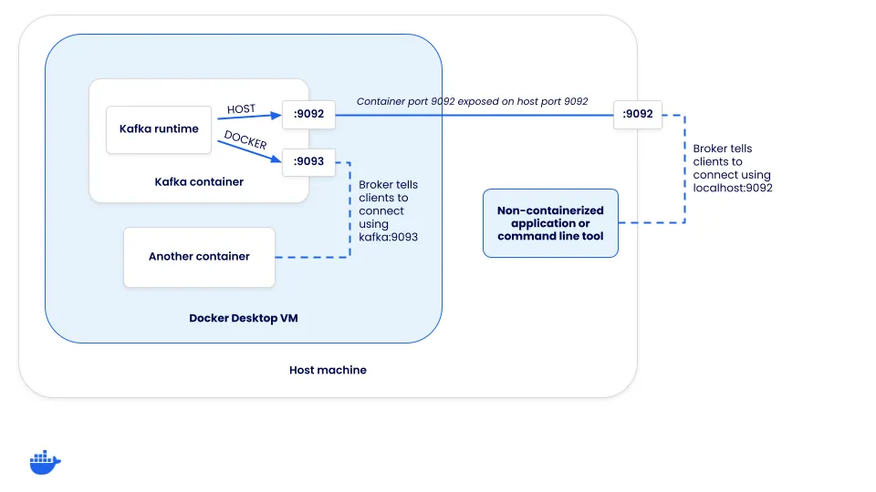

With the rise of microservices, event-driven architectures have become increasingly popular.
[Apache Kafka](https://kafka.apache.org/), a distributed event streaming platform, is often at the
heart of these architectures. Unfortunately, setting up and deploying your own Kafka instance for development
is often tricky. Fortunately, Docker and containers make this much easier.

In this guide, you will learn how to:

1. Use Docker to launch up a Kafka cluster
2. Connect a non-containerized app to the cluster
3. Connect a containerized app to the cluster
4. Deploy Kafka-UI to help with troubleshooting and debugging

## Prerequisites

The following prerequisites are required to follow along with this how-to guide:

- [Docker Desktop](https://www.docker.com/products/docker-desktop/)
- [Node.js](https://nodejs.org/en/download/package-manager) and [yarn](https://yarnpkg.com/)
- Basic knowledge of Kafka and Docker

## Launching Kafka

Beginning with [Kafka 3.3](https://www.confluent.io/blog/apache-kafka-3-3-0-new-features-and-updates/), the deployment of Kafka was greatly simplified by no longer requiring Zookeeper thanks to KRaft (Kafka Raft). With KRaft, setting up a Kafka instance for local development is much easier. Starting with the launch of [Kafka 3.8](https://www.confluent.io/blog/introducing-apache-kafka-3-8/), a new [kafka-native](https://hub.docker.com/r/apache/kafka-native) Docker image is now available, providing a significantly faster startup and lower memory footprint.

> [!TIP]
>
> This guide will be using the apache/kafka image, as it includes many helpful scripts to manage and work with Kafka. However, you may want to use the apache/kafka-native image, as it starts more quickly and requires fewer resources.

### Starting Kafka

Start a basic Kafka cluster by doing the following steps. This example will launch a cluster, exposing port 9092 onto the host to let a native-running application to connect to it.

1. Start a Kafka container by running the following command:

   ```console
   $ docker run -d --name=kafka -p 9092:9092 apache/kafka
   ```

2. Once the image pulls, you’ll have a Kafka instance up and running within a second or two.

3. The apache/kafka image ships with several helpful scripts in the `/opt/kafka/bin` directory. Run the following command to verify the cluster is up and running and get its cluster ID:

   ```console
   $ docker exec -ti kafka /opt/kafka/bin/kafka-cluster.sh cluster-id --bootstrap-server :9092
   ```

   Doing so will produce output similar to the following:

   ```plaintext
   Cluster ID: 5L6g3nShT-eMCtK--X86sw
   ```

4. Create a sample topic and produce (or publish) a few messages by running the following command:

   ```console
   $ docker exec -ti kafka /opt/kafka/bin/kafka-console-producer.sh --bootstrap-server :9092 --topic demo
   ```

   After running, you can enter a message per line. For example, enter a few messages, one per line. A few examples might be:

   ```plaintext
   First message
   ```

   And

   ```plaintext
   Second message
   ```

   Press `enter` to send the last message and then press ctrl+c when you’re done. The messages will be published to Kafka.

5. Confirm the messages were published into the cluster by consuming the messages:

   ```console
   $ docker exec -ti kafka /opt/kafka/bin/kafka-console-consumer.sh --bootstrap-server :9092 --topic demo --from-beginning
   ```

   You should then see your messages in the output:

   ```plaintext
   First message
   Second message
   ```

   If you want, you can open another terminal and publish more messages and see them appear in the consumer.

   When you’re done, hit ctrl+c to stop consuming messages.

You have a locally running Kafka cluster and have validated you can connect to it.

## Connecting to Kafka from a non-containerized app

Now that you’ve shown you can connect to the Kafka instance from a command line, it’s time to connect to the cluster from an application. In this example, you will use a simple Node project that uses the [KafkaJS](https://github.com/tulios/kafkajs) library.

Since the cluster is running locally and is exposed at port 9092, the app can connect to the cluster at localhost:9092 (since it’s running natively and not in a container right now). Once connected, this sample app will log messages it consumes from the `demo` topic. Additionally, when it runs in development mode, it will also create the topic if it isn’t found.

1. If you don’t have the Kafka cluster running from the previous step, run the following command to start a Kafka instance:

   ```console
   $ docker run -d --name=kafka -p 9092:9092 apache/kafka
   ```

2. Clone the [GitHub repository](https://github.com/dockersamples/kafka-development-node) locally.

   ```console
   $ git clone https://github.com/dockersamples/kafka-development-node.git
   ```

3. Navigate into the project.

   ```console
   cd kafka-development-node/app
   ```

4. Install the dependencies using yarn.

   ```console
   $ yarn install
   ```

5. Start the application using `yarn dev`. This will set the `NODE_ENV` environment variable to `development` and use `nodemon` to watch for file changes.

   ```console
   $ yarn dev
   ```

6. With the application now running, it will log received messages to the console. In a new terminal, publish a few messages using the following command:

   ```console
   $ docker exec -ti kafka /opt/kafka/bin/kafka-console-producer.sh --bootstrap-server :9092 --topic demo
   ```

   And then send a message to the cluster:

   ```plaintext
   Test message
   ```

   Remember to press `ctrl+c` when you’re done to stop producing messages.

## Connecting to Kafka from both containers and native apps

Now that you have an application connecting to Kafka through its exposed port, it’s time to explore what changes are needed to connect to Kafka from another container. To do so, you will now run the application out of a container instead of natively.

But before you do that, it’s important to understand how Kafka listeners work and how those listeners help clients connect.

### Understanding Kafka listeners

When a client connects to a Kafka cluster, it actually connects to a “broker”. While brokers have many roles, one of them is to support load balancing of clients. When a client connects, the broker returns a set of connection URLs the client should then use for the client to connect for the producing or consuming of messages. How are these connection URLs configured?

Each Kafka instance has a set of listeners and advertised listeners. The “listeners” are what Kafka binds to and the “advertised listeners” configure how clients should connect to the cluster. The connection URLs a client receives is based on which listener a client connects to.

### Defining the listeners

To help this make sense, let’s look at how Kafka needs to be configured to support two connection opportunities:

1. Host connections (those coming through the host’s mapped port) - these will need to connect using localhost
2. Docker connections (those coming from inside the Docker networks) - these can not connect using localhost, but the network alias (or DNS address) of the Kafka service

Since there are two different methods clients need to connect, two different listeners are required - `HOST` and `DOCKER`. The `HOST` listener will tell clients to connect using localhost:9092, while the `DOCKER` listener will inform clients to connect using `kafka:9093`. Notice this means Kafka is listening on both ports 9092 and 9093. But, only the host listener needs to be exposed to the host.



In order to set this up, the `compose.yaml` for Kafka needs some additional configuration. Once you start overriding some of the defaults, you also need to specify a few other options in order for KRaft mode to work.

```yaml
services:
  kafka:
    image: apache/kafka-native
    ports:
      - "9092:9092"
    environment:
      # Configure listeners for both docker and host communication
      KAFKA_LISTENERS: CONTROLLER://localhost:9091,HOST://0.0.0.0:9092,DOCKER://0.0.0.0:9093
      KAFKA_ADVERTISED_LISTENERS: HOST://localhost:9092,DOCKER://kafka:9093
      KAFKA_LISTENER_SECURITY_PROTOCOL_MAP: CONTROLLER:PLAINTEXT,DOCKER:PLAINTEXT,HOST:PLAINTEXT

      # Settings required for KRaft mode
      KAFKA_NODE_ID: 1
      KAFKA_PROCESS_ROLES: broker,controller
      KAFKA_CONTROLLER_LISTENER_NAMES: CONTROLLER
      KAFKA_CONTROLLER_QUORUM_VOTERS: 1@localhost:9091

      # Listener to use for broker-to-broker communication
      KAFKA_INTER_BROKER_LISTENER_NAME: DOCKER

      # Required for a single node cluster
      KAFKA_OFFSETS_TOPIC_REPLICATION_FACTOR: 1
```

Give it a try using the steps below.

1. If you have the Node app running from the previous step, go ahead and stop it by pressing `ctrl+c` in the terminal.

2. If you have the Kafka cluster running from the previous section, go ahead and stop that container using the following command:

   ```console
   $ docker rm -f kafka
   ```

3. Start the Compose stack by running the following command at the root of the cloned project directory:

   ```console
   $ docker compose up
   ```

   After a moment, the application will be up and running.

4. In the stack is another service that can be used to publish messages. Open it by going to [http://localhost:3000](http://localhost:3000). As you type in a message and submit the form, you should see the log message of the message being received by the app.

   This helps demonstrate how a containerized approach makes it easy to add additional services to help test and troubleshoot your application.

## Adding cluster visualization

Once you start using containers in your development environment, you start to realize the ease of adding additional services that are solely focused on helping development, such as visualizers and other supporting services. Since you have Kafka running, it might be helpful to visualize what’s going on in the Kafka cluster. To do so, you can run the [Kafbat UI web application](https://github.com/kafbat/kafka-ui).

To add it to your own project (it’s already in the demo application), you only need to add the following configuration to your Compose file:

```yaml
services:
  kafka-ui:
    image: ghcr.io/kafbat/kafka-ui:latest
    ports:
      - 8080:8080
    environment:
      DYNAMIC_CONFIG_ENABLED: "true"
      KAFKA_CLUSTERS_0_NAME: local
      KAFKA_CLUSTERS_0_BOOTSTRAPSERVERS: kafka:9093
    depends_on:
      - kafka
```

Then, once the Compose stack starts, you can open your browser to [http://localhost:8080](http://localhost:8080) and navigate around to view additional details about the cluster, check on consumers, publish test messages, and more.

## Testing with Kafka

If you’re interested in learning how you can integrate Kafka easily into your integration tests, check out the [Testing Spring Boot Kafka Listener using Testcontainers guide](https://testcontainers.com/guides/testing-spring-boot-kafka-listener-using-testcontainers/). This guide will teach you how to use Testcontainers to manage the lifecycle of Kafka containers in your tests.

## Conclusion

By using Docker, you can simplify the process of developing and testing event-driven applications with Kafka. Containers simplify the process of setting up and deploying the various services you need to develop. And once they’re defined in Compose, everyone on the team can benefit from the ease of use.

In case you missed it earlier, all of the sample app code can be found at dockersamples/kafka-development-node.
