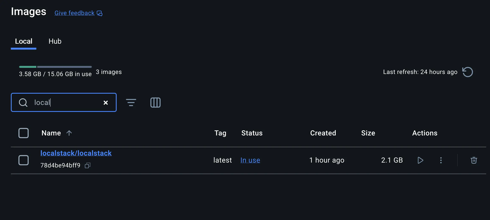
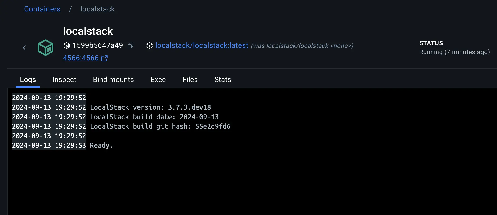
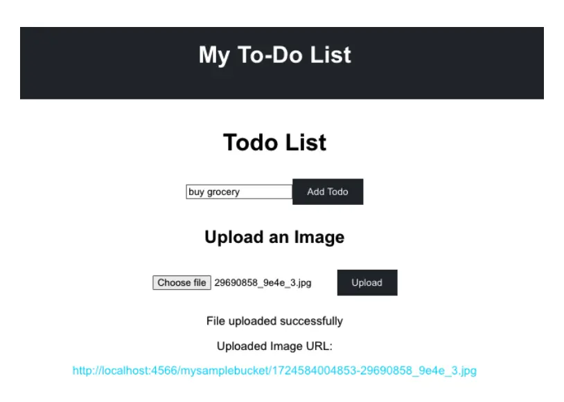

In modern application development, testing cloud applications locally before deploying them to a live environment helps you ship faster and with more confidence. This approach involves simulating services locally, identifying and fixing issues early, and iterating quickly without incurring costs or facing the complexities of a full cloud environment. Tools like [LocalStack](https://www.localstack.cloud/) have become invaluable in this process, enabling you to emulate AWS services and containerize applications for consistent, isolated testing environments. 

In this guide, you'll learn how to:

- Use Docker to launch up a LocalStack container
- Connect to LocalStack from a non-containerized application
- Connect to LocalStack from a containerized application

## What is LocalStack?

LocalStack is a cloud service emulator that runs in a single container on your laptop. It provides a powerful, flexible, and cost-effective way to test and develop AWS-based applications locally. 

## Why use LocalStack?

Simulating AWS services locally allows you to test how your app interacts with services like S3, Lambda, and DynamoDB without needing to connect to the real AWS cloud. You can quickly iterate on your development, avoiding the cost and complexity of deploying to the cloud during this phase.

By mimicking the behavior of these services locally, LocalStack enables faster feedback loops. Your app can interact with external APIs, but everything runs locally, removing the need to deal with cloud provisioning or network latency.

This makes it easier to validate integrations and test cloud-based scenarios without needing to configure IAM roles or policies in a live environment. You can simulate complex cloud architectures locally and push your changes to AWS only when you’re ready.

## Using LocalStack with Docker

The [official Docker image for LocalStack](https://hub.docker.com/r/localstack/localstack) provides a convenient way to run LocalStack on your development machine. It’s free to use and doesn’t require any API key to run. You can even use [LocalStack Docker Extension](https://www.docker.com/blog/develop-your-cloud-app-locally-with-the-localstack-extension/) to use LocalStack with a graphical user interface.

## Prerequisites

The following prerequisites are required to follow along with this how-to guide:

- [Docker Desktop](https://www.docker.com/products/docker-desktop/) 
- [Node.js](https://nodejs.org/en/download/package-manager)
- [Python and pip](https://www.python.org/downloads/)
- Basic knowledge of Docker

## Launching LocalStack

Launch a quick demo of LocalStack by using the following steps:

1. Start by [cloning a sample application](https://github.com/dockersamples/todo-list-localstack-docker). Open the terminal and run the following command:

   ```console
   $ git clone https://github.com/dockersamples/todo-list-localstack-docker
   $ cd todo-list-localstack-docker
   ```

2. Bring up LocalStack

   Run the following command to bring up LocalStack.   

   ```console
   $ docker compose -f compose-native.yml up -d
   ```

   This Compose file also includes specifications for a required Mongo database. You can verify the services are up and running by visiting the Docker Desktop Dashboard.

   

3. Verify that LocalStack is up and running by selecting the container and checking the logs.

   

4. Creating a Local Amazon S3 Bucket

   When you create a local S3 bucket using LocalStack, you're essentially simulating the creation of an S3 bucket on AWS. This lets you to test and develop applications that interact with S3 without needing an actual AWS account.

   To create Local Amazon S3 bucket, you’ll need to install an `awscli-local` package to be installed on your system. This package provides the awslocal command, which is a thin wrapper around the AWS command line interface for use with LocalStack.  It lets you to test and develop against a simulated environment on your local machine without needing to access the real AWS services. You can learn more about this utility [here](https://github.com/localstack/awscli-local).

    ```console
    $ pip install awscli-local
    ```

    Create a new S3 bucket within the LocalStack environment with the following command:

    ```console
    $ awslocal s3 mb s3://mysamplebucket
    ```

    The command `s3 mb s3://mysamplebucket` tells the AWS CLI to create a new S3 bucket (mb stands for `make bucket`) named `mysamplebucket`.

    You can verify if the S3 bucket gets created or not by selecting the LocalStack container on the Docker Desktop Dashboard and viewing the logs. The logs indicates that your LocalStack environment is configured correctly and you can now use the `mysamplebucket` for storing and retrieving objects.

    

## Using LocalStack in development

Now that you've familiarized yourself with LocalStack, it's time to see it in action. In this demonstration, you'll use a sample application featuring a React frontend and a Node.js backend. This application stack utilizes the following components:

- React: A user-friendly frontend for accessing the todo-list application
- Node: A backend responsible for handling the HTTP requests.
- MongoDB: A database to store all the to-do list data
- LocalStack: Emulates the Amazon S3 service and stores and retrieve images.


## Connecting to LocalStack from a non-containerized app

Now it’s time to connect your app to LocalStack. The `index.js` file, located in the backend/ directory, serves as the main entry point for the backend application.

The code interacts with LocalStack’s S3 service, which is accessed via the endpoint defined by the `S3_ENDPOINT_URL` environment variable, typically set to `http://localhost:4556` for local development.

The `S3Client` from the AWS SDK is configured to use this LocalStack endpoint, along with test credentials (`AWS_ACCESS_KEY_ID` and `AWS_SECRET_ACCESS_KEY`) that are also sourced from environment variables. This setup lets the application to perform operations on the locally simulated S3 service as if it were interacting with the real AWS S3, making the code flexible for different environments.

The code uses `multer` and `multer-s3` to handle file uploads. When a user uploads an image through the /upload route, the file is stored directly in the S3 bucket simulated by LocalStack. The bucket name is retrieved from the environment variable `S3_BUCKET_NAME`. Each uploaded file is given a unique name by appending the current timestamp to the original filename. The route then returns the URL of the uploaded file within the local S3 service, making it accessible just as it would be if hosted on a real AWS S3 bucket.

Let’s see it in action. Start by launching the Node.js backend service.

1. Change to the backend/ directory

   ```console
   $ cd backend/
   ```

2. Install the required dependencies:
  
   ```console
   $ npm install
   ```

3. Setting up AWS environment variables


   The `.env` file located in the backend/ directory already contains placeholder credentials and configuration values that LocalStack uses to emulate AWS services. The `AWS_ACCESS_KEY_ID` and `AWS_SECRET_ACCESS_KEY` are placeholder credentials, while `S3_BUCKET_NAME` and `S3_ENDPOINT_URL` are configuration settings. No changes are needed as these values are already correctly set for LocalStack.

   > [!TIP]
   >
   > Given that you’re running Mongo in a Docker container and the backend Node app is running natively on your host, ensure that  `MONGODB_URI=mongodb://localhost:27017/todos` is set in your `.env` file.

   ```plaintext
   MONGODB_URI=mongodb://localhost:27017/todos
   AWS_ACCESS_KEY_ID=test
   AWS_SECRET_ACCESS_KEY=test
   S3_BUCKET_NAME=mysamplebucket
   S3_ENDPOINT_URL=http://localhost:4566
   AWS_REGION=us-east-1
   ```

   While the AWS SDK might typically use environment variables starting with `AWS_`, this specific application directly references the following `S3_*` variables in the index.js file (under the `backend/` directory) to configure the S3Client. 

   ```js
   const s3 = new S3Client({
     endpoint: process.env.S3_ENDPOINT_URL, // Use the provided endpoint or fallback to defaults
     credentials: {
       accessKeyId: process.env.AWS_ACCESS_KEY_ID || 'default_access_key', // Default values for development
       secretAccessKey: process.env.AWS_SECRET_ACCESS_KEY || 'default_secret_key',  
     },
   });
   ```

4. Start the backend server:

   ```console
   $ node index.js
   ```

    You will see the message that the backend service has successfully started at port 5000.

## Start the frontend service

To start the frontend service, open a new terminal and follow these steps:

1. Navigate to the `frontend` directory:

   ```console
   $ cd frontend
   ```

2. Install the required dependencies
  
   ```console
   $ npm install
   ```

3. Start the frontend service

   ```console
   $ npm run dev
   ```
   
   By now, you should see the following message:

   ```console
   VITE v5.4.2  ready in 110 ms
   ➜  Local: http://localhost:5173/
   ➜  Network: use --host to expose
   ➜  press h + enter to show help
   ```

   You can now access the app via [http://localhost:5173](http://localhost:5173). Go ahead, and upload an image by choosing an image file and clicking the **Upload** button.

   

   You can verify the image is uploaded to the S3 bucket by checking the LocalStack container logs:

   

   The `200` status code signifies that the `putObject` operation, which involves uploading an object to the S3 bucket, was executed successfully within the LocalStack environment. LocalStack logs this entry to provide visibility into the operations being performed. It helps debug and confirm that your application is interacting correctly with the emulated AWS services. 


   Since LocalStack is designed to simulate AWS services locally, this log entry shows that your application is functioning as expected when performing cloud operations in a local sandbox environment.

## Connecting to LocalStack from containerized Node app

Now that you have learnt how to connect a non-containerized Node.js application to LocalStack, it's time to explore the necessary changes to run the complete application stack in a containerized environment. To achieve this, you will create a Compose file specifying all required services - frontend, backend, database, and LocalStack.

1. Examine the Docker Compose file. 

   The following Docker Compose file defines four services: `backend`, `frontend`, `mongodb`, and `localstack`. The `backend` and `frontend` services are your Node.js applications, while `mongodb` provides a database and `localstack` simulates AWS services like S3.

   The `backend` service depends on `localstack` and `mongodb` services, ensuring they are running before it starts. It also uses a .env file for environment variables. The frontend service depends on the backend and sets the API URL. The `mongodb` service uses a persistent volume for data storage, and `localstack` is configured to run the S3 service. This setup lets you to develop and test your application locally with AWS-like services.

   ```yaml
   services:
     backend:
       build:
         context: ./backend
         dockerfile: Dockerfile
       ports:
         - 5000:5000
       depends_on:
         - localstack
         - mongodb
       env_file:
         - backend/.env

     frontend:
       build:
         context: ./frontend
         dockerfile: Dockerfile
       ports:
         - 5173:5173
       depends_on:
         - backend
       environment:
         - REACT_APP_API_URL=http://backend:5000/api

     mongodb:
       image: mongo
       container_name: mongodb
       volumes:
         - mongodbdata:/data/db
       ports:
         - 27017:27017

     localstack:
       image: localstack/localstack
       container_name: localstack
       ports:
         - 4566:4566
       environment:
         - SERVICES=s3
         - GATEWAY_LISTEN=0.0.0.0:4566
       volumes:
         - ./localstack:/docker-entrypoint-initaws.d"

   volumes:
     mongodbdata:
   ```

2. Modify the `.env` file under the `backend/` directory to have the resources connect using the internal network names.

   > [!TIP]
   > Given the previous Compose file, the app would connect to LocalStack using the hostname `localstack` while Mongo would connect using the hostname `mongodb`.
 
   ```plaintext
   MONGODB_URI=mongodb://mongodb:27017/todos
   AWS_ACCESS_KEY_ID=test
   AWS_SECRET_ACCESS_KEY=test
   S3_BUCKET_NAME=mysamplebucket
   S3_ENDPOINT_URL=http://localstack:4566
   AWS_REGION=us-east-1
   ```

3. Stop the running services

   Ensure that you stop the Node frontend and backend service from the previous step by pressing “Ctrl+C” in the terminal. Also, you'll need to stop the LocalStack and Mongo containers by selecting them in the Docker Desktop Dashboard and selecting the "Delete" button. 


4. Start the application stack by executing the following command at the root of your cloned project directory:

   ```console
   $ docker compose -f compose.yml up -d --build
   ```

   After a brief moment, the application will be up and running.

5. Create an S3 bucket manually

   The AWS S3 bucket is not created beforehand by the Compose file. Run the following command to create a new bucket within the LocalStack environment:


   ```console
   $ awslocal s3 mb s3://mysamplebucket
   ```

   The command creates an S3 bucket named `mysamplebucket`.

   Open [http://localhost:5173](http://localhost:5173) to access the complete to-do list application and start uploading images to the Amazon S3 bucket. 

   > [!TIP]
   > To optimize performance and reduce upload times during development, consider uploading smaller image files. Larger images may take longer to process and could impact the overall responsiveness of the application.


## Recap

This guide has walked you through setting up a local development environment using LocalStack and Docker. You’ve learned how to test AWS-based applications locally, reducing costs and increasing the efficiency of your development workflow.
