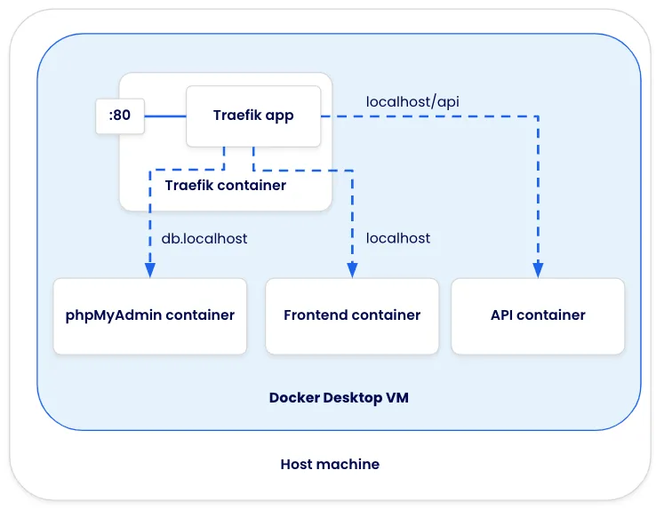
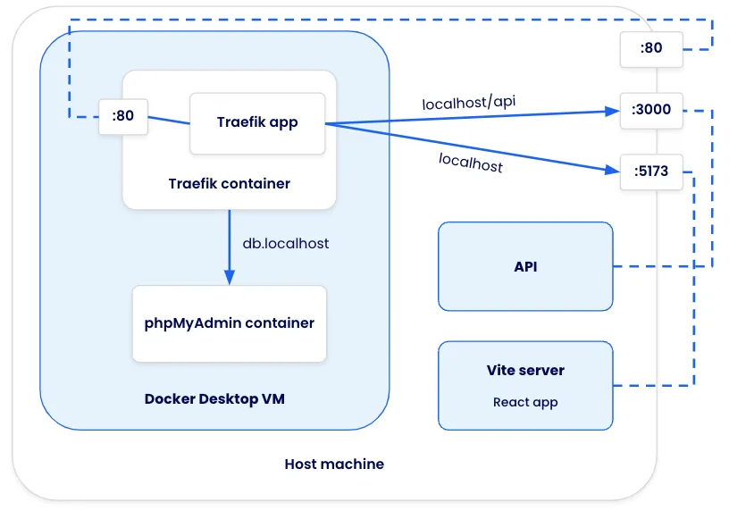

## Introduction

During local development, it’s quite common to need to run multiple HTTP services. You might have both an API and a frontend app, a WireMock service to mock data endpoints, or a database visualizer (such as phpMyAdmin or pgAdmin). In many development setups, these services are exposed on different ports, which then requires you to remember what’s on what port but can also introduce other problems (such as CORS).

A reverse proxy can dramatically simplify this setup by being the single exposed service and then routing requests to the appropriate service based on the request URL (either by path or hostname). [Traefik](https://traefik.io/traefik/) is a modern, cloud-native reverse proxy and load balancer that makes developing and deploying multi-service applications easier. This guide will show you how to use Traefik with Docker to enhance your development environment.

In this guide, you will learn how to:

1. Start Traefik with Docker
2. Configure routing rules to split traffic between two containers
3. Use Traefik in a containerized development environment
4. Use Traefik to send requests to non-containerized workloads

## Prerequisites

The following prerequisites are required to follow along with this how-to guide:

- [Docker Desktop](https://www.docker.com/products/docker-desktop/)
- [Node.js](https://nodejs.org/en/download/package-manager) and [yarn](https://yarnpkg.com/)
- Basic of Docker

## Using Traefik with Docker

One of the unique features of Traefik is its ability to be configured in many ways. When using the Docker provider, Traefik gets its configuration from other running containers using [labels](https://docs.docker.com/config/labels-custom-metadata/). Traefik will watch engine events (for container starts and stops), extract the labels, and update its configuration.

While there are [many Traefik-monitored labels](https://doc.traefik.io/traefik/routing/providers/docker/), the two most common will be:

- `traefik.http.routers.<service-name>.rule` - used to indicate the routing rule ([view all of the available rules here](https://doc.traefik.io/traefik/routing/routers/#rule))
- `traefik.http.services.<service-name>.loadbalancer.server.port` - indicates the port Traefik should forward the request to. Note that this container port does not need to be exposed on your host machine ([read about port detection here](https://doc.traefik.io/traefik/providers/docker/#port-detection))

Let’s do a quick demo of starting Traefik and then configuring two additional containers to be accessible using different hostnames.

1. In order for two containers to be able to communicate with each other, they need to be on the same network. Create a network named `traefik-demo` using the `docker network create` command:

   ```console
   $ docker network create traefik-demo
   ```

2. Start a Traefik container using the following command. The command exposes Traefik on port 80, mounts the Docker socket (which is used to monitor containers to update configuration), and passes the `--providers.docker` argument to configure Traefik to use the Docker provider.

   ```console
   $ docker run -d --network=traefik-demo -p 80:80 -v /var/run/docker.sock:/var/run/docker.sock traefik:v3.1.2 --providers.docker
   ```

3. Now, start a simple Nginx container and define the labels Traefik is watching for to configure the HTTP routing. Note that the Nginx container is not exposing any ports.

   ```console
   $ docker run -d --network=traefik-demo --label 'traefik.http.routers.nginx.rule=Host(`nginx.localhost`)' nginx
   ```

   Once the container starts, open your browser to [http://nginx.localhost](http://nginx.localhost) to see the app (all Chromium-based browsers route \*.localhost requests locally with no additional setup).

4. Start a second application that will use a different hostname.

   ```console
   $ docker run -d --network=traefik-demo --label 'traefik.http.routers.welcome.rule=Host(`welcome.localhost`)' docker/welcome-to-docker
   ```

   Once the container starts, open your browser to http://welcome.localhost. You should see a “Welcome to Docker” website.

## Using Traefik in development

Now that you’ve experienced Traefik, it’s time to try using it in a development environment. In this example, you will use a sample application that has a split frontend and backend. This app stack has the following configuration:

1. All requests to /api to go to the API service
2. All other requests to localhost go to the frontend client
3. Since the app uses MySQL, db.localhost should provide phpMyAdmin to make it easy to access the database during development



The application can be accessed on GitHub at [dockersamples/easy-http-routing-with-traefik](https://github.com/dockersamples/easy-http-routing-with-traefik).

1. In the `compose.yaml` file, Traefik is using the following configuration:

   ```yaml
   services:
     proxy:
       image: traefik:v3.1.2
       command: --providers.docker
       ports:
         - 80:80
       volumes:
         - /var/run/docker.sock:/var/run/docker.sock
   ```

   Note that this is essentially the same configuration as used earlier, but now in a Compose syntax.

2. The client service has the following configuration, which will start the container and provide it with the labels to receive requests at localhost.

   ```yaml {hl_lines=[7,8]}
   services:
     # …
     client:
       image: nginx:alpine
       volumes:
         - "./client:/usr/share/nginx/html"
       labels:
         traefik.http.routers.client.rule: "Host(`localhost`)"
   ```

3. The api service has a similar configuration, but you’ll notice the routing rule has two conditions - the host must be “localhost” and the URL path must have a prefix of “/api”. Since this rule is more specific, Traefik will evaluate it first compared to the client rule.

   ```yaml {hl_lines=[7,8]}
   services:
     # …
     api:
       build: ./dev/api
       volumes:
         - "./api:/var/www/html/api"
       labels:
         traefik.http.routers.api.rule: "Host(`localhost`) && PathPrefix(`/api`)"
   ```

4. And finally, the `phpmyadmin` service is configured to receive requests for the hostname “db.localhost”. The service also has environment variables defined to automatically log in, making it a little easier to get into the app.

   ```yaml {hl_lines=[5,6]}
   services:
     # …
     phpmyadmin:
       image: phpmyadmin:5.2.1
       labels:
         traefik.http.routers.db.rule: "Host(`db.localhost`)"
       environment:
         PMA_USER: root
         PMA_PASSWORD: password
   ```

5. Before starting the stack, stop the Nginx container if it is still running.

And that’s it. Now, you only need to spin up the Compose stack with a `docker compose up` and all of the services and applications will be ready for development.

## Sending traffic to non-containerized workloads

In some situations, you may want to forward requests to applications not running in containers. In the following architecture diagram, the same application from before is used, but the API and React apps are now running natively on the host machine.



To accomplish this, Traefik will need to use another method to configure itself. The [File provider](https://doc.traefik.io/traefik/providers/file/) lets you define the routing rules in a YAML document. Here is an example file:

```yaml
http:
  routers:
    native-api:
      rule: "Host(`localhost`) && PathPrefix(`/api`)"
      service: native-api
    native-client:
      rule: "Host(`localhost`)"
      service: native-client

  services:
    native-api:
      loadBalancer:
        servers:
          - url: "http://host.docker.internal:3000/"
    native-client:
      loadBalancer:
        servers:
          - url: "http://host.docker.internal:5173/"
```

This configuration indicates that requests that for `localhost/api` will be forwarded to a service named `native-api`, which then forwards the request to http://host.docker.internal:3000. The hostname `host.docker.internal` is a name that Docker Desktop provides to send requests to the host machine.

With this file, the only change is to the Compose configuration for Traefik. There are specifically two things that have changed:

1. The configuration file is mounted into the Traefik container (the exact destination path is up to you)
2. The `command` is updated to add the file provider and point to the location of the configuration file

```yaml
services:
  proxy:
    image: traefik:v3.1.2
    command: --providers.docker --providers.file.filename=/config/traefik-config.yaml --api.insecure
    ports:
      - 80:80
      - 8080:8080
    volumes:
      - /var/run/docker.sock:/var/run/docker.sock
      - ./dev/traefik-config.yaml:/config/traefik-config.yaml
```

### Starting the example app

To run the example app that forwards requests from Traefik to native-running apps, use the following steps:

1. If you have the Compose stack still running, stop it with the following command:

   ```console
   $ docker compose down
   ```

2. Start the application using the provided `compose-native.yaml` file:

   ```console
   $ docker compose -f compose-native.yaml up
   ```

   Opening [http://localhost](http://localhost) will return a 502 Bad Gateway because the other apps aren’t running yet.

3. Start the API by running the following steps:

   ```console
   cd api
   yarn install
   yarn dev
   ```

4. Start the frontend by running the following steps in a new terminal (starting from the root of the project):

   ```console
   cd client
   yarn install
   yarn dev
   ```

5. Open the app at [http://localhost](http://localhost). You should see an app that fetches a message from [http://localhost/api/messages](http://localhost/api/messages). You can also open [http://db.localhost](http://db.localhost) to view or adjust the available messages directly from the Mongo database. Traefik will ensure the requests are properly routed to the correct container or application.

6. When you’re done, run `docker compose down` to stop the containers and stop the Yarn apps by hitting `ctrl+c`.

## Recap

Running multiple services doesn’t have to require tricky port configuration and a good memory. With tools like Traefik, it’s easy to launch the services you need and easily access them - whether they’re for the app itself (such as the frontend and backend) or for additional development tooling (such as phpMyAdmin).
