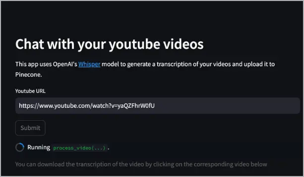
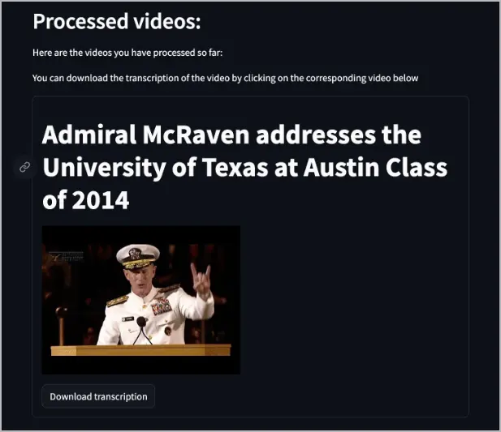
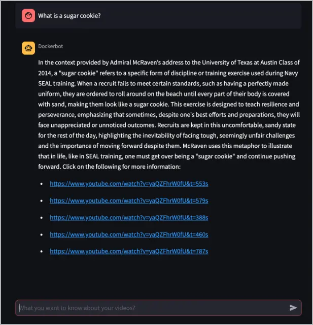
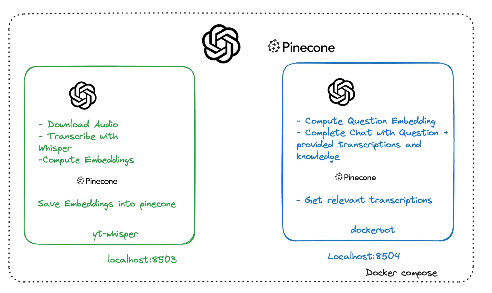
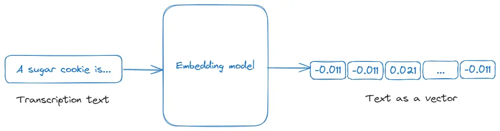

## Overview

This guide presents a project on video transcription and analysis using a set of
technologies related to the
[GenAI Stack](https://www.docker.com/blog/introducing-a-new-genai-stack/).

The project showcases the following technologies:
- [Docker and Docker Compose](#docker-and-docker-compose)
- [OpenAI](#openai-api)
- [Whisper](#whisper)
- [Embeddings](#embeddings)
- [Chat completions](#chat-completions)
- [Pinecone](#pinecone)
- [Retrieval-Augmented Generation](#retrieval-augmented-generation)

> **Acknowledgment**
>
> This guide is a community contribution. Docker would like to thank
> [David Cardozo](https://www.davidcardozo.com/) for his contribution
> to this guide.

## Prerequisites

- You have an [OpenAI API Key](https://platform.openai.com/api-keys).
- You have a [Pinecone API Key](https://app.pinecone.io/).
- You have installed the latest version of [Docker Desktop](../../../get-docker.md). Docker adds new features regularly and some parts of this guide may work only with the latest version of Docker Desktop.
- You have a [Git client](https://git-scm.com/downloads). The examples in this section use a command-line based Git client, but you can use any client.

## About the application

The application is a chatbot that can answer questions from a video. In
addition, it provides timestamps from the video that can help you find the sources used to answer your question.

## Get and run the application

1. Clone the sample application's repository. In a terminal, run the following
   command.
   ```console
   $ git clone https://github.com/Davidnet/docker-genai.git
   ```
   The project contains the following directories and files:
   ```text
   ├── docker-genai/
   │ ├── docker-bot/
   │ ├── yt-whisper/
   │ ├── .env.example
   │ ├── .gitignore
   │ ├── LICENSE
   │ ├── README.md
   │ └── docker-compose.yaml
   ```

2. Specify your API keys. In the `docker-genai` directory, create a text file
   called `.env` and specify your API keys inside. The following is the contents of the `.env.example` file that you can refer to as an example.

   ```text
   #----------------------------------------------------------------------------
   # OpenAI
   #----------------------------------------------------------------------------
   OPENAI_TOKEN=your-api-key # Replace your-api-key with your personal API key

   #----------------------------------------------------------------------------
   # Pinecone
   #----------------------------------------------------------------------------
   PINECONE_TOKEN=your-api-key # Replace your-api-key with your personal API key
   ```

3. Build and run the application. In a terminal, change directory to your
   `docker-genai` directory and run the following command.
   ```console
   $ docker compose up --build
   ```
   Docker Compose builds and runs the application based on the services defined
   in the `docker-compose.yaml` file. When the application is running, you'll
   see the logs of 2 services in the terminal.

   In the logs, you'll see the services are exposed on ports `8503` and `8504`.
   The two services are complimentary to each other.

   The `yt-whisper` service is running on port `8503`. This service feeds the
   Pinecone database with videos that you want to archive in your knowledge
   database. The following section explores this service.

## Using the yt-whisper service

The yt-whisper service is a YouTube video processing service that uses the OpenAI
Whisper model to generate transcriptions of videos and stores them in a Pinecone
database. The following steps show how to use the service.

1. Open a browser and access the yt-whisper service at [http://localhost:8503](http://localhost:8503).
2. Once the application appears, in the **Youtube URL** field specify a Youtube video URL
   and select **Submit**. The following example uses
   [https://www.youtube.com/watch?v=yaQZFhrW0fU](https://www.youtube.com/watch?v=yaQZFhrW0fU).

   

   The yt-whisper service downloads the audio of the video, uses Whisper to
   transcribe it into a WebVTT (`*.vtt`) format (which you can download), then
   uses the text-embedding-3-small model to create embeddings, and finally
   uploads those embeddings in to the Pinecone database.

   After processing the video, a video list appears in the web app that informs
   you which videos have been indexed in Pinecone. It also provides a button to
   download the transcript.

   

   You can now access the dockerbot service on port `8504` and ask questions
   about the videos.

## Using the dockerbot service

The dockerbot service is a question-answering service that leverages both the
Pinecone database and an AI model to provide responses. The following steps show
how to use the service.

> **Note**
>
> You must process at least one video via the
> [yt-whisper service](#using-the-yt-whisper-service) before using
> the dockerbot service.

1. Open a browser and access the service at
   [http://localhost:8504](http://localhost:8504).

2. In the **What do you want to know about your videos?** text box, ask the
   Dockerbot a question about a video that was processed by the yt-whisper
   service. The following example asks the question, "What is a sugar cookie?".
   The answer to that question exists in the video processed in the previous
   example,
   [https://www.youtube.com/watch?v=yaQZFhrW0fU](https://www.youtube.com/watch?v=yaQZFhrW0fU).
   
   
   
   As you can see in the previous image, the Dockerbot answers the question and
   provides links to the video with timestamps, which may contain more
   information about the answer.

   The dockerbot service takes the question, turns it into an embedding using
   the text-embedding-3-small model, queries the Pinecone database to find
   similar embeddings, and then passes that context into the gpt-4-turbo-preview
   to generate an answer.

3. Select the first link to see what information it provides. Based on the
   previous example, select
   [https://www.youtube.com/watch?v=yaQZFhrW0fU&t=553s](https://www.youtube.com/watch?v=yaQZFhrW0fU&t=553s).

   In the example link, you can see that the section of video perfectly answers
   the question, "What is a sugar cookie?".

## Explore the application architecture

The following image shows the application's high-level service architecture, which includes:
- yt-whisper: A local service, ran by Docker Compose, that interacts with the
  remote OpenAI and Pinecone services.
- dockerbot: A local service, ran by Docker Compose, that interacts with the
  remote OpenAI and Pinecone services.
- OpenAI: A remote third-party service.
- Pinecone: A remote third-party service.



## Explore the technologies used and their role

### Docker and Docker Compose

The application uses Docker to run the application in containers, providing a
consistent and isolated environment for running it. This means the application
will operate as intended within its Docker containers, regardless of the
underlying system differences. To learn more about Docker, see the [Getting started overview](../../get-started/_index.md).

Docker Compose is a tool for defining and running multi-container applications.
Compose makes it easy to run this application with a single command, `docker
compose up`. For more details, see the [Compose overview](../../../compose/_index.md).

### OpenAI API

The OpenAI API provides an LLM service that's known for its cutting-edge AI and
machine learning technologies. In this application, OpenAI's technology is used
to generate transcriptions from audio (using the Whisper model) and to create
embeddings for text data, as well as to generate responses to user queries
(using GPT and chat completions). For more details, see
[openai.com](https://openai.com/product).

### Whisper

Whisper is an automatic speech recognition system developed by OpenAI, designed
to transcribe spoken language into text. In this application, Whisper is used to
transcribe the audio from YouTube videos into text, enabling further processing
and analysis of the video content. For more details, see [Introducing Whisper](https://openai.com/research/whisper).

### Embeddings

Embeddings are numerical representations of text or other data types, which
capture their meaning in a way that can be processed by machine learning
algorithms. In this application, embeddings are used to convert video
transcriptions into a vector format that can be queried and analyzed for
relevance to user input, facilitating efficient search and response generation
in the application. For more details, see OpenAI's
[Embeddings](https://platform.openai.com/docs/guides/embeddings) documentation.



### Chat completions

Chat completion, as utilized in this application through OpenAI's API, refers to
the generation of conversational responses based on a given context or prompt.
In the application, it is used to provide intelligent, context-aware answers to
user queries by processing and integrating information from video transcriptions
and other inputs, enhancing the chatbot's interactive capabilities. For more
details, see OpenAI's
[Chat Completions API](https://platform.openai.com/docs/guides/text-generation) documentation.

### Pinecone

Pinecone is a vector database service optimized for similarity search, used for
building and deploying large-scale vector search applications. In this
application, Pinecone is employed to store and retrieve the embeddings of video
transcriptions, enabling efficient and relevant search functionality within the
application based on user queries. For more details, see
[pincone.io](https://www.pinecone.io/).

### Retrieval-Augmented Generation

Retrieval-Augmented Generation (RAG) is a technique that combines information
retrieval with a language model to generate responses based on retrieved
documents or data. In RAG, the system retrieves relevant information (in this
case, via embeddings from video transcriptions) and then uses a language model
to generate responses based on this retrieved data. For more details, see
OpenAI's cookbook for
[Retrieval Augmented Generative Question Answering with Pinecone](https://cookbook.openai.com/examples/vector_databases/pinecone/gen_qa).

## Next steps

Explore how to [create a PDF bot application](../genai-pdf-bot/_index.md) using
generative AI, or view more GenAI samples in the
[GenAI Stack](https://github.com/docker/genai-stack) repository.