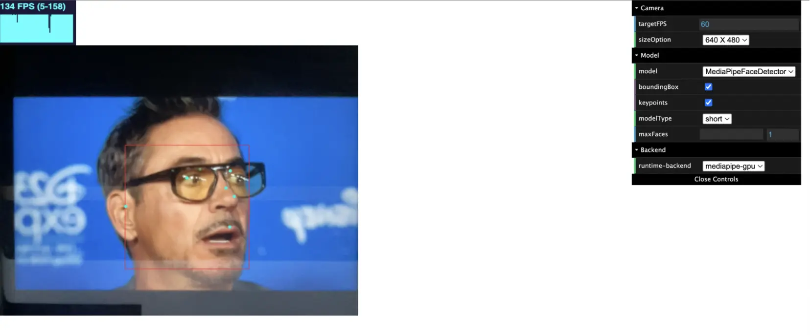

This guide introduces the seamless integration of TensorFlow.js with Docker to
perform face detection. In this guide, you'll explore:

- How to run a containerized TensorFlow.js application with Docker
- The code for a face detection application using TensorFlow.js
- How to create and modify the Docker assets for a TensorFlow.js application

> **Acknowledgment**
>
> Docker would like to thank [Harsh Manvar](https://github.com/harsh4870) for
> his contribution to this guide.

## Prerequisites

* You have installed the latest version of [Docker Desktop](../../../get-docker.md).
* You have a [Git client](https://git-scm.com/downloads). The examples in this guide use a command-line based Git client, but you can use any client.

## What is TensorFlow.js?

[TensorFlow.js](https://www.tensorflow.org/js) is an open-source JavaScript
library for machine learning that enables you to train and deploy ML models in
the browser or on Node.js. It supports creating new models from scratch or using
pre-trained models, facilitating a wide range of ML applications directly in web
environments. TensorFlow.js offers efficient computation, making sophisticated
ML tasks accessible to web developers without deep ML expertise.

## Why Use TensorFlow.js and Docker together?

- Environment consistency and simplified deployment: Docker packages
  TensorFlow.js applications and their dependencies into containers, ensuring
  consistent runs across all environments and simplifying deployment.
- Efficient development and easy scaling: Docker enhances development efficiency
  with features like hot reloading and facilitates easy scaling of -
  TensorFlow.js applications using orchestration tools like Kubernetes.
- Isolation and enhanced security: Docker isolates TensorFlow.js applications in
  secure environments, minimizing conflicts and security vulnerabilities while
  running applications with limited permissions.


## Get and run the sample application

In a terminal, clone the sample application using the following command.

```console
$ git clone https://github.com/docker/face-detection-tensorjs
```

After cloning the application, you'll notice the application has a `Dockerfile`
and a `compose.yaml` file. These Docker assets let you build and run the
application locally with nothing more than Docker.

To run the application, run the following command in a terminal
inside the `face-detection-tensorjs` directory.

```console
$ docker compose up --build
```

The command builds the application into an image and runs it. Depending on your
network connection, it can take several minutes to download the dependencies the
first time you run the command.

You'll see the following output when the application starts.

```console
[+] Running 1/0
 ✔ Container face-detection-tensorjs-server-1  Created                                                                             0.0s 
Attaching to server-1
server-1  | yarn run v1.22.19
server-1  | $ cross-env BUILD_PATH='./static' NODE_ENV=development parcel index.html --no-hmr
server-1  | Server running at http://localhost:1234 
server-1  | ✨  Built in 80.45s.
```

Once the application is running, open a web browser and access the application at [http://localhost:1234](http://localhost:1234). You may need to grant access to your webcam for the application.



To stop the application, press `ctrl`+`c` in the terminal.

## Explore the application's code

The sample application is based on the MediaPipe Face Detector demo. [MediaPipe](https://developers.google.com/mediapipe/) is a comprehensive framework for building multimodal machine learning pipelines. The application uses a pre-trained model from MediaPipe.

Explore the purpose of each file and their contents in the following sections.

### The index.html file

The web application's principal entry point is the `index.html` file. It
includes the video element needed to display the real-time video stream from the
user’s webcam and the basic HTML page structure. The relevant JavaScript scripts
for the facial detection capabilities are also imported.



```html
<!DOCTYPE html>
<html>

<head>
  <meta charset="utf-8">
  <meta name="viewport" content="width=device-width,initial-scale=1,maximum-scale=1.0, user-scalable=no">
  <style>
    body {
      margin: 0;
    }

    #stats {
      position: relative;
      width: 100%;
      height: 80px;
    }

    #main {
      position: relative;
      margin: 0;
    }

    #canvas-wrapper {
      position: relative;
    }
  </style>
</head>

<body>
  <div id="stats"></div>
  <div id="main">
    <div class="container">
      <div class="canvas-wrapper">
        <canvas id="output"></canvas>
        <video id="video" playsinline style="
          -webkit-transform: scaleX(-1);
          transform: scaleX(-1);
          visibility: hidden;
          width: auto;
          height: auto;
          ">
        </video>
      </div>
    </div>
  </div>
  </div>
</body>
<script src="https://cdnjs.cloudflare.com/ajax/libs/dat-gui/0.7.6/dat.gui.min.js"></script>
<script src="https://cdnjs.cloudflare.com/ajax/libs/stats.js/r16/Stats.min.js"></script>
<script src="src/index.js"></script>

</html>
```



### The src/index.js file

The `src/index.js` file conducts the facial detection logic. The script loads
TensorFlow.js, allowing for real-time face detection on the video stream using
the pre-trained face identification model. The file manages access to the
camera, processing of the video frames, and creating bounding boxes around faces
that have been recognized in the video feed.



```javascript
import '@tensorflow/tfjs-backend-webgl';
import '@tensorflow/tfjs-backend-webgpu';

import * as tfjsWasm from '@tensorflow/tfjs-backend-wasm';

tfjsWasm.setWasmPaths(
    `https://cdn.jsdelivr.net/npm/@tensorflow/tfjs-backend-wasm@${
        tfjsWasm.version_wasm}/dist/`);

import * as faceDetection from '@tensorflow-models/face-detection';

import {Camera} from './camera';
import {setupDatGui} from './option_panel';
import {STATE, createDetector} from './shared/params';
import {setupStats} from './shared/stats_panel';
import {setBackendAndEnvFlags} from './shared/util';

let detector, camera, stats;
let startInferenceTime, numInferences = 0;
let inferenceTimeSum = 0, lastPanelUpdate = 0;
let rafId;

async function checkGuiUpdate() {
  if (STATE.isTargetFPSChanged || STATE.isSizeOptionChanged) {
    camera = await Camera.setupCamera(STATE.camera);
    STATE.isTargetFPSChanged = false;
    STATE.isSizeOptionChanged = false;
  }

  if (STATE.isModelChanged || STATE.isFlagChanged || STATE.isBackendChanged) {
    STATE.isModelChanged = true;

    window.cancelAnimationFrame(rafId);

    if (detector != null) {
      detector.dispose();
    }

    if (STATE.isFlagChanged || STATE.isBackendChanged) {
      await setBackendAndEnvFlags(STATE.flags, STATE.backend);
    }

    try {
      detector = await createDetector(STATE.model);
    } catch (error) {
      detector = null;
      alert(error);
    }

    STATE.isFlagChanged = false;
    STATE.isBackendChanged = false;
    STATE.isModelChanged = false;
  }
}

function beginEstimateFaceStats() {
  startInferenceTime = (performance || Date).now();
}

function endEstimateFaceStats() {
  const endInferenceTime = (performance || Date).now();
  inferenceTimeSum += endInferenceTime - startInferenceTime;
  ++numInferences;

  const panelUpdateMilliseconds = 1000;
  if (endInferenceTime - lastPanelUpdate >= panelUpdateMilliseconds) {
    const averageInferenceTime = inferenceTimeSum / numInferences;
    inferenceTimeSum = 0;
    numInferences = 0;
    stats.customFpsPanel.update(
        1000.0 / averageInferenceTime, 120);
    lastPanelUpdate = endInferenceTime;
  }
}

async function renderResult() {
  if (camera.video.readyState < 2) {
    await new Promise((resolve) => {
      camera.video.onloadeddata = () => {
        resolve(video);
      };
    });
  }

  let faces = null;

  if (detector != null) {
  
    beginEstimateFaceStats();

    try {
      faces =
          await detector.estimateFaces(camera.video, {flipHorizontal: false});
    } catch (error) {
      detector.dispose();
      detector = null;
      alert(error);
    }

    endEstimateFaceStats();
  }

  camera.drawCtx();
  if (faces && faces.length > 0 && !STATE.isModelChanged) {
    camera.drawResults(
        faces, STATE.modelConfig.boundingBox, STATE.modelConfig.keypoints);
  }
}

async function renderPrediction() {
  await checkGuiUpdate();

  if (!STATE.isModelChanged) {
    await renderResult();
  }

  rafId = requestAnimationFrame(renderPrediction);
};

async function app() {
  const urlParams = new URLSearchParams(window.location.search);

  await setupDatGui(urlParams);

  stats = setupStats();

  camera = await Camera.setupCamera(STATE.camera);

  await setBackendAndEnvFlags(STATE.flags, STATE.backend);

  detector = await createDetector();

  renderPrediction();
};

app();
```



### The src/camera.js file

The `camera.js` file manages the configuration for the camera's width, audio, and other setup-related items.



```javascript
import {VIDEO_SIZE} from './shared/params';
import {drawResults, isMobile} from './shared/util';

export class Camera {
  constructor() {
    this.video = document.getElementById('video');
    this.canvas = document.getElementById('output');
    this.ctx = this.canvas.getContext('2d');
  }
   
  static async setupCamera(cameraParam) {
    if (!navigator.mediaDevices || !navigator.mediaDevices.getUserMedia) {
      throw new Error(
          'Browser API navigator.mediaDevices.getUserMedia not available');
    }

    const {targetFPS, sizeOption} = cameraParam;
    const $size = VIDEO_SIZE[sizeOption];
    const videoConfig = {
      'audio': false,
      'video': {
        facingMode: 'user',
        width: isMobile() ? VIDEO_SIZE['360 X 270'].width : $size.width,
        height: isMobile() ? VIDEO_SIZE['360 X 270'].height : $size.height,
        frameRate: {
          ideal: targetFPS,
        },
      },
    };

    const stream = await navigator.mediaDevices.getUserMedia(videoConfig);

    const camera = new Camera();
    camera.video.srcObject = stream;

    await new Promise((resolve) => {
      camera.video.onloadedmetadata = () => {
        resolve(video);
      };
    });

    camera.video.play();

    const videoWidth = camera.video.videoWidth;
    const videoHeight = camera.video.videoHeight;
    // Must set below two lines, otherwise video element doesn't show.
    camera.video.width = videoWidth;
    camera.video.height = videoHeight;

    camera.canvas.width = videoWidth;
    camera.canvas.height = videoHeight;
    const canvasContainer = document.querySelector('.canvas-wrapper');
    canvasContainer.style = `width: ${videoWidth}px; height: ${videoHeight}px`;
    camera.ctx.translate(camera.video.videoWidth, 0);
    camera.ctx.scale(-1, 1);

    return camera;
  }

  drawCtx() {
    this.ctx.drawImage(
        this.video, 0, 0, this.video.videoWidth, this.video.videoHeight);
  }

  drawResults(faces, boundingBox, keypoints) {
    drawResults(this.ctx, faces, boundingBox, keypoints);
  }
}
```



### The files in the src/shared/ directory

The parameters and other shared files found in the `src/shared` directory are
needed to run and access the camera, checks, and parameter values.

## Explore the Docker assets

In a Docker-based project, the Dockerfile and Compose file serve as foundational
assets for building and orchestrating your application's environment. The
Dockerfile defines the image that your container will run from, while the
Compose file streamlines the deployment of multi-container applications,
specifying how these containers interact with each other and with the host
system. Explore the assets for this project in the following sections.

### The Dockerfile

A Dockerfile is a text file that instructs Docker how to create an image of your
application's environment. An image contains everything you want and
need when running application, such as files, packages, and tools.

You can use the [`docker init`](/reference/cli/docker/init/) command to help create a `Dockerfile` and other Docker assets for your projects. The following `Dockerfile` is based on Docker Init's Node.js template and has been modified for this TensorFlow.js application.


```dockerfile
# syntax=docker/dockerfile:1

# Comments are provided throughout this file to help you get started.
# If you need more help, visit the Dockerfile reference guide at
# https://docs.docker.com/go/dockerfile-reference/

# This Dockerfile uses a modified version of the Docker Init Node.js template.
# For more information, see https://docs.docker.com/reference/cli/docker/init/

# Want to help us make this template better? Share your feedback here: https://forms.gle/ybq9Krt8jtBL3iCk7

ARG NODE_VERSION=21.0.0

FROM node:${NODE_VERSION}

# Use development node environment by default.
ENV NODE_ENV development

WORKDIR /usr/src/app

# Download dependencies as a separate step to take advantage of Docker's caching.
# Leverage a cache mount to /root/.yarn to speed up subsequent builds.
# Leverage a bind mounts to package.json and yarn.lock to avoid having to copy them into
# into this layer.
RUN --mount=type=bind,source=package.json,target=package.json \
    --mount=type=bind,source=yarn.lock,target=yarn.lock \
    --mount=type=cache,target=/root/.yarn \
    yarn install --frozen-lockfile


# Copy the rest of the source files into the image.
COPY . .

# Create a static directory to store the built assets
RUN mkdir -p static

# Change ownership of the /usr/src/app directory to the 'node' user
RUN chown -R node:node /usr/src/app

# Run the application as a non-root user.
USER node

# Expose the port that the application listens on.
EXPOSE 1234

# Run the application.
CMD yarn watch
```

### The Compose file

In addition to the `Dockerfile`, there is a `compose.yaml` file in the project.
Docker Compose uses the `compose.yaml` file to define and run multi-container
applications. In this case, the application isn't a multi-container application,
but Docker Compose makes it easier to build and run the application with a
single command.

Like the `Dockerfile`, the `docker init` command` generated the `compose.yaml`
file.

The following is the updated contents of the `compose.yaml` file. Some existing
comments have been removed for readability.

```yaml
# Comments are provided throughout this file to help you get started.
# If you need more help, visit the Docker compose reference guide at
# https://docs.docker.com/go/compose-spec-reference/

# This Compose file uses a modified version of the Docker Init Node.js template.
# For more information, see https://docs.docker.com/reference/cli/docker/init/

# Here the instructions define your application as a service called "server".
# This service is built from the Dockerfile in the current directory.
# You can add other services your application may depend on here, such as a
# database or a cache. For examples, see the Awesome Compose repository:
# https://github.com/docker/awesome-compose
services:
  server:
    build:
      context: .
    ports:
      - 1234:1234
```

## Summary

In this guide, you explored how to leverage TensorFlow.js with Docker to run pre-trained models for face detection in web applications. You explored the necessary Docker assets to run your TensorFlow.js application in a container, and how the assets were created.

Related information:

- [TensorFlow.js website](https://www.tensorflow.org/js)
- [MediaPipe website](https://developers.google.com/mediapipe/)
- [Dockerfile reference](/reference/dockerfile/)
- [Compose file reference](/compose/compose-file/)
- [docker init CLI reference](/reference/cli/docker/init/)
- [Docker Blog: Accelerating Machine Learning with TensorFlow.js](https://www.docker.com/blog/accelerating-machine-learning-with-tensorflow-js-using-pretrained-models-and-docker/)