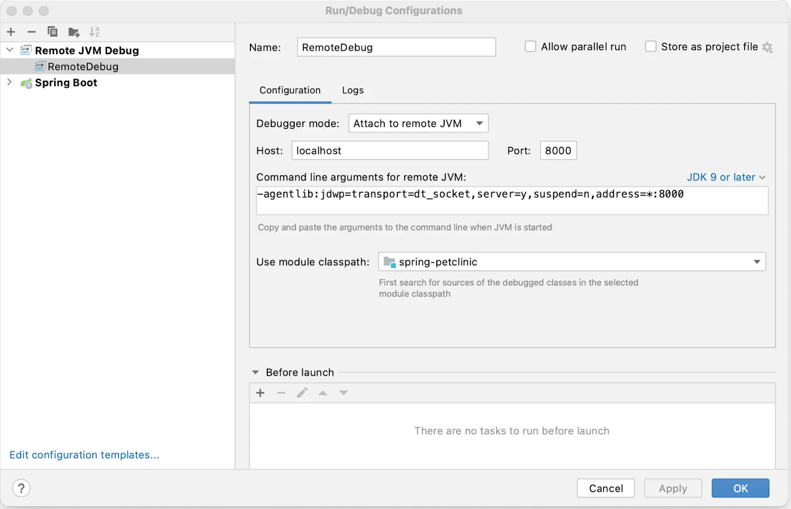
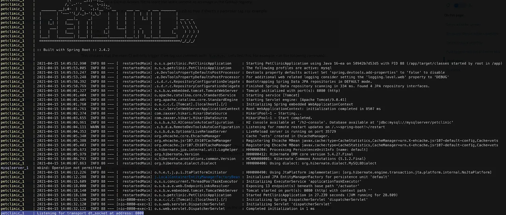
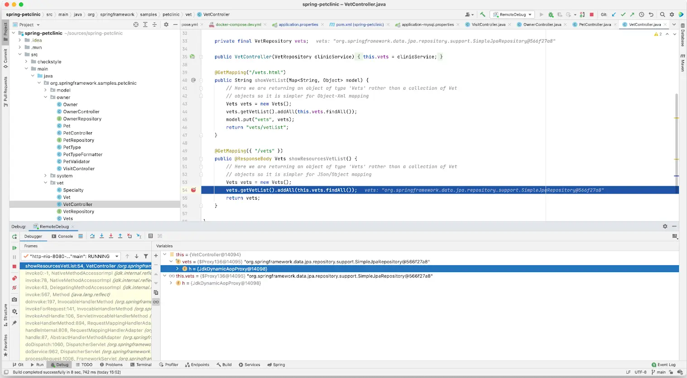

## Prerequisites

Work through the steps to containerize your application in [Containerize your app](containerize.md).

## Overview

In this section, you’ll walk through setting up a local development environment
for the application you containerized in the previous section. This includes:
  - Adding a local database and persisting data
  - Creating a development container to connect a debugger
  - Configuring Compose to automatically update your running Compose services as
   you edit and save your code


## Add a local database and persist data

You can use containers to set up local services, like a database. In this section, you'll update the `docker-compose.yaml` file to define a database service and a volume to persist data. Also, this particular application uses a system property to define the database type, so you'll need to update the `Dockerfile` to pass in the system property when starting the app.

In the cloned repository's directory, open the `docker-compose.yaml` file in an IDE or text editor. Your Compose file has an example database service, but it'll require a few changes for your unique app.

In the `docker-compose.yaml` file, you need to do the following:
- Uncomment all of the database instructions. You'll now use a database service
  instead of local storage for the data.
- Remove the top-level `secrets` element as well as the element inside the `db`
  service. This example uses the environment variable for the password rather than secrets.
- Remove the `user` element from the `db` service. This example specifies the
  user in the environment variable.
- Update the database environment variables. These are defined by the Postgres
  image. For more details, see the
  [Postgres Official Docker Image](https://hub.docker.com/_/postgres).
- Update the healthcheck test for the `db` service and specify the user. By
  default, the healthcheck uses the root user instead of the `petclinic` user
  you defined.
- Add the database URL as an environment variable in the `server` service. This
  overrides the default value defined in
  `spring-petclinic/src/main/resources/application-postgres.properties`.

The following is the updated `docker-compose.yaml` file. All comments have been removed.

```yaml {hl_lines="7-29"}
services:
  server:
    build:
      context: .
    ports:
      - 8080:8080
    depends_on:
      db:
        condition: service_healthy
    environment:
      - POSTGRES_URL=jdbc:postgresql://db:5432/petclinic
  db:
    image: postgres
    restart: always
    volumes:
      - db-data:/var/lib/postgresql/data
    environment:
      - POSTGRES_DB=petclinic
      - POSTGRES_USER=petclinic
      - POSTGRES_PASSWORD=petclinic
    ports:
      - 5432:5432
    healthcheck:
      test: [ "CMD", "pg_isready", "-U", "petclinic" ]
      interval: 10s
      timeout: 5s
      retries: 5
volumes:
  db-data:
```

Open the `Dockerfile` in an IDE or text editor. In the `ENTRYPOINT` instruction,
update the instruction to pass in the system property as specified in the
`spring-petclinic/src/resources/db/postgres/petclinic_db_setup_postgres.txt`
file.


```diff
- ENTRYPOINT [ "java", "org.springframework.boot.loader.launch.JarLauncher" ]
+ ENTRYPOINT [ "java", "-Dspring.profiles.active=postgres", "org.springframework.boot.loader.launch.JarLauncher" ]
```

Save and close all the files.

Now, run the following `docker compose up` command to start your application.

```console
$ docker compose up --build
```

Open a browser and view the application at [http://localhost:8080](http://localhost:8080). You should see a simple app for a pet clinic. Browse around the application. Navigate to **Veterinarians** and verify that the application is connected to the database by being able to list veterinarians.

In the terminal, press `ctrl`+`c` to stop the application.

## Dockerfile for development

The Dockerfile you have now is great for a small, secure production image with
only the components necessary to run the application. When developing, you may
want a different image that has a different environment.

For example, in the development image you may want to set up the image to start
the application so that you can connect a debugger to the running Java process.

Rather than managing multiple Dockerfiles, you can add a new stage. Your
Dockerfile can then produce a final image which is ready for production as well
as a development image.

Replace the contents of your Dockerfile with the following.

```dockerfile {hl_lines="22-29"}
# syntax=docker/dockerfile:1

FROM eclipse-temurin:17-jdk-jammy as deps
WORKDIR /build
COPY --chmod=0755 mvnw mvnw
COPY .mvn/ .mvn/
RUN --mount=type=bind,source=pom.xml,target=pom.xml \
    --mount=type=cache,target=/root/.m2 ./mvnw dependency:go-offline -DskipTests

FROM deps as package
WORKDIR /build
COPY ./src src/
RUN --mount=type=bind,source=pom.xml,target=pom.xml \
    --mount=type=cache,target=/root/.m2 \
    ./mvnw package -DskipTests && \
    mv target/$(./mvnw help:evaluate -Dexpression=project.artifactId -q -DforceStdout)-$(./mvnw help:evaluate -Dexpression=project.version -q -DforceStdout).jar target/app.jar

FROM package as extract
WORKDIR /build
RUN java -Djarmode=layertools -jar target/app.jar extract --destination target/extracted

FROM extract as development
WORKDIR /build
RUN cp -r /build/target/extracted/dependencies/. ./
RUN cp -r /build/target/extracted/spring-boot-loader/. ./
RUN cp -r /build/target/extracted/snapshot-dependencies/. ./
RUN cp -r /build/target/extracted/application/. ./
ENV JAVA_TOOL_OPTIONS -agentlib:jdwp=transport=dt_socket,server=y,suspend=n,address=*:8000
CMD [ "java", "-Dspring.profiles.active=postgres", "org.springframework.boot.loader.launch.JarLauncher" ]

FROM eclipse-temurin:17-jre-jammy AS final
ARG UID=10001
RUN adduser \
    --disabled-password \
    --gecos "" \
    --home "/nonexistent" \
    --shell "/sbin/nologin" \
    --no-create-home \
    --uid "${UID}" \
    appuser
USER appuser
COPY --from=extract build/target/extracted/dependencies/ ./
COPY --from=extract build/target/extracted/spring-boot-loader/ ./
COPY --from=extract build/target/extracted/snapshot-dependencies/ ./
COPY --from=extract build/target/extracted/application/ ./
EXPOSE 8080
ENTRYPOINT [ "java", "-Dspring.profiles.active=postgres", "org.springframework.boot.loader.launch.JarLauncher" ]
```

Save and close the `Dockerfile`.

In the `Dockerfile` you added a new stage labeled `development` based on the `extract` stage. In this stage, you copy the extracted files to a common directory, then run a command to start the application. In the command, you expose port 8000 and declare the debug configuration for the JVM so that you can attach a debugger.

## Use Compose to develop locally

The current Compose file doesn't start your development container. To do that, you must update your Compose file to target the development stage. Also, update the port mapping of the server service to provide access for the debugger.

Open the `docker-compose.yaml` and add the following instructions into the file.

```yaml {hl_lines=["5","8"]}
services:
  server:
    build:
      context: .
      target: development
    ports:
      - 8080:8080
      - 8000:8000
    depends_on:
      db:
        condition: service_healthy
    environment:
      - POSTGRES_URL=jdbc:postgresql://db:5432/petclinic
  db:
    image: postgres
    restart: always
    volumes:
      - db-data:/var/lib/postgresql/data
    environment:
      - POSTGRES_DB=petclinic
      - POSTGRES_USER=petclinic
      - POSTGRES_PASSWORD=petclinic
    ports:
      - 5432:5432
    healthcheck:
      test: [ "CMD", "pg_isready", "-U", "petclinic" ]
      interval: 10s
      timeout: 5s
      retries: 5
volumes:
  db-data:
```

Now, start your application and to confirm that it's running.

```console
$ docker compose up --build
```

Finally, test your API endpoint. Run the following curl command:

```console
$ curl  --request GET \
  --url http://localhost:8080/vets \
  --header 'content-type: application/json'
```

You should receive the following response:

```json
{"vetList":[{"id":1,"firstName":"James","lastName":"Carter","specialties":[],"nrOfSpecialties":0,"new":false},{"id":2,"firstName":"Helen","lastName":"Leary","specialties":[{"id":1,"name":"radiology","new":false}],"nrOfSpecialties":1,"new":false},{"id":3,"firstName":"Linda","lastName":"Douglas","specialties":[{"id":3,"name":"dentistry","new":false},{"id":2,"name":"surgery","new":false}],"nrOfSpecialties":2,"new":false},{"id":4,"firstName":"Rafael","lastName":"Ortega","specialties":[{"id":2,"name":"surgery","new":false}],"nrOfSpecialties":1,"new":false},{"id":5,"firstName":"Henry","lastName":"Stevens","specialties":[{"id":1,"name":"radiology","new":false}],"nrOfSpecialties":1,"new":false},{"id":6,"firstName":"Sharon","lastName":"Jenkins","specialties":[],"nrOfSpecialties":0,"new":false}]}
```

## Connect a Debugger

You’ll use the debugger that comes with the IntelliJ IDEA. You can use the community version of this IDE. Open your project in IntelliJ IDEA, go to the **Run** menu, and then **Edit Configuration**. Add a new Remote JVM Debug configuration similar to the following:



Set a breakpoint.

Open `src/main/java/org/springframework/samples/petclinic/vet/VetController.java` and add a breakpoint inside the `showResourcesVetList` function.

To start your debug session, select the **Run** menu and then **Debug _NameOfYourConfiguration_**.


You should now see the connection in the logs of your Compose application.



You can now call the server endpoint.

```console
$ curl --request GET --url http://localhost:8080/vets
```

You should have seen the code break on the marked line and now you are able to use the debugger just like you would normally. You can also inspect and watch variables, set conditional breakpoints, view stack traces and a do bunch of other stuff.



Press `ctrl+c` in the terminal to stop your application.

## Automatically update services

Use Compose Watch to automatically update your running Compose services as you
edit and save your code. For more details about Compose Watch, see
[Use Compose Watch](../../compose/file-watch.md).

Open your `docker-compose.yaml` file in an IDE or text editor and then add the
Compose Watch instructions. The following is the updated `docker-compose.yaml`
file.

```yaml {hl_lines="14-17"}
services:
  server:
    build:
      context: .
      target: development
    ports:
      - 8080:8080
      - 8000:8000
    depends_on:
      db:
        condition: service_healthy
    environment:
      - POSTGRES_URL=jdbc:postgresql://db:5432/petclinic
    develop:
      watch:
        - action: rebuild
          path: .
  db:
    image: postgres
    restart: always
    volumes:
      - db-data:/var/lib/postgresql/data
    environment:
      - POSTGRES_DB=petclinic
      - POSTGRES_USER=petclinic
      - POSTGRES_PASSWORD=petclinic
    ports:
      - 5432:5432
    healthcheck:
      test: [ "CMD", "pg_isready", "-U", "petclinic" ]
      interval: 10s
      timeout: 5s
      retries: 5
volumes:
  db-data:
```

Run the following command to run your application with Compose Watch.

```console
$ docker compose watch
```

Open a web browser and view the application at [http://localhost:8080](http://localhost:8080). You should see the Spring Pet Clinic home page.

Any changes to the application's source files on your local machine will now be automatically reflected in the running container.

Open `spring-petclinic/src/main/resources/templates/fragments/layout.html` in an IDE or text editor and update the `Home` navigation string by adding an exclamation mark.

```diff
-   <li th:replace="~{::menuItem ('/','home','home page','home','Home')}">
+   <li th:replace="~{::menuItem ('/','home','home page','home','Home!')}">

```

Save the changes to `layout.html` and then you can continue developing while the container automatically rebuilds.

After the container is rebuilt and running, refresh [http://localhost:8080](http://localhost:8080) and then verify that **Home!** now appears in the menu.

Press `ctrl+c` in the terminal to stop Compose Watch.

## Summary

In this section, you took a look at running a database locally and persisting the data. You also created a development image that contains the JDK and lets you attach a debugger. Finally, you set up your Compose file to expose the debugging port and configured Compose Watch to live reload your changes.

Related information:

 - [Compose file reference](/reference/compose-file/)
 - [Compose Watch](../../compose/file-watch.md)
 - [Dockerfile reference](/reference/dockerfile/)

## Next steps

In the next section, you’ll take a look at how to run unit tests in Docker.


