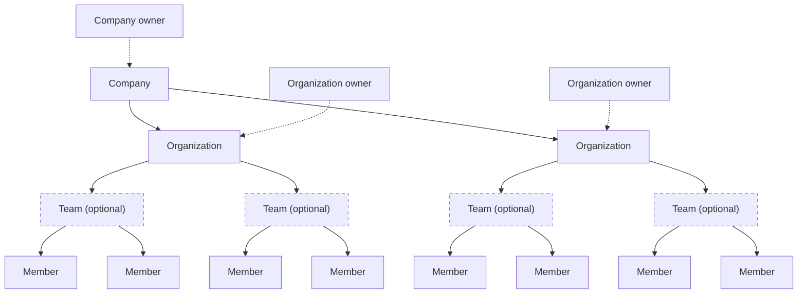



A company groups multiple Docker organizations for centralized configuration
and provides a single point of visibility across those organizations.
Organization owners with a Docker Business subscription can create a company
and manage it through Docker Home.

## Company structure

A company sits at the top of the hierarchy and groups multiple Docker
organizations for centralized configuration. Companies are only available
for Docker Business subscribers.

The following diagram shows how a company groups organizations, optional
teams, and members.

An organization sits below the company. You group teams and members there
and assign access to repositories. Every Docker Team and Business
subscriber has at least one organization.

For organization structure, including teams and members, see
[Organization accounts](/manuals/accounts/organization/_index.md).

[Upgrading to a Docker Business plan](https://www.docker.com/pricing?ref=Docs&refAction=DocsAdmin)
grants you the company owner role so you can manage multiple organizations.

## Company roles

A company includes one or more company owners. The creator of a company
becomes both a company owner and an organization owner, and occupies a seat
as organization owner. After creation, a company can have multiple owners,
and each owner has visibility across the entire company. They can manage
settings for every organization under it and have the same access rights as
organization owners.

- A company can have up to ten unique company owners.
- Company owners don't occupy a seat unless one of the following applies:
  - They're added as a member of an organization under the company.
  - SSO is enabled and the company owner signs in through SSO, which
    automatically adds them as an organization member.

To add or remove company owners, see
[Manage your company](/manuals/accounts/company/manage.md#company-owners).

## Next steps

Learn how to create and manage a company in the following sections.


