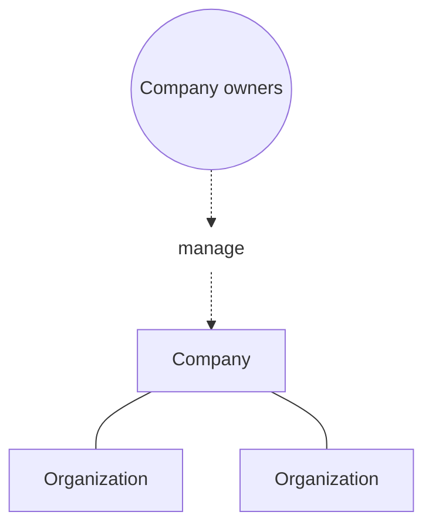



A company groups multiple Docker organizations so you can configure settings
in one place and view those organizations together. Organization owners with a Docker
Business subsription can create a company in [Docker Home](https://app.docker.com/).

## Company structure

A company sits above its organizations so company owners manage the company and all organizations within the company.
Each organization keeps its own members, teams, repositories, and billing.
Shared configuration, such as SSO and SCIM, applies at the company.

The following diagram shows that hierarchy.

Docker Team and Business subscriptions use an organization as the workspace.
To group more than one organization, [upgrade to Docker
Business](https://www.docker.com/pricing?ref=Docs&refAction=DocsAdmin) and
create a company. Creating the company makes you a company owner. The
organization you start from moves under the company, and you remain an
organization owner there.

For members, teams, and repositories inside an organization, see
[Organization accounts](/manuals/accounts/organization/_index.md).

## Company roles

Company owners have full administrative access across the organizations in
the company. They can manage company settings and the same
organization-management work as organization owners. Content and registry
permissions, such as repository pull and push, don't apply to the company
owner role. For the permission comparison, see
[Core roles](/manuals/security/roles-and-permissions/core-roles.md).

You can assign 10 company owner roles without occupying a purchased seat.
A company owner occupies a seat when they're also a member of an
organization under the company. For those cases, see
[Do company owners occupy a subscription
seat?](/manuals/faqs/accounts.md#do-company-owners-occupy-a-subscription-seat).

To add or remove company owners, see
[Manage your company](/manuals/accounts/company/manage.md#company-owners).

## Next steps

Learn how to create and manage a company in the following sections.


