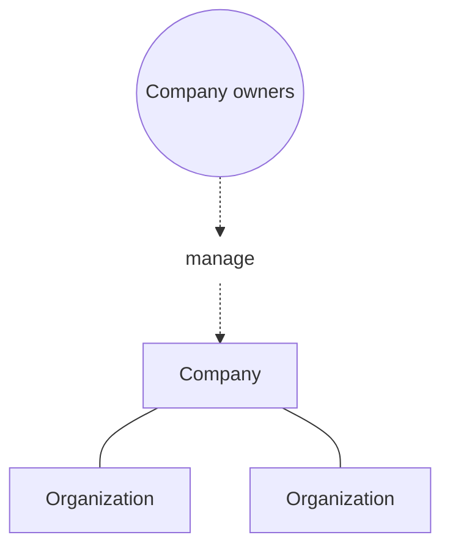



A company is where you configure sign-in and administration for multiple
Docker organizations.

> [!TIP]
>
> Organization owners with a Docker Business
> subscription can [create a company](./new-company.md) in
> [Docker Home](https://app.docker.com/).

## Company roles

The following diagram shows the hierarchy between companies and organizations.

 A company lets you:

- Administer every organization in the company through up to 10 company
  owners who don't occupy a purchased seat. Without a company, each
  organization's owners occupy a seat in that organization.
- Configure SSO and SCIM once for every organization in the company
- Verify your domains once at the company instead of in each organization.
  When you turn on auto-provisioning for a domain, you choose which
  organization new users join
- View members and invitations from every organization in one list, and
  export that list as a CSV

## Next steps

Learn how to create and manage a company in the following sections.


