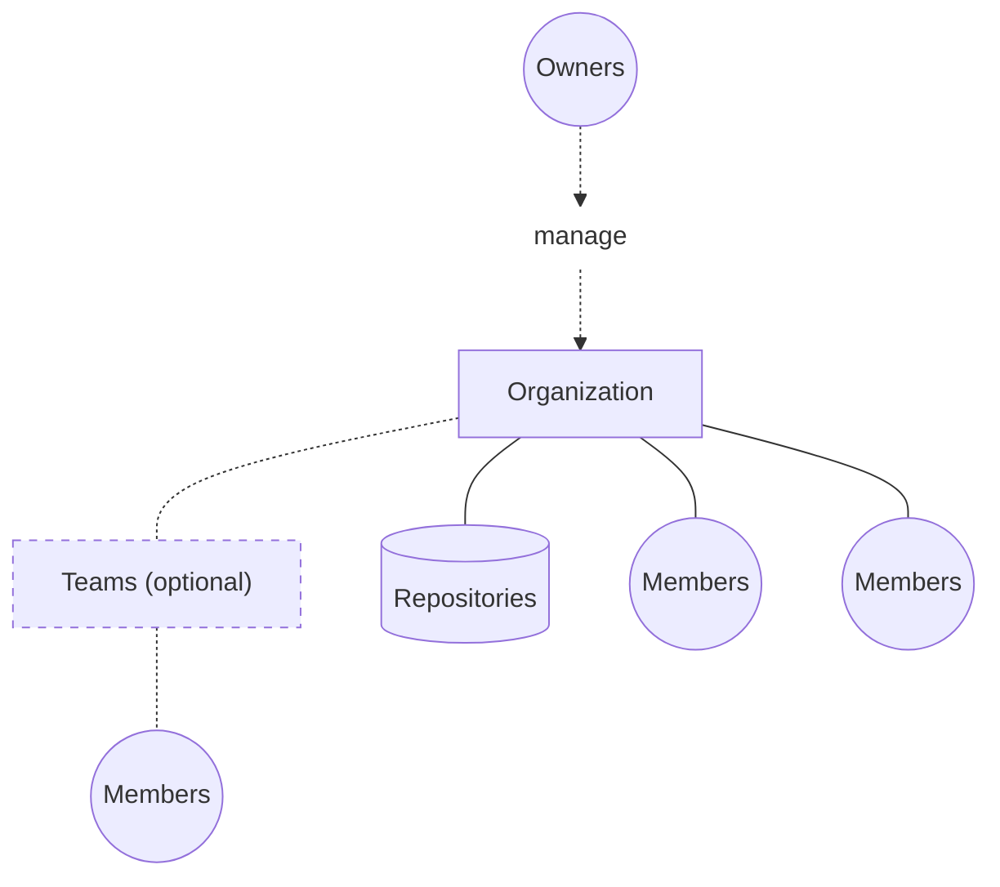

A Docker organization is a shared workspace for members and repositories
under one namespace. You manage it in [Docker Home](https://app.docker.com/).
Organization owners administer membership, access, and security.

For how individual, organization, and company accounts compare, see
[Accounts](/manuals/accounts/_index.md). For individual accounts, see
[Docker individual accounts](/manuals/accounts/individual/_index.md).
To create, convert, or onboard an organization, see
[Set up a Docker organization](/manuals/accounts/organization/setup/_index.md).

## Organization structure

Owners manage the organization. The organization contains repositories and
members. Teams are an optional way to group some of those members. The
members beside the repositories belong to the organization without joining
a team.

The following diagram shows that hierarchy.

### Owners

Organization owners administer the organization. They invite members, assign
roles, and manage teams and repositories.

For each role and its permissions, see
[Roles and
permissions](/manuals/security/roles-and-permissions/_index.md).

### Members

A member is a Docker user added to the organization. Organization and company
owners assign a role to each member. That role sets organization-wide access.
Team permissions can grant extra access to specific repositories.

### Teams

Teams group members so you can grant repository access to many people at
once. Use a team when several members need the same repositories. Members
don't have to join a team.

For how companies relate to organizations, see
[Company structure](/manuals/accounts/company/_index.md#company-structure).

## Next steps

Learn how to manage organizations in the following sections.


