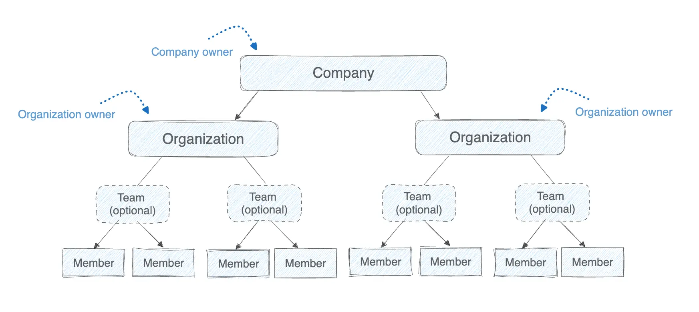

Administrators can manage companies and organizations using
[Docker Home](https://app.docker.com). Docker Home provides centralized
observability, access management, and security controls across Docker
environments. It lets you:

- Create and manage companies and organizations
- Assign roles and permissions to members
- Group members into teams to manage access by project or role
- Set company-wide policies, including SCIM provisioning and security
  enforcement

## Company and organization hierarchy

To provide centralized administration, Docker organizes companies and
organizations into the following hierarchy and roles.

### Company

A company groups multiple Docker organizations for centralized configuration. A
company owner can view and manage every organization in the company and its
company-wide settings, with the same access rights as an organization owner. For
the company owner role and how it affects seats, see
[Company owners](/manuals/admin/company/_index.md#company-owners).

Companies are only available for Docker Business subscribers.

### Organization

Organization owners have the organization owner administrator role available. They can manage organization settings, users, and access controls, but occupy a [seat](/manuals/admin/organization/organization-faqs.md#what-is-the-difference-between-user-invitee-seat-and-member).

- An organization contains teams and repositories.
- All Docker Team and Business subscribers must have at least one organization.

[Upgrading to a Docker Business plan](https://www.docker.com/pricing?ref=Docs&refAction=DocsAdmin) grants you the company owner role so you can manage multiple organizations.

### Team

Teams are optional and let you group members to assign repository permissions
collectively. Teams simplify permission management across projects
or functions.

### Member

A member is any Docker user added to an organization. Organization and company
owners can assign roles to members to define their level of access.

## What's next

Learn how to manage companies and organizations in the following sections.


