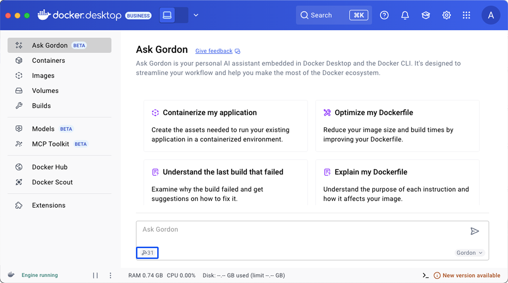
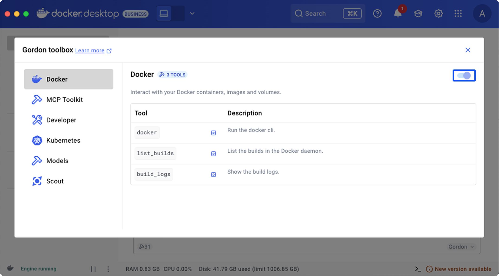

Gordon comes with an integrated toolbox providing access to various system tools
and capabilities. These tools extend Gordon's functionality by allowing it to
interact with the Docker Engine, Kubernetes, Docker Scout's security scanning,
and other developer utilities. This documentation covers the available tools,
their configuration, and usage patterns.

## Configuration

Tools can be configured globally in the toolbox, making them accessible
throughout the Gordon interfaces, including both Docker Desktop and the CLI.

To configure:

1. On the **Ask Gordon** view in Docker Desktop, select the `Toolbox` button in the bottom left of the input area.

   

2. To enable or disable a tool, select it in the left-menu and select the toggle.

   

   For more information on the available Docker tools, see [Reference](#reference).

## Usage examples

This section provides task-oriented examples for common operations with Gordon
tools.

### Managing Docker containers

#### List and monitor containers

```console
# List all running containers
$ docker ai "Show me all running containers"

# List containers using specific resources
$ docker ai "List all containers using more than 1GB of memory"

# View logs from a specific container
$ docker ai "Show me logs from my running api-container from the last hour"
```

#### Manage container lifecycle

```console
# Run a new container
$ docker ai "Run a nginx container with port 80 exposed to localhost"

# Stop a specific container
$ docker ai "Stop my database container"

# Clean up unused containers
$ docker ai "Remove all stopped containers"
```

### Working with Docker images

```console
# List available images
$ docker ai "Show me all my local Docker images"

# Pull a specific image
$ docker ai "Pull the latest Ubuntu image"

# Build an image from a Dockerfile
$ docker ai "Build an image from my current directory and tag it as myapp:latest"

# Clean up unused images
$ docker ai "Remove all my unused images"
```

### Managing Docker volumes

```console
# List volumes
$ docker ai "List all my Docker volumes"

# Create a new volume
$ docker ai "Create a new volume called postgres-data"

# Backup data from a container to a volume
$ docker ai "Create a backup of my postgres container data to a new volume"
```

### Kubernetes operations

```console
# Create a deployment
$ docker ai "Create an nginx deployment and make sure it's exposed locally"

# List resources
$ docker ai "Show me all deployments in the default namespace"

# Get logs
$ docker ai "Show me logs from the auth-service pod"
```

### Security analysis


```console
# Scan for CVEs
$ docker ai "Scan my application for security vulnerabilities"

# Get security recommendations
$ docker ai "Give me recommendations for improving the security of my nodejs-app image"
```

### Development workflows

```console
# Analyze and commit changes
$ docker ai "Look at my local changes, create multiple commits with sensible commit messages"

# Review branch status
$ docker ai "Show me the status of my current branch compared to main"
```

## Reference

This section provides a comprehensive listing of the built-in tools you can find
in Gordon's toolbox.

### Docker tools

Tools to interact with your Docker containers, images, and volumes.

#### Container management

| Name          | Description                            |
|---------------|----------------------------------------|
| `docker`      | Access to the Docker cli               |
| `list_builds` | List the builds in the Docker daemon   |
| `build_logs`  | Show the build logs.                   |

#### Volume management

| Tool | Description |
|------|-------------|
| `list_volumes` | List all Docker volumes |
| `remove_volume` | Remove a Docker volume |
| `create_volume` | Create a new Docker volume |

#### Image management

| Tool | Description |
|------|-------------|
| `list_images` | List all Docker images |
| `remove_images` | Remove Docker images |
| `pull_image` | Pull an image from a registry |
| `push_image` | Push an image to a registry |
| `build_image` | Build a Docker image |
| `tag_image` | Tag a Docker image |
| `inspect` | Inspect a Docker object |

### Kubernetes tools

Tools to interact with your Kubernetes cluster

#### Pods

| Tool | Description |
|------|-------------|
| `list_pods` | List all pods in the cluster |
| `get_pod_logs` | Get logs from a specific pod |

#### Deployment management


| Tool | Description |
|------|-------------|
| `list_deployments` | List all deployments |
| `create_deployment` | Create a new deployment |
| `expose_deployment` | Expose a deployment as a service |
| `remove_deployment` | Remove a deployment |

#### Service management

| Tool | Description |
|------|-------------|
| `list_services` | List all services |
| `remove_service` | Remove a service |

#### Cluster information

| Tool | Description |
|------|-------------|
| `list_namespaces` | List all namespaces |
| `list_nodes` | List all nodes in the cluster |

### Docker Scout tools

Security analysis tools powered by Docker Scout.

| Tool | Description |
|------|-------------|
| `search_for_cves` | Analyze a Docker image, a project directory, or other artifacts for vulnerabilities using Docker Scout CVEs.search for cves |
| `get_security_recommendations` | Analyze a Docker image, a project directory, or other artifacts for base image update recommendations using Docker Scout. |

### Developer tools

General-purpose development utilities.

| Tool | Description |
|------|-------------|
| `fetch` | Retrieve content from a URL |
| `get_command_help` | Get help for CLI commands |
| `run_command` | Execute shell commands |
| `filesystem` | Perform filesystem operations |
| `git` | Execute git commands |

### AI model tools

| Tool | Description |
|------|-------------|
| `list_models` | List all available Docker models |
| `pull_model` | Download an Docker model |
| `run_model` | Query a model with a prompt |
| `remove_model` | Remove an Docker model |

### Docker MCP Catalog

If you have enabled the [MCP Toolkit feature](../../mcp-catalog-and-toolkit/_index.md), 
all the tools you have enabled and configured are available for Gordon to use.
