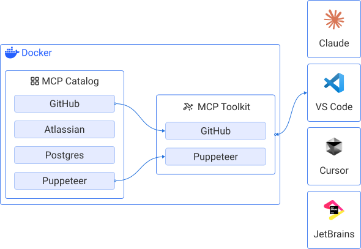
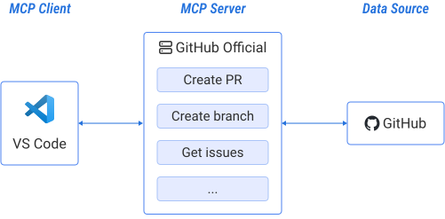



[Model Context Protocol](https://modelcontextprotocol.io/introduction) (MCP) is
an open protocol that standardizes how applications provide context and
additional functionality to large language models. MCP functions as a
client-server protocol, where the client, for example an application such as [Gordon](/manuals/ai/gordon/_index.md) or Claude Desktop, sends requests, and the server processes those requests to deliver the necessary context to the AI.

Docker MCP Catalog and Toolkit is a solution for securely building, sharing, and
running MCP tools. It simplifies the developer experience across the following areas:

- Discovery: A central catalog with verified, versioned tools.
- Credential management: OAuth-based and secure by default.
- Execution: Tools run in isolated, containerized environments.
- Portability: Use MCP tools across Claude, Cursor, Visual Studio Code, and more—no code
  changes needed.

With Docker Hub and the MCP Toolkit, you can:

- Launch MCP servers in seconds.
- Add tools using the CLI or GUI.
- Rely on Docker's pull-based infrastructure for trusted delivery.

## MCP servers

MCP servers are systems that use the [Model Context Protocol](https://modelcontextprotocol.io/introduction) (MCP) to help manage
and run AI or machine learning models more efficiently. MCP allows different
parts of a system, like the model, data, and runtime environment, to
communicate in a standardized way. You can see them as
add-ons that provide specific tools to an LLM.

> [!TIP]
> Example:
> If you work in Visual Studio Code's _agent mode_ and ask it to create a
> branch in GitHub, it needs an MCP server provided by GitHub to do that.
>
> The MCP server provided by GitHub provides _tools_ to your model to perform
> atomic actions, like:
>
> - `Create a PR`
> - `Create a branch`
> - ...
>

## Learn more


