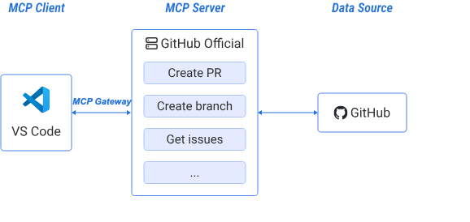



[Model Context Protocol](https://modelcontextprotocol.io/introduction) (MCP) is
an open protocol that standardizes how applications provide context and
additional functionality to large language models. Through a client-server architecture, applications such as [Gordon](/manuals/ai/gordon/_index.md) or Claude Desktop act as clients that send requests to MCP servers, which then process these requests and deliver the necessary context to AI models.

Building and managing MCP tools can be complex. Docker MCP Catalog and Toolkit simplifies this by providing a secure, streamlined way to build, share, and run MCP tools, addressing common challenges developers face.

Docker MCP Catalog and Toolkit simplifies the developer experience across the following areas:

- Discovery: Centralized discovery through a verified catalog of versioned tools.
- Credential management: Secure credential management with OAuth-based authentication.
- Execution: Safe execution by running tools in isolated, containerized environments.
- Portability: True portability. MCP tools work seamlessly across Claude, Cursor, Visual Studio Code, and other platforms without requiring code changes.

This integrated approach means you can launch MCP servers in seconds, add new tools through either CLI or GUI interfaces, and rely on Docker's pull-based infrastructure for trusted delivery of your tools.

  

To understand how Docker MCP Catalog and Toolkit achieves this streamlined experience, let's explore the underlying architecture and how its key components work together.

## MCP architecture overview

MCP follows a client-server architecture that enables standardized communication between AI applications and external tools. This foundational understanding helps you build and integrate MCP solutions effectively.

### MCP servers

MCP servers are systems that use the [Model Context Protocol](https://modelcontextprotocol.io/introduction) to help manage
and run AI or machine learning models more efficiently. MCP allows different
parts of a system, like the model, data, and runtime environment, to
communicate in a standardized way. You can see them as
add-ons that provide specific tools to an LLM.

### MCP clients

MCP clients are the bridge between AI applications and MCP servers. They enable AI systems to discover, connect to, and interact with external tools and data sources through the standardized MCP protocol. Each client maintains a dedicated one-to-one relationship with a specific MCP server, enabling secure and isolated communication.

When you interact with an AI application that supports MCP, the client establishes connections to configured servers, discovers available tools and resources, executes requests when needed, and manages contextual information to enhance AI responses.

### MCP Gateway

The [MCP Gateway](/manuals/ai/mcp-catalog-and-toolkit/mcp-gateway.md) is Docker's open-source solution which connects MCP servers to MCP clients. It provides a unified endpoint that consolidates multiple MCP servers from the Docker MCP Catalog into a single, manageable connection point. Instead of clients connecting directly to individual MCP servers, the MCP Gateway sits in between, providing centralized connectivity, secure layer, and enterprise controls.

In the context of MCP Catalog and Toolkit:

-  MCP Catalog provides the MCP servers (the tools/capabilities)
-  MCP Gateway orchestrates and secures those servers
-  MCP clients connect through the Gateway to access the servers

## How MCP components work together

MCP components communicate through a structured flow that connects your development environment to external services. The following diagram shows how MCP works in practice with the key components:

1. The MCP client (VS Code) serves as your development environment where you interact with AI assistance.
2. The MCP Gateway acts as a secure orchestration layer, managing and routing connection between the client (VS Code) and the GitHub Official MCP server.
3. The MCP server acts as the bridge, providing specialized capabilities. In the following example, the GitHub Official server offers tools like creating pull requests, creating branches, and retrieving issues.
4. The data source (GitHub) provides the actual service or platform that the MCP server connects to for real-time information and actions.

This architecture enables seamless integration where you can access GitHub functionality directly from VS Code through standardized MCP communication. The server translates requests between your development environment and external services, making it easy to incorporate various tools and data sources into your AI-assisted workflow without complex custom integrations.

  

> [!TIP]
> Example:
> If you work in Visual Studio Code's _agent mode_ and ask it to create a
> branch in GitHub, it needs an MCP server provided by GitHub to do that.
>
> The MCP server provided by GitHub provides _tools_ to your model to perform
> atomic actions, like:
>
> - `Create a PR`
> - `Create a branch`
> - ...
>

## Learn more


