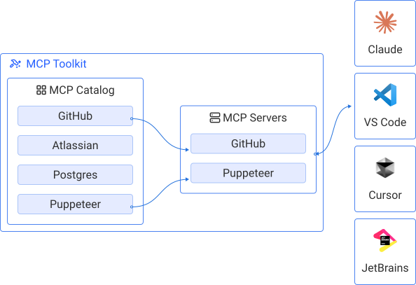



[Model Context Protocol](https://modelcontextprotocol.io/introduction) (MCP) is
an open protocol that standardizes how applications provide context and
additional functionality to large language models. MCP functions as a
client-server protocol, where the client, for example an application such as [Gordon](/manuals/ai/gordon/_index.md) or Claude Desktop, sends requests, and the server processes those requests to deliver the necessary context to the AI.

Docker MCP Catalog and Toolkit is a solution for securely building, sharing, and
running MCP tools. It simplifies the developer experience across the following areas:

- Discovery: A central catalog with verified, versioned tools.
- Credential management: OAuth-based and secure by default.
- Execution: Tools run in isolated, containerized environments.
- Portability: Use MCP tools across Claude, Cursor, Visual Studio Code, and more—no code
  changes needed.

With Docker Hub and the MCP Toolkit, you can:

- Launch MCP servers in seconds.
- Add tools using the CLI or GUI.
- Rely on Docker's pull-based infrastructure for trusted delivery.

## MCP servers

MCP follows a client-server architecture that enables standardized communication between AI applications and external tools. Understanding this concept helps you build and integrate MCP solutions effectively.

MCP servers are systems that use the [Model Context Protocol](https://modelcontextprotocol.io/introduction) to help manage
and run AI or machine learning models more efficiently. MCP allows different
parts of a system, like the model, data, and runtime environment, to
communicate in a standardized way. You can see them as
add-ons that provide specific tools to an LLM.

## MCP clients

MCP clients are the bridge between AI applications and MCP servers. They enable AI systems to discover, connect to, and interact with external tools and data sources through the standardized MCP protocol. Each client maintains a dedicated one-to-one relationship with a specific MCP server, enabling secure and isolated communication.

When you interact with an AI application that supports MCP, the client establishes connections to configured servers, discovers available tools and resources, executes requests when needed, and manages contextual information to enhance AI responses.

## How MCP components work together

MCP components communicate through a structured flow that connects your development environment to external services. The following diagram shows how MCP works in practice with three key components:

1. The MCP client (VS Code) serves as your development environment where you interact with AI assistance.
1. The MCP server acts as the bridge, providing specialized capabilities. In the following example, the GitHub Official server offers tools like creating pull requests, creating branches, and retrieving issues.
1. The data source (GitHub) provides the actual service or platform that the MCP server connects to for real-time information and actions.

This architecture enables seamless integration where you can access GitHub functionality directly from VS Code through standardized MCP communication. The server translates requests between your development environment and external services, making it easy to incorporate various tools and data sources into your AI-assisted workflow without complex custom integrations.

  

> [!TIP]
> Example:
> If you work in Visual Studio Code's _agent mode_ and ask it to create a
> branch in GitHub, it needs an MCP server provided by GitHub to do that.
>
> The MCP server provided by GitHub provides _tools_ to your model to perform
> atomic actions, like:
>
> - `Create a PR`
> - `Create a branch`
> - ...
>

## Local and Remote MCP servers

The Docker MCP Catalog supports two types of servers: local and remote. Understanding the differences between these server types helps you choose the right approach for your workflow.

### Local MCP servers

Local MCP servers are containerized applications that run directly on your machine within Docker Desktop. All local servers are built and digitally signed by Docker, providing enhanced security through verified provenance and integrity. These servers run as containers on your local Docker Desktop environment and work without internet connectivity once downloaded. In Docker Desktop, local servers display a Docker whale logo to indicate they are built by Docker.

### Remote MCP servers

Remote MCP servers are hosted services that you connect to through the internet, typically managed by the original service providers. These servers are maintained and updated by the service provider, ensuring you always have access to the latest features and data without manual updates. In Docker Desktop, remote servers display a cloud icon to indicate their hosted nature.

The key advantage of remote servers is their ability to provide always up-to-date capabilities with no local resource usage or storage requirements. They also offer direct access to live data and services.

## Learn more


