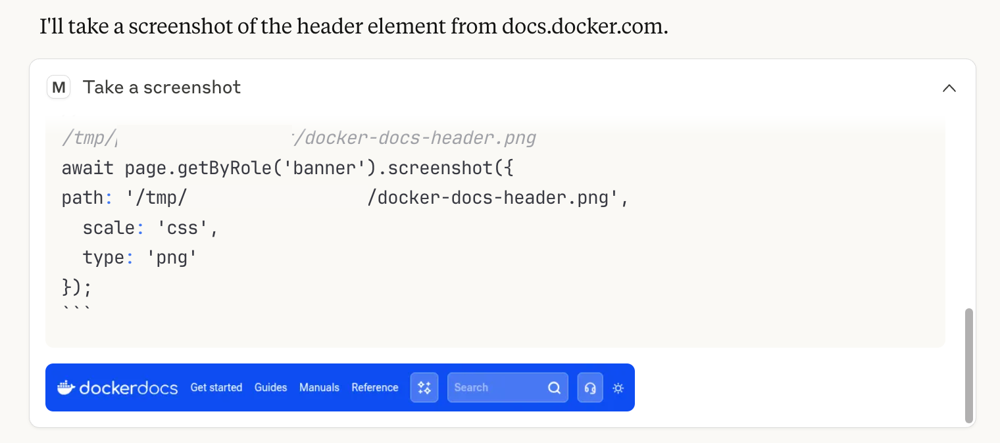



Docker Model Context Protocol (MCP) Toolkit makes it easy to set up, manage, and run containerized MCP servers, and connect them to AI agents. It provides secure defaults, one-click setup, and support for a growing ecosystem of LLM-based clients. This page shows you how to get started quickly with the Docker MCP Toolkit.

## Requirements

Before you begin, make sure you meet the following requirements to get started with Docker MCP Toolkit.

### Download and install Docker Desktop

- Install [Docker Desktop version 4.42.0](/manuals/desktop/release-notes.md#4420) and later.
- To try the MCP Toolkit Learning center walkthrough, you must install [Docker Desktop version 4.46.0](/manuals/desktop/release-notes.md#4460) and later.

### Enable Docker MCP Toolkit

1. Open the Docker Desktop settings and select **Beta features**.
2. Select **Enable Docker MCP Toolkit**.
3. Select **Apply**.

There are multiple ways to get started with Docker MCP Toolkit. You can:
-  Try the [Learning center](#learning-center) walkthrough in Docker Desktop, available in [Docker Desktop version 4.46.0](/manuals/desktop/release-notes.md#4460) and later.
-  Alternatively, follow the step-by-step instructions on this page to use Docker Desktop or the CLI to [Install an MCP server](#install-an-mcp-server), [add a client, and test your setup](#install-an-mcp-client-and-test-your-setup) with example prompts.

## Learning center

The **Learning center** in Docker Desktop provides walkthroughs and resources to help you get started with Docker products and features.

On the **MCP Toolkit** page, Docker Desktop shows the **Get started** walkthrough that guides you through installing an MCP server, connecting a client, and testing your setup.

## Install an MCP server




1. In Docker Desktop, select **MCP Toolkit** and select the **Catalog** tab.
2. Search for the **GitHub Official** server from the catalog and then select the plus icon to add it.
3. In the **GitHub Official** server page, select the **Configuration** tab and select **OAuth**.

   >[!NOTE]
   >
   > The type of configuration required depends on the server you select. For the GitHub Official server, you must authenticate using OAuth.

   Your browser opens the GitHub authorization page. Follow the on-screen instructions to [authenticate via OAuth](/manuals/ai/mcp-catalog-and-toolkit/toolkit.md#authenticate-via-oauth).

4. Return to Docker Desktop when the authentication process is complete.
5. Search for the **Playwright** server from the catalog and add it.




1. Add the GitHub Official MCP server. Run:

   ```console
   $ docker mcp server enable github-official
   ```

2. Authenticate the server by running the following command:

   ```console
   $ docker mcp oauth authorize github
   ```

   >[!NOTE]
   >
   > The type of configuration required depends on the server you select. For the GitHub Official server, you must authenticate using OAuth.

   Your browser opens the GitHub authorization page. Follow the on-screen instructions to [authenticate via OAuth](/manuals/ai/mcp-catalog-and-toolkit/toolkit.md#authenticate-via-oauth).

3. Add the **Playwright** server. Run:

   ```console
   $ docker mcp server enable playwright
   ```



You’ve now successfully added an MCP server. Next, install an MCP client and test your setup with an example prompt.


## Install an MCP client and test your setup

After you've installed MCP servers, you can add clients to the MCP Toolkit. These clients can interact with the installed MCP servers, turning the MCP Toolkit into a gateway. In the following section, let’s add the Claude Desktop client.




1. In Docker Desktop, select **MCP Toolkit** and select the **Clients** tab.
2. Find **Claude Desktop** and select **Connect**.

   If Claude Desktop isn't installed, select **Download** to install it, then select **Connect**.
3. Restart Claude Desktop if it's running, and it can now access all the servers in the MCP Toolkit.
4. Open Claude Desktop and run a test by submitting the following prompt using the Sonnet Opus 4.1 model:

   ```text
   Take a screenshot of the header element on docs.docker.com
   ```
   Claude prompts you for permissions and shares a screenshot of the header element from the Docker documentation page.

   





1. In a terminal window, run the following commands to connect the Claude Desktop client:

   ```console
   $ docker mcp client connect claude-desktop --global
   ```
2. Restart Claude Desktop if it's running, and it can now access all the servers in the MCP Toolkit.
3. Open Claude Desktop and run a test by submitting the following prompt using the Sonnet 4 model:

   ```text
   Take a screenshot of the header element on docs.docker.com
   ```
   Claude prompts you for permissions and shares a screenshot of the header element from the Docker documentation page.

   




## Related pages

- [MCP Toolkit](/manuals/ai/mcp-catalog-and-toolkit/toolkit.md)
- [MCP Catalog](/manuals/ai/mcp-catalog-and-toolkit/catalog.md)
- [Open-source MCP Gateway](/manuals/ai/mcp-gateway/_index.md)
