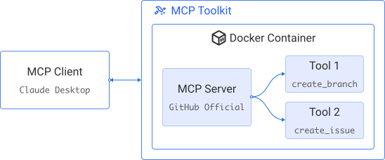
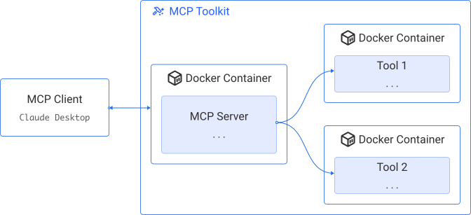



The Docker MCP Toolkit is a gateway that lets you set up, manage, and run
containerized MCP servers and connect them to AI agents. It removes friction
from tool usage by offering secure defaults, one-click setup, and support for a
growing ecosystem of LLM-based clients. It is the fastest way from MCP tool
discovery to local execution.

> [!NOTE]
> If you need to run your own MCP gateway,
> see [Docker MCP Gateway](../mcp-gateway/_index.md).

## Key features

- Cross-LLM compatibility: Instantly works with Claude Desktop, Cursor, Continue.dev, and [Gordon](/manuals/ai/gordon/_index.md).
- Integrated tool discovery: Browse and launch MCP servers from the Docker MCP Catalog directly in Docker Desktop.
- Zero manual setup: No dependency management, runtime configuration, or server setup required.
- Functions as both an MCP server aggregator and a gateway for clients to access installed MCP servers.

## How the MCP Toolkit works

MCP introduces two core concepts: MCP clients and MCP servers.

- MCP clients are typically embedded in LLM-based applications, such as the
  Claude Desktop app. They request resources or actions.
- MCP servers are launched by the client to perform the requested tasks, using
  any necessary tools, languages, or processes.

Docker standardizes the development, packaging, and distribution of
applications, including MCP servers. By packaging MCP servers as containers,
Docker eliminates issues related to isolation and environment differences. You
can run a container directly, without managing dependencies or configuring
runtimes.

Depending on the MCP server, the tools it provides might run within the same
container as the server or in dedicated containers:














>[!NOTE]
>
> The Docker MCP Toolkit was originally released as an extension. This extension is now deprecated and should be uninstalled.

## Security

The Docker MCP Toolkit combines passive and active measures to reduce attack
surfaces and ensure safe runtime behavior.

### Passive security

- Image signing and attestation: All MCP server images under `mcp/` in the [catalog](catalog.md)
  are built by Docker and digitally
  signed to verify their source and integrity. Each image includes a Software
  Bill of Materials (SBOM) for full transparency.

### Active security

Security at runtime is enforced through resource and access limitations:

- CPU allocation: MCP tools are run in their own container. They are
  restricted to 1 CPU, limiting the impact of potential misuse of computing
  resources.

- Memory allocation: Containers for MCP tools are limited to 2 GB.

- Filesystem access: By default, MCP Servers have no access to the host filesystem.
  The user explicitly selects the servers that will be granted file mounts.

- Interception of tool requests: Requests to and from tools that contain sensitive
  information such as secrets are blocked.

To learn more about the MCP server catalog, see [Catalog](catalog.md).

### Example: Use the **GitHub Official** MCP server

Imagine you want to enable [Ask Gordon](/manuals/ai/gordon/_index.md) to interact with your GitHub account:

1. From the **MCP Toolkit** menu, select the **Catalog** tab and find
   the **GitHub Official** server and add it.
2. In the server's **Config** tab, [connect via OAuth](#authenticate-via-oauth).
3. In the **Clients** tab, ensure Gordon is connected.
4. From the **Ask Gordon** menu, you can now send requests related to your
   GitHub account, in accordance to the tools provided by the GitHub Official server. To test it, ask Gordon:

   ```text
   What's my GitHub handle?
   ```

   Make sure to allow Gordon to interact with GitHub by selecting **Always allow** in Gordon's answer.

> [!TIP]
> By default, the Gordon client is enabled,
> which means Gordon can automatically interact with your MCP servers.


### Example: Use Claude Desktop as a client

Imagine you have Claude Desktop installed, and you want to use the GitHub MCP server,
and the Puppeteer MCP server, you do not have to install the servers in Claude Desktop.
You can simply install these 2 MCP servers in the MCP Toolkit,
and add Claude Desktop as a client:

1. From the **MCP Toolkit** menu, select the **Catalog** tab and find the **Puppeteer** server and add it.
1. Repeat for the **GitHub Official** server.
1. From the **Clients** tab, select **Connect** next to **Claude Desktop**. Restart
   Claude Desktop if it's running, and it can now access all the servers in the MCP Toolkit.
1. Within Claude Desktop, run a test by submitting the following prompt using the Sonnet 3.5 model:

   ```text
   Take a screenshot of docs.docker.com and then invert the colors
   ```

### Example: Use Visual Studio Code as a client

You can interact with all your installed MCP servers in Visual Studio Code:

<!-- vale off -->

1. To enable the MCP Toolkit:


   
   

   1. Insert the following in your Visual Studio Code's User`mcp.json`:

      ```json
      "mcp": {
       "servers": {
         "MCP_DOCKER": {
           "command": "docker",
           "args": [
             "mcp",
             "gateway",
             "run"
           ],
           "type": "stdio"
         }
       }
      }
      ```

   
   

   1. In your terminal, navigate to your project's folder.
   1. Run:

      ```bash
      docker mcp client connect vscode
      ```

      > [!NOTE]
      > This command creates a `.vscode/mcp.json` file in the current directory. We
      > recommend you add it to your  `.gitignore` file.

  
  

1. In Visual Studio Code, open a new Chat and select the **Agent** mode:

   

1. You can also check the available MCP tools:

   

For more information about the Agent mode, see the
[Visual Studio Code documentation](https://code.visualstudio.com/docs/copilot/chat/mcp-servers#_use-mcp-tools-in-agent-mode).

<!-- vale on -->

## Authenticate via OAuth

You can connect the MCP Toolkit to your development workflow via
OAuth integration. For now, the MCP Toolkit only supports GitHub OAuth.

1. On https://github.com/, ensure you are signed in.
1. In Docker Desktop, select **MCP Toolkit** and select the **OAuth** tab.
1. In the GitHub entry, select **Authorize**. Your browser opens the GitHub authorization page.
1. In the GitHub authorization page, select **Authorize Docker**. Once the authorization
   is successful, you are automatically redirected to Docker Desktop.
1. Install the **GitHub Official** MCP server, see [Install an MCP server](/manuals/ai/mcp-catalog-and-toolkit/get-started.md#install-an-mcp-server).

The MCP Toolkit now has access to your GitHub account. To revoke access, select **Revoke** in the **OAuth** tab.
See an example in [Use the **GitHub Official** MCP server](#example-use-the-github-official-mcp-server).

## Related pages

- [Open-source MCP Gateway](/manuals/ai/mcp-gateway/_index.md)
