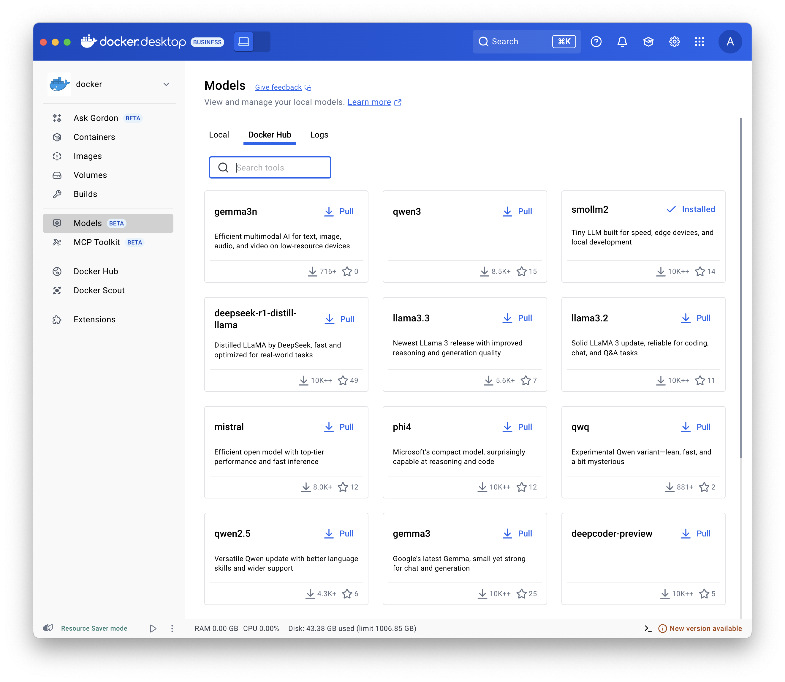
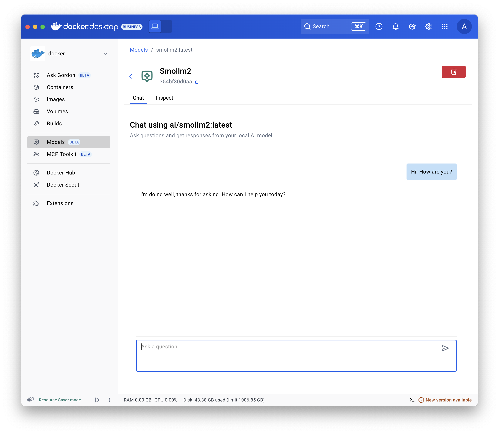
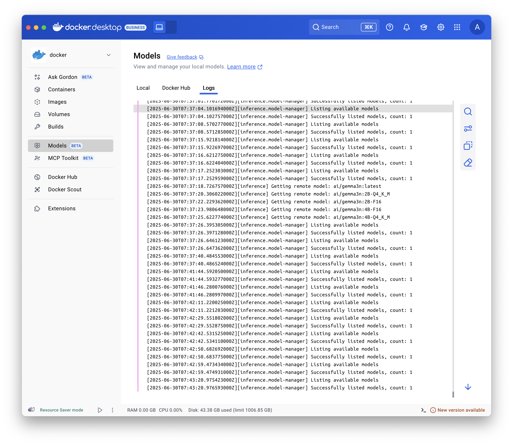

Docker Model Runner (DMR) lets you run and manage AI models locally using Docker. This page shows you how to enable DMR, pull and run a model, configure model settings, and publish custom models.

## Enable Docker Model Runner

You can enable DMR using Docker Desktop or Docker Engine. Follow the instructions below based on your setup.

### Docker Desktop

1. In the settings view, go to the **AI** tab.
1. Select the **Enable Docker Model Runner** setting.
1. If you use Windows with a supported NVIDIA GPU, you also see and can select
   **Enable GPU-backed inference**.
1. Optional: To enable TCP support, select **Enable host-side TCP support**.
   1. In the **Port** field, type the port you want to use.
   1. If you interact with Model Runner from a local frontend web app, in
      **CORS Allows Origins**, select the origins that Model Runner should
      accept requests from. An origin is the URL where your web app runs, for
      example `http://localhost:3131`.

You can now use the `docker model` command in the CLI and view and interact
with your local models in the **Models** tab in the Docker Desktop Dashboard.

> [!IMPORTANT]
>
> For Docker Desktop versions 4.45 and earlier, this setting was under the
> **Beta features** tab.

### Docker Engine

1. Ensure you have installed [Docker Engine](/engine/install/).
1. Docker Model Runner is available as a package. To install it, run:

   
   

   ```bash
   $ sudo apt-get update
   $ sudo apt-get install docker-model-plugin
   ```

   
   

   ```bash
   $ sudo dnf update
   $ sudo dnf install docker-model-plugin
   ```

   
   

1. Test the installation:

   ```bash
   $ docker model version
   $ docker model run ai/smollm2
   ```

> [!NOTE]
> TCP support is enabled by default for Docker Engine on port `12434`.

### Update DMR in Docker Engine

To update Docker Model Runner in Docker Engine, uninstall it with
[`docker model uninstall-runner`](/reference/cli/docker/model/uninstall-runner/)
then reinstall it:

```bash
docker model uninstall-runner --images && docker model install-runner
```

> [!NOTE]
> With the above command, local models are preserved.
> To delete the models during the upgrade, add the `--models` option to the
> `uninstall-runner` command.

## Pull a model

Models are cached locally.

> [!NOTE]
>
> When you use the Docker CLI, you can also pull models directly from
> [HuggingFace](https://huggingface.co/).




1. Select **Models** and select the **Docker Hub** tab.
1. Find the model you want and select **Pull**.






Use the [`docker model pull` command](/reference/cli/docker/model/pull/).
For example:

```bash {title="Pulling from Docker Hub"}
docker model pull ai/smollm2:360M-Q4_K_M
```

```bash {title="Pulling from HuggingFace"}
docker model pull hf.co/bartowski/Llama-3.2-1B-Instruct-GGUF
```




## Run a model




1. Select **Models** and select the **Local** tab.
1. Select the play button. The interactive chat screen opens.






Use the [`docker model run` command](/reference/cli/docker/model/run/).




## Configure a model

You can configure a model, such as its maximum token limit and more,
use Docker Compose.
See [Models and Compose - Model configuration options](../compose/models-and-compose.md#model-configuration-options).

## Publish a model

> [!NOTE]
>
> This works for any Container Registry supporting OCI Artifacts, not only
> Docker Hub.

You can tag existing models with a new name and publish them under a different
namespace and repository:

```bash
# Tag a pulled model under a new name
$ docker model tag ai/smollm2 myorg/smollm2

# Push it to Docker Hub
$ docker model push myorg/smollm2
```

For more details, see the [`docker model tag`](/reference/cli/docker/model/tag)
and [`docker model push`](/reference/cli/docker/model/push) command
documentation.

You can also package a model file in GGUF format as an OCI Artifact and publish
it to Docker Hub.

```bash
# Download a model file in GGUF format, for example from HuggingFace
$ curl -L -o model.gguf https://huggingface.co/TheBloke/Mistral-7B-v0.1-GGUF/resolve/main/mistral-7b-v0.1.Q4_K_M.gguf

# Package it as OCI Artifact and push it to Docker Hub
$ docker model package --gguf "$(pwd)/model.gguf" --push myorg/mistral-7b-v0.1:Q4_K_M
```

For more details, see the
[`docker model package`](/reference/cli/docker/model/package/) command
documentation.

## Troubleshooting

### Display the logs

To troubleshoot issues, display the logs:




Select **Models** and select the **Logs** tab.






Use the [`docker model logs` command](/reference/cli/docker/model/logs/).




### Inspect requests and responses

Inspecting requests and responses helps you diagnose model-related issues.
For example, you can evaluate context usage to verify you stay within the model's context
window or display the full body of a request to control the parameters you are passing to your models
when developing with a framework.

In Docker Desktop, to inspect the requests and responses for each model:

1. Select **Models** and select the **Requests** tab. This view displays all the requests to all models:
   - The time the request was sent.
   - The model name and version
   - The prompt/request
   - The context usage
   - The time it took for the response to be generated.
1. Select one of the requests to display further details:
   - In the **Overview** tab, view the token usage, response metadata and generation speed, and the actual prompt and response.
   - In the **Request**  and **Response** tabs, view the full JSON payload of the request and the response.

> [!NOTE]
> You can also display the requests for a specific model when you select a model and then select the **Requests** tab.

## Related pages

- [Interact with your model programmatically](./api-reference.md)
- [Models and Compose](../compose/models-and-compose.md)
- [Docker Model Runner CLI reference documentation](/reference/cli/docker/model)