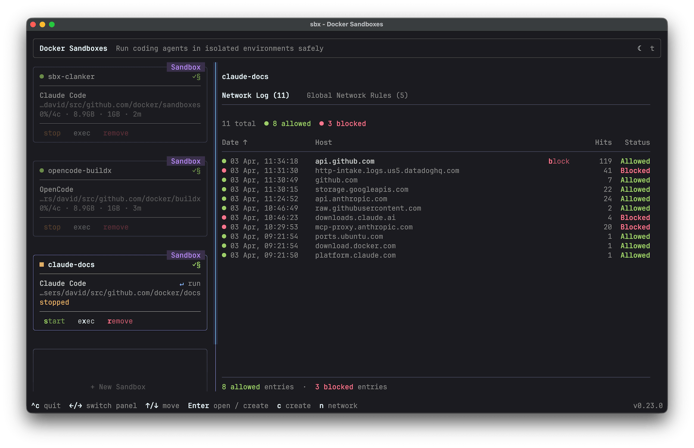

Docker Sandboxes run AI coding agents in isolated microVM sandboxes. Each
sandbox gets its own Docker daemon, filesystem, and network — the agent can
build containers, install packages, and modify files without touching your host
system.

This page walks through your first session: run an agent in a sandbox, see how
the sandbox isolates it, control what it can reach on the network, and clean
up.

## Prerequisites

- [Install the `sbx` CLI](install.md) and sign in to Docker
- Configure an authentication method for the agent you want to use. Most agents
  require an API key for their model provider. See the [agent pages](agents/)
  for provider-specific instructions.

## Authenticate your agent

For Claude Code with a Claude subscription (Max, Team, or Enterprise), no
upfront setup is needed — use the `/login` command inside the sandbox to sign
in with OAuth. The session token stays on your host and is never stored inside
the sandbox.

If you prefer to authenticate with an API key, see
[Credentials](configuration/credentials.md) for how to store one with
`sbx secret set`.

To give the agent access to GitHub for creating pull requests or interacting
with repositories:

```console
$ sbx secret set github --command 'gh auth token'
```

## Run your first sandbox

Pick a project directory and launch an agent with
[`sbx run`](/reference/cli/sbx/run/):

```console
$ cd ~/my-project
$ sbx run --name my-sandbox claude
```

The first time you run a sandbox, the CLI prompts you to choose a default
network preset:

```plaintext
Initialize the global network policy for your sandboxes:

  Applies to all sandboxes, current and future — change it later with
  "sbx policy allow/deny/rm". Kits, including built-in agent kits, may
  also add per-sandbox rules.

     1. Open         — All network traffic allowed, no restrictions.
  ❯  2. Balanced     — Default deny, with common dev sites allowed.
     3. Locked Down  — All network traffic blocked unless you allow it.

  Use ↑/↓ or 1–3 to navigate, Enter to confirm, Esc to cancel.
```

**Balanced** is a good starting point — it permits traffic to common
development services while blocking everything else. You can adjust individual
rules later. See [Local policy](governance/access-controls/local.md) for a full
description of each option.

Replace `claude` with the agent you want to use — see [Agents](agents/) for the
full list.

The first run takes a little longer while the agent image is pulled. Subsequent
runs reuse the cached image and start in seconds.

This attaches you to the agent running inside the sandbox. Give it a real
task — ask it to add a feature, install a dependency, or build and run your
project. The agent has a full Linux environment with its own Docker daemon, so
it can install packages, build images, and start containers on its own while it
works.

## See what the agent can touch

From another terminal, list your sandboxes:

```console
$ sbx ls
SANDBOX       AGENT    STATUS    PORTS   WORKSPACE
my-sandbox    claude   running           ~/my-project
```

Each row shows a sandbox's name, the agent running in it, its status, any
[published ports](usage.md#publish-ports), and its
workspace — the host directory shared into the sandbox. That workspace is the
one part of your machine the agent can see.

By default, the workspace is shared read-write, so the agent and your host see
the same files. Edits the agent makes to your project appear in your working
tree as it writes them, and you review them as an ordinary Git diff before
committing.

Everything else runs inside the microVM, isolated from your host:

- The agent has its own filesystem, Docker daemon, and network.
- Packages it installs, images it pulls, and containers it starts stay inside
  the sandbox. Your host system is untouched, and removing the sandbox discards
  them.

If you'd rather the agent not touch your working tree at all — for example,
when running several agents on one repository — use
[clone mode](usage.md#clone-mode), which gives it a private clone instead.

## Control what the agent can reach

Isolation isn't only about the filesystem. You also control what the sandbox
can reach on the network. You chose a default policy before the sandbox
started, and you can inspect or adjust it at any time.

Check which rules are in effect:

```console
$ sbx policy ls
```

To allow a specific host:

```console
$ sbx policy allow network registry.npmjs.org
```

With **Locked Down**, even your model provider API is blocked unless you
explicitly allow it. With **Balanced**, common development services are
permitted by default. See
[local policy](governance/access-controls/local.md) for the full rule set
and how to customize it.

## Clean up

Sandboxes persist after the agent exits, so you can stop one and pick up where
you left off later:

```console
$ sbx stop my-sandbox
```

Installed packages, Docker images, and configuration changes are preserved
across restarts. When you're done with a sandbox, remove it to reclaim disk
space:

```console
$ sbx rm my-sandbox
```

Removing a sandbox deletes everything inside it — installed packages, Docker
images, and the in-sandbox Git clone if you used clone mode. Files in your
host working tree are unaffected.

## What's next

You've run an agent, seen how the sandbox isolates it, and controlled its
network access. A few directions from here.

Run `sbx` with no arguments to open the interactive dashboard: a live view of
every sandbox where you can attach to agents, open shells, and manage network
rules from one place.



Then explore:

- [Usage guide](usage.md) — basic commands, reconnecting, workspaces, and port
  publishing.
- [Workflow patterns](workflows/) — Git strategies, local services, CI, and
  authenticated tools.
- [Sandbox environment files](configuration/environment-files.md) — declare and share
  repeatable local sandbox configurations with `sbxenv.yaml`.
- [Customize with kits](customize/) — package an agent, its tools, and its
  network rules into a reusable definition you launch with a single flag.
- [Agents](agents/) — the full list of supported agents and how to configure
  each one.
- [Governance](governance/) — centrally manage network, filesystem, and MCP
  policies across a team.
