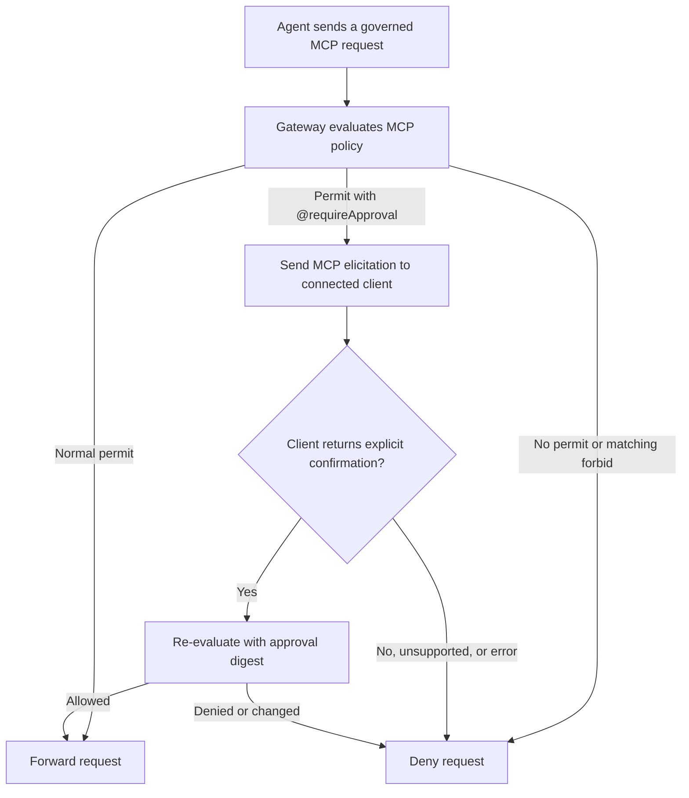

MCP access policies let organization administrators control which Model
Context Protocol (MCP) servers developers can register and what agents can do
through Docker's MCP gateway. Use these policies to approve trusted servers,
withdraw access to a server, require approval for tool calls, and restrict
host-run servers. To register MCP servers and connect them to sandboxes, see
[MCP gateway](../../mcp-gateway.md).

Unlike [network access policies](network.md) and
[filesystem access policies](filesystem.md), MCP policies are organization
policies written in Cedar. Docker defines the `MCP` namespace, including the
actions, resource types, attributes, and approval behavior that policies can
match. This page focuses on representative access patterns. For Docker's exact
policy surface, see the [MCP policy reference](../reference/mcp-policy.md). For
Cedar syntax and language semantics, see the
[Cedar documentation](https://docs.cedarpolicy.com/).

## Govern the server lifecycle

MCP policy applies at two points in a server's lifecycle. A rule for one point
doesn't automatically govern the other.

| Admin decision                             | Evaluation point                            | Match with                                                                 |
| ------------------------------------------ | ------------------------------------------- | -------------------------------------------------------------------------- |
| Whether a server can be registered         | When a developer runs `sbx mcp add`         | The registered name and resolved server attributes, such as `identityURL`  |
| What agents can do through the MCP gateway | When the gateway handles a governed request | The registered server name, tool annotations, resource URI, or prompt name |

Registration rules affect future registrations. They don't remove a saved
registration or prevent an existing registration from being loaded with
`sbx mcp load`. Use-time rules govern tool calls, resource reads, and prompt
retrieval from servers that are already registered or loaded.

Server names are chosen during registration. Registration rules can match the
chosen name and resolved server identity together. At use time, tools,
resources, and prompts are associated with the registered name, so rules for an
existing server must match every name under which it was registered.

Built-in gateway tools, such as `code-mode` and OAuth authorization helpers,
are also governed at use time. They are `MCP::Primordial` resources rather than
tools associated with a registered server. For details, see
[Built-in gateway tools](../../mcp-gateway.md#built-in-gateway-tools).

Use-time policy doesn't hide or remove existing registrations. Tool and
resource listings can also include entries that policy denies when an agent
tries to use them.

## Choose an access posture

When MCP policy enforcement is active for a user, registration and governed MCP
requests are denied unless a matching `permit` allows them. A matching `forbid`
overrides any `permit`, including a permit with `@requireApproval`.

Use permits for an allowlist policy. For a blocklist policy that grants MCP
activity except for explicit restrictions, start with an actionless permit:

```plaintext
permit (principal, action, resource);
```

This statement permits every MCP action that reaches Cedar evaluation. Add
`forbid` statements for the restrictions the policy must enforce.

Policy scope supplies the principal. Use organization or team scope instead of
matching users, teams, tenants, or roles in Cedar. If MCP policy enforcement
isn't active for a user, the gateway doesn't evaluate Cedar policy and permits
MCP activity. MCP doesn't have a local preset equivalent to network policy.

## Approve a server

For an allowlist, approve both the server registration and its use-time
capabilities. The following policy approves a remote server only when it is
registered as `example` with the expected identity URL. It permits read-only
tool calls, resource reads, and prompt retrieval from that registered server:

```plaintext
// Permit registration with the expected name and identity URL.
permit (principal, action == MCP::Action::"register", resource)
when {
  resource in MCP::Server::"example" &&
  resource.identityURL == "https://mcp.example.com/mcp"
};

// Permit read-only tool calls.
permit (principal, action == MCP::Action::"invokeTool", resource)
when {
  resource in MCP::Server::"example" &&
  resource.readOnly == true
};

// Permit resource reads.
permit (principal, action == MCP::Action::"readResource", resource)
when { resource in MCP::Server::"example" };

// Permit prompt retrieval.
permit (principal, action == MCP::Action::"getPrompt", resource)
when { resource in MCP::Server::"example" };
```

Matching both the name and identity URL establishes a canonical registration.
It prevents a developer from registering another endpoint under the approved
name or registering the approved endpoint under another name. Remove the
resource or prompt permit if users don't need that capability.

## Require confirmation with MCP elicitation

Use `@requireApproval` to require per-request confirmation through MCP. When a
request matches the annotated `permit`, the gateway sends an
`elicitation/create` request to the same MCP client session that made the
governed request. In a human-driven client, the person operating the agent sees
the prompt and decides whether to proceed.

The following policy requires confirmation for non-read-only tools on a server
registered as `example`. Use it alongside any permits needed to register the
server or use its other capabilities. The annotation string becomes the reason
shown in the elicitation:

```plaintext
@requireApproval("non-read-only tool call")
permit (principal, action == MCP::Action::"invokeTool", resource)
when {
  resource in MCP::Server::"example" &&
  resource.readOnly == false
};
```

Tool annotations are supplied by the server and are advisory. `readOnly`
defaults to `false` for tools that don't declare it, so this pattern requires
confirmation for unannotated tools.

The gateway handles a matching request as follows:



The prompt identifies the server or gateway tool and includes the annotation
reason. It doesn't include raw tool arguments. Each matching request requires a
new confirmation. After confirmation, the gateway re-evaluates the request with
a digest that binds the response to the evaluated authorization request.

Use this mechanism as a confirmation guardrail for human-driven clients. It
doesn't create administrator approval or separation of duties. An autonomous
MCP client can respond to an in-protocol elicitation programmatically. Use
`forbid` for operations that must never run.

The request is denied if the originating client session can't handle MCP
elicitation, the user declines, the elicitation fails, or re-evaluation doesn't
allow the request. `sbx mcp add` can't present an elicitation, so a registration
permit with `@requireApproval` results in a denial. Tool calls made from an
execution context that can't relay an elicitation, including calls from inside
`code-mode`, are also denied.

## Withdraw server access

To withdraw access from a server that broader rules permit, block it at
registration and at use time. Registration policy controls future `sbx mcp add`
operations, while use-time policy controls requests from servers that are
already registered or loaded.

Prevent future registrations of the server by matching its identity URL:

```plaintext
forbid (principal, action == MCP::Action::"register", resource)
when { resource.identityURL == "https://mcp.example.com/mcp" };
```

Deny use-time requests for each registered name that refers to the server:

```plaintext
forbid (principal, action == MCP::Action::"invokeTool", resource)
when { resource in MCP::Server::"example" };

forbid (principal, action == MCP::Action::"readResource", resource)
when { resource in MCP::Server::"example" };

forbid (principal, action == MCP::Action::"getPrompt", resource)
when { resource in MCP::Server::"example" };
```

The registration remains saved and can still be listed or loaded. These rules
prevent another registration for the identity URL and deny governed use under
the registered name. If the server was registered under other names, add
use-time rules for those names as well.

An OAuth authorization helper is a built-in gateway tool, not a child of the
registered server. To prevent agents from starting authorization for the
server, govern the helper separately:

```plaintext
forbid (principal, action == MCP::Action::"invokePrimordial", resource)
when { resource in MCP::Primordial::"example-authorize" };
```

## Restrict host-run servers

Local stdio servers run on the host, outside the sandbox VM. This includes
explicit host commands and OCI-packaged stdio servers started with host Docker.
For details about this boundary, see
[Docker Engine isolation](../../security/isolation.md#docker-engine-isolation).

In a blocklist policy that otherwise permits registration, deny the host-run
server type:

```plaintext
forbid (principal, action == MCP::Action::"register", resource)
when { resource.type == "local-stdio" };
```

`local-stdio` covers explicit commands, including commands that start a Docker
container, and OCI-packaged stdio servers resolved from registry or manifest
metadata with `--local`.

## Related information

- [MCP policy concepts](../concepts.md#mcp-policies): policy model and rule
  evaluation.
- [MCP policy reference](../reference/mcp-policy.md): exact action, resource,
  attribute, context, and approval behavior.
- [Organization policies](organization.md): policy creation and scope.
- [MCP policy audit logs](../monitor-and-enforce/audit.md): policy decision
  records.
