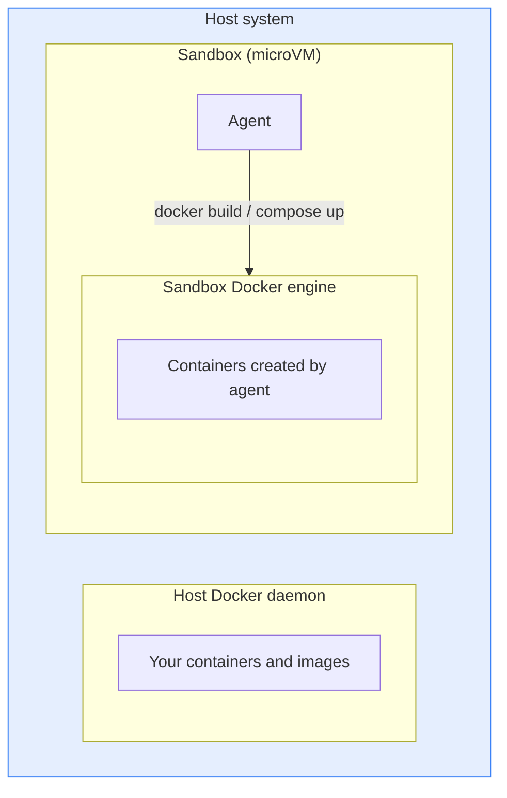
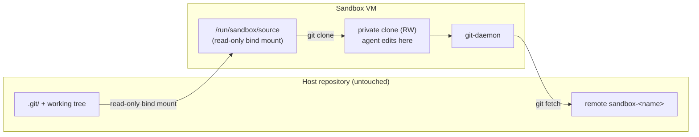

AI coding agents need to execute code, install packages, and run tools on
your behalf. Docker Sandboxes run each agent in its own microVM. Five
isolation layers protect your host: hypervisor, network, Docker Engine,
workspace, and credential proxy.

## Hypervisor isolation

Every sandbox runs inside a lightweight microVM with its own Linux kernel.
Unlike containers, which share the host kernel, a sandbox VM cannot access host
processes, files, or resources outside its defined boundaries.

- **Process isolation:** separate kernel per sandbox; processes inside the VM
  are invisible to your host and to other sandboxes
- **Filesystem isolation:** only your workspace directory is shared with the
  host. The rest of the VM filesystem persists across restarts but is removed
  when you delete the sandbox. Symlinks pointing outside the workspace scope
  are not followed.
- **Full cleanup:** when you remove a sandbox with `sbx rm`, the VM and
  everything inside it is deleted

The agent runs as a non-root user with sudo privileges inside the VM. The
hypervisor boundary is the isolation control, not in-VM privilege separation.

## Network isolation

Each sandbox has its own isolated network. Sandboxes cannot communicate with
each other and cannot reach your host's localhost. There is no shared network
between sandboxes or between a sandbox and your host.

All HTTP and HTTPS traffic leaving a sandbox passes through a proxy on your
host that enforces the [network policy](../governance/). The sandbox routes
traffic through either a forward proxy or a transparent proxy depending on the
client's configuration. Both enforce the network policy; only the forward proxy
[injects credentials](credentials.md) for AI services.

Raw TCP connections, UDP, and ICMP are blocked at the network layer. DNS
resolution is handled by the proxy; the sandbox cannot make raw DNS queries.
Traffic to private IP ranges, loopback, and link-local addresses is also
blocked. Only domains explicitly listed in the policy are reachable.

For the default set of allowed domains, see
[Default security posture](defaults.md).

## Docker Engine isolation

Agents often need to build images, run containers, and use Docker Compose.
Mounting your host Docker socket into a container would give the agent full
access to your environment.

Docker Sandboxes avoid this by running a separate [Docker
Engine](https://docs.docker.com/engine/) inside the sandbox environment, isolated from
your host. When the agent runs `docker build` or `docker compose up`, those
commands execute against that engine. The agent has no path to your host Docker
daemon.

Each sandbox VM runs its own Docker Engine. The agent runs inside the VM,
alongside that engine, and drives it to create containers, all within the
VM:

## Workspace isolation

When you create a sandbox, you choose one of two ways to share your
workspace with it:

- **Direct mount** (the default): the agent has read-write access to
  your working tree. There is no boundary between the agent's edits and
  your host filesystem.
- **Clone mode** (`--clone`): your repository is mounted read-only into
  the VM and the agent works on a private clone inside the VM. The
  agent's edits never reach your host until you fetch them.

See [Git workflow](../usage.md#git-workflow) for the workflow side of
each.

### Direct mount (default)

By default, your workspace is shared into the VM as a read-write mount.
The agent and the host see the same files, and changes the agent makes
appear on your host as soon as they're written.

There is no isolation between the agent and your workspace in this mode.
The agent can create, modify, or delete any file in the workspace,
including:

- Source code and configuration files
- Build files (`Makefile`, `package.json`, `Cargo.toml`)
- Git hooks (`.git/hooks/`)
- CI configuration (`.github/workflows/`, `.gitlab-ci.yml`)
- IDE configuration (`.vscode/tasks.json`, `.idea/` run configurations)
- Hidden files, shell scripts, and executables

Some of these files execute code when you trigger normal development
actions — committing, pushing, building, or opening the project in an IDE.
Review them after any agent session before performing those actions:

- Git hooks (`.git/hooks/`) run on commit, push, and other Git actions.
  These are inside `.git/` and don't appear in `git diff` output —
  check them separately with `ls -la .git/hooks/`.
- CI configuration (`.github/workflows/`, `.gitlab-ci.yml`) runs on
  push.
- Build files (`Makefile`, `package.json` scripts, `Cargo.toml`) run
  during build or install steps.
- IDE configuration (`.vscode/tasks.json`, `.idea/`) can run tasks
  when you open the project.

> [!WARNING]
> Treat sandbox-modified workspace files the same way you would treat a pull
> request from an untrusted contributor: review before you trust them on
> your host.

### Clone mode

When you start a sandbox with [`--clone`](../usage.md#clone-mode), the agent
never works directly against your host repository. Even with full root
inside the VM, it cannot modify your `.git` directory, your working tree,
or any tracked file on your host.

How the boundary is enforced:

- Your repository's Git root is mounted at `/run/sandbox/source` as
  read-only. Nothing the agent does inside the VM can write back through
  that mount.
- The agent works on a private clone that lives inside the sandbox. The
  clone has its own index, its own refs, and its own working tree. Writes
  to the clone never reach your host.
- The sandbox publishes the clone over a Git daemon bound to localhost on
  the host. The CLI wires it up as a `sandbox-<sandbox-name>` Git remote on
  your host repository. Fetching from that remote uses the same trust
  model as fetching from any third-party remote — nothing is integrated
  until you explicitly merge or check out the fetched refs.

The practical guarantees:

- The agent cannot modify any tracked file or any byte under `.git/` on
  your host. A compromised or buggy agent cannot drop a
  `.git/hooks/pre-commit`, alter `.github/workflows/`, or sneak changes
  into your working tree.
- Concurrent `git` commands on the host and inside the sandbox cannot
  race on a shared `.git/index` or shared refs — there is no shared
  writable state.
- Credentials, signing keys, and any settings in your repository's
  `.git/config` stay on the host. The agent's clone has its own
  independent configuration.

Use clone mode whenever you want a strong boundary between the agent's
Git activity and your host repository — for example when running an
unfamiliar agent, running multiple agents on the same repository at once,
or keeping your working tree clean while the agent works.

## Credential isolation

Most agents need API keys for their model provider. Rather than passing keys
into the sandbox, the host-side proxy intercepts outbound API requests and
injects authentication headers before forwarding each request.

Credential values are never stored inside the VM. They are not available as
environment variables or files inside the sandbox unless you explicitly set
them. This means a compromised sandbox cannot read API keys from the local
environment.

For how to store and manage credentials, see [Credentials](credentials.md).
