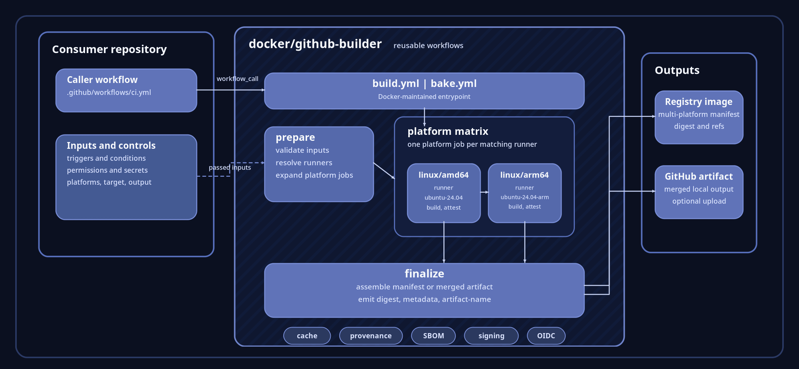
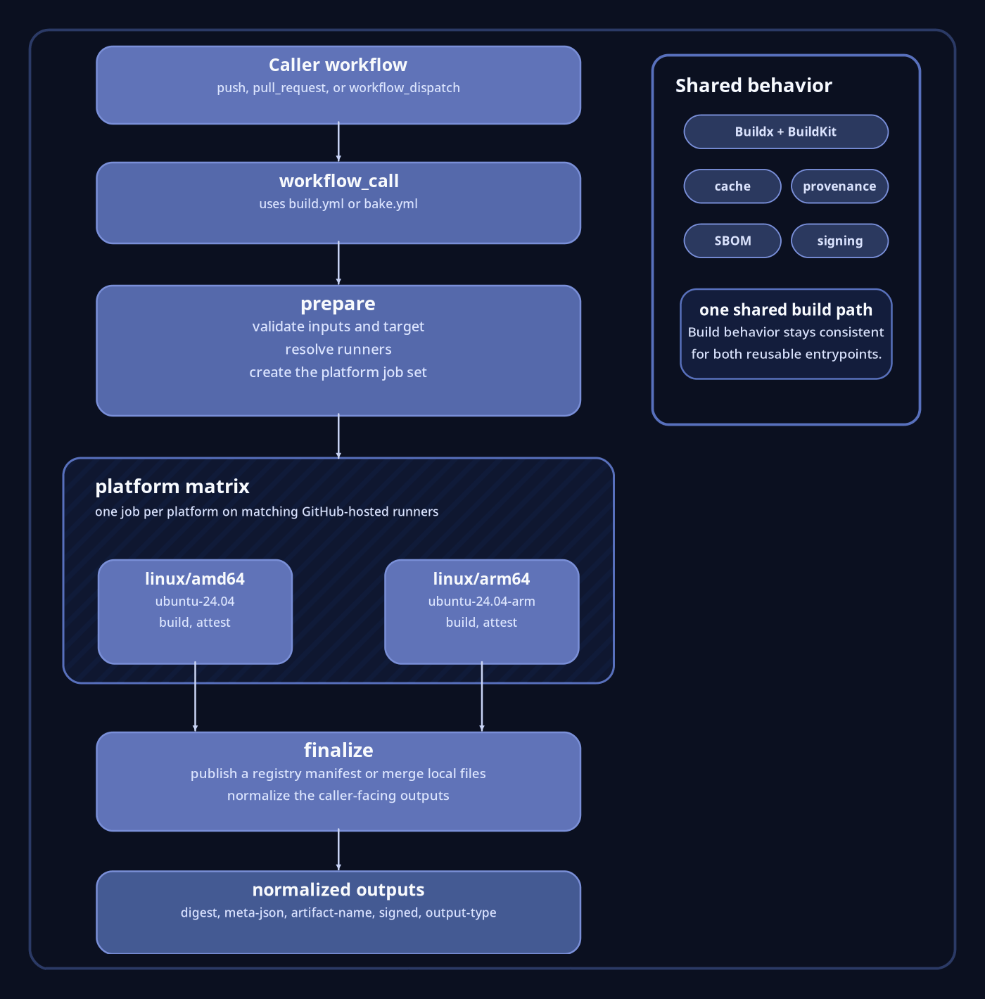

Docker GitHub Builder separates repository orchestration from build
implementation. A consuming repository decides when a build runs, which
permissions and secrets are granted, and which inputs are passed. The reusable
workflow in [`docker/github-builder` repository](https://github.com/docker/github-builder)
owns the build implementation itself. That split keeps repository workflows
short while centralizing BuildKit, caching, provenance, SBOM generation,
signing, and multi-platform assembly in one Docker-maintained path.



## Core architecture

A caller workflow invokes either [`build.yml`](build.md) or [`bake.yml`](bake.md).
[`build.yml`](build.md) is the entrypoint for Dockerfile-oriented builds.
[`bake.yml`](bake.md) is the entrypoint for Bake-oriented builds, where the
Bake definition remains the source of truth for targets and overrides. In both
cases the caller still owns repository policy, including triggers, branch
conditions, permissions, secrets, target selection, metadata inputs, and the
choice between image output and local output.

Inside the reusable workflow, the first phase prepares the build. It validates
the incoming inputs, resolves the appropriate runner, and expands a
multi-platform request into one job per platform. The execution model is
easiest to picture as a matrix where `linux/amd64` runs on `ubuntu-24.04` and
`linux/arm64` runs on `ubuntu-24.04-arm`. Each platform job builds independently,
then the workflow finalizes the result into one caller-facing output contract.

```yaml
requested platforms:
  linux/amd64,linux/arm64

conceptual platform jobs:
  linux/amd64 -> ubuntu-24.04
  linux/arm64 -> ubuntu-24.04-arm
```

## Execution path



The execution path stays short on purpose. The consuming repository calls the
reusable workflow. The reusable workflow prepares the build, runs the
per-platform jobs, and finalizes the result. For image output, finalization
produces a registry image and multi-platform manifest. For local output,
finalization merges the per-platform files and can upload the merged result as
a GitHub artifact. The caller does not need to reconstruct how Buildx,
BuildKit, caching, or manifest assembly were wired together.

## The two reusable entrypoints

[`build.yml`](build.md) is the better fit when the build is already expressed as
a Dockerfile-oriented workflow. It lines up naturally with concepts such as
`context`, `file`, `target`, `build-args`, `labels`, `annotations`, and
`platforms`. This is the entrypoint that feels closest to
`docker/build-push-action`, except the workflow implementation is centralized.

[`bake.yml`](bake.md) is the better fit when the repository already uses Bake
as the build definition. It preserves the Bake model, including target
resolution, `files`, `set`, and `vars`, while still routing execution through
the same Docker-maintained build path. One important architectural detail is
that the Bake workflow is centered on one target per workflow call, which keeps
provenance, digest handling, and final manifest assembly scoped to one build
unit at a time.

## Output model

The reusable workflows expose a stable set of caller-facing outputs so
downstream jobs can consume results without understanding the internal job
graph. In practice, the main values are `digest`, `meta-json`, `artifact-name`,
`output-type`, and `signed`. That contract matters because it keeps promotion,
publishing, or follow-on automation decoupled from the mechanics of runner
selection and per-platform assembly.

## Examples

### Dockerfile-oriented image build

The following example shows the shape of a multi-platform image build driven
by [`build.yml`](build.md).

```yaml
name: ci

on:
  push:
    branches:
      - "main"
    tags:
      - "v*"
  pull_request:

permissions:
  contents: read

jobs:
  build:
    uses: docker/github-builder/.github/workflows/build.yml@{}
    permissions:
      contents: read
      id-token: write
    with:
      output: image
      push: ${{ github.event_name != 'pull_request' }}
      platforms: linux/amd64,linux/arm64
      meta-images: name/app
      meta-tags: |
        type=ref,event=branch
        type=ref,event=pr
        type=semver,pattern={{version}}
    secrets:
      registry-auths: |
        - registry: docker.io
          username: ${{ vars.DOCKERHUB_USERNAME }}
          password: ${{ secrets.DOCKERHUB_TOKEN }}
```

This call is small because the reusable workflow absorbs the heavy lifting. The
repository decides when the build should run and which inputs it wants, while
the shared implementation handles Buildx setup, BuildKit configuration,
platform fan-out, metadata generation, provenance, SBOM generation, signing,
and final manifest creation.

### Bake-oriented local output

The following example shows the shape of a Bake call that exports local output
and uploads the merged artifact.

```yaml
name: ci

on:
  pull_request:

permissions:
  contents: read

jobs:
  bake:
    uses: docker/github-builder/.github/workflows/bake.yml@{}
    permissions:
      contents: read
      id-token: write
    with:
      output: local
      target: binaries
      artifact-upload: true
      artifact-name: bake-output
```

This form is useful when the repository already keeps its build definition in
Bake and wants to preserve that source of truth. The workflow injects the local
output behavior into the Bake run, executes the target per platform when
needed, and merges the result into one caller-facing artifact.

## Why this architecture works

### Performance

The performance story comes from native platform fan-out, shared BuildKit
configuration, and centralized cache handling. Multi-platform work can be
spread across matching GitHub-hosted runners instead of forcing every
architecture through one build machine. That reduces emulation pressure,
shortens the critical path for cross-platform builds, and gives every
consuming repository the same optimized build baseline.

### Security

The security model comes from putting the build implementation in
Docker-maintained reusable workflows instead of ad hoc job steps in each
consumer repository. The caller still controls permissions and secrets, but
the build logic itself is centrally reviewed and versioned. The project also
treats provenance, SBOM generation, and signing as first-class concerns,
which strengthens the trust boundary between repository orchestration and
artifact production.

### Isolation and reliability

The reliability story comes from separation of concerns. The consuming
repository orchestrates the build. The reusable workflow executes the build.
That reduces CI drift, removes repeated glue code from repositories, and makes
the outcome easier to reason about because the caller sees a stable contract
instead of a large custom job definition.
