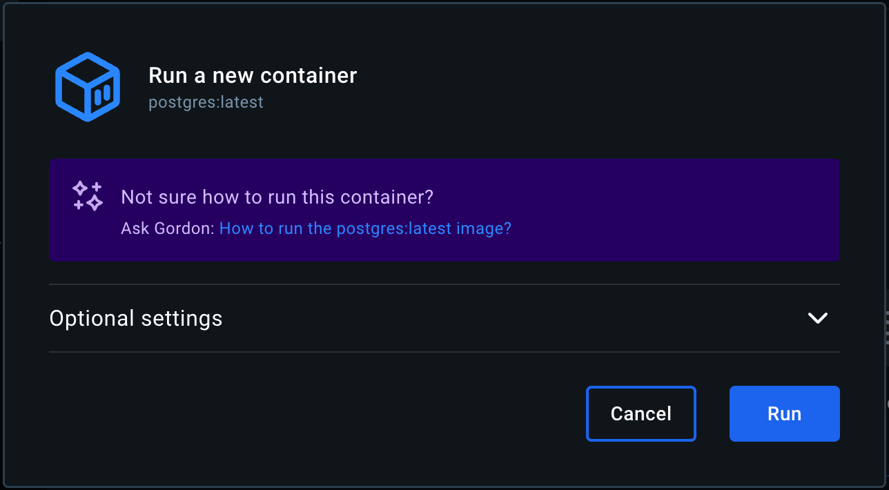



Ask Gordon is your personal AI assistant embedded in Docker Desktop and the
Docker CLI. It's designed to streamline your workflow and help you make the
most of the Docker ecosystem.

## What is Ask Gordon?

Ask Gordon is a suite of AI-powered capabilities integrated into Docker's
tools. These features, currently in Beta, are not enabled by default, and are
not production-ready. You may also encounter the term "Docker AI" as a broader
reference to this technology.

The goal of Ask Gordon is to make Docker's tools for managing images and
containers more intuitive and accessible. It provides contextual assistance
tailored to your local environment, including Dockerfiles, containers, and
applications.

Ask Gordon integrates directly with Docker's tools to help you perform specific
tasks. It understands your local setup, such as your local source code and
images. For example, you can ask Gordon to help you identify vulnerabilities in
your project or how to optimize a Dockerfile in your local repository. This
tight integration ensures responses are practical and actionable.

> [!NOTE]
> Ask Gordon is powered by Large Language Models (LLMs). Like all LLM-based
> tools, its responses may sometimes be inaccurate. Always verify the
> information provided.

### What data does Gordon access?

When you use Ask Gordon, the data it accesses depends on the context of your
query:

- Local files: If you use the `docker ai` command, Ask Gordon can access
  files and directories in the current working directory where the command is
  executed. In Docker Desktop, if you ask about a specific file or directory in
  the **Ask Gordon** view, you'll be prompted to select the relevant context.
- Local images: Gordon integrates with Docker Desktop and can view all images
  in your local image store. This includes images you've built or pulled from a
  registry.

To provide accurate responses, Ask Gordon may send relevant files, directories,
or image metadata to the Gordon backend along with your query. This data
transfer occurs over the network but is never stored persistently or shared
with third parties. It is used exclusively to process your request and
formulate a response. For more information about privacy terms and conditions
for Docker AI, review [Gordon's Supplemental Terms](https://www.docker.com/legal/docker-ai-supplemental-terms/).

All data transferred is encrypted in transit.

### How your data is collected and used

Docker collects anonymized data from your interactions with Ask Gordon to
enhance the service. This includes the following:

- Your queries: Questions you ask Gordon.
- Responses: Answers provided by Gordon.
- Feedback: Thumbs-up and thumbs-down ratings.

To ensure privacy and security:

- Data is anonymized and cannot be traced back to you or your account.
- Docker does not use this data to train AI models or share it with third
  parties.

By using Ask Gordon, you help improve Docker AI's reliability and accuracy,
making it more effective for all users.

If you have concerns about data collection or usage, you can
[disable](#disable-ask-gordon) the feature at any time.

## Setup

To use this feature, you must have:

- Docker Desktop version 4.38 or later.

Ask Gordon is not enabled by default. To enable the feature:

1. [Sign in](#sign-in) to your Docker account.
2. [Enable the feature](#enable-the-feature) in the Docker Desktop settings.

### Sign in

1. Open Docker Desktop.
2. Select the **Sign in** button.
3. Complete the sign-in process in your web browser.

### Enable the feature

After signing in to your Docker Account, enable the Docker AI feature:

1. Open the **Settings** view in Docker Desktop.
2. Navigate to **Features in development**.
3. Check the **Enable Docker AI** checkbox.

   The Docker AI terms of service agreement is displayed. You must agree to the
   terms before you can enable the feature. Review the terms and select **Accept and enable** to continue.

4. Select **Apply & restart**.

## Using Ask Gordon

The primary interfaces to Docker's AI capabilities are through the **Ask
Gordon** view in Docker Desktop, or if you prefer to use the CLI: the `docker
ai` CLI command.

If you've used an AI chatbot before, these interfaces will be pretty familiar
to you. You can chat with the Docker AI to get help with your Docker tasks.

### Contextual help

Once you've enabled the Docker AI features, you'll also find references to
**Ask Gordon** in various other places throughout the Docker Desktop user
interface. Whenever you encounter a button with the "sparkles" (✨) icon in the
user interface, you can use the button to get contextual support from Ask
Gordon.

## Example workflows

Ask Gordon is a general-purpose AI assistant created to help you with all your
Docker-related tasks and workflows. If you need some inspiration, here are a
few ways things you can try:

- [Troubleshoot a crashed container](#troubleshoot-a-crashed-container)
- [Get help with running a container](#get-help-with-running-a-container)
- [Improve a Dockerfile](#improve-a-dockerfile)

For more examples, try asking Gordon directly. For example:

```console
$ docker ai "What can you do?"
```

### Troubleshoot a crashed container

If you try to start a container with an invalid configuration or command, you
can use Ask Gordon to troubleshoot the error. For example, try starting a
Postgres container without specifying a database password:

```console
$ docker run postgres
Error: Database is uninitialized and superuser password is not specified.
       You must specify POSTGRES_PASSWORD to a non-empty value for the
       superuser. For example, "-e POSTGRES_PASSWORD=password" on "docker run".

       You may also use "POSTGRES_HOST_AUTH_METHOD=trust" to allow all
       connections without a password. This is *not* recommended.

       See PostgreSQL documentation about "trust":
       https://www.postgresql.org/docs/current/auth-trust.html
```

In the **Containers** view in Docker Desktop, select the ✨ icon next to the
container's name, or inspect the container and open the **Ask Gordon** tab.

### Get help with running a container

If you want to run a specific image but you're not sure how, Gordon might be
able to help you get set up:

1. Pull an image from Docker Hub (for example, `postgres`).
2. Open the **Images** view in Docker Desktop and select the image.
3. Select the **Run** button.

In the _Run a new container_ dialog that opens, you should see a message about
**Ask Gordon**.



The linked text in the hint is a suggested prompt to start a conversation with
Ask Gordon.

### Improve a Dockerfile

Gordon can analyze your Dockerfile and suggest improvements. To have Gordon
evaluate your Dockerfile using the `docker ai` command:

1. Navigate to your project directory:

   ```console
   $ cd path/to/my/project
   ```

2. Use the `docker ai` command to rate your Dockerfile:

   ```console
   $ docker ai rate my Dockerfile
   ```

Gordon will analyze your Dockerfile and identify opportunities for improvement
across several dimensions:

- Build cache optimization
- Security
- Image size efficiency
- Best practices compliance
- Maintainability
- Reproducibility
- Portability
- Resource efficiency

## Disable Ask Gordon

If you've enabled Ask Gordon and you want to disable it again:

1. Open the **Settings** view in Docker Desktop.
2. Navigate to **Features in development**.
3. Clear the **Enable Docker AI** checkbox.
4. Select **Apply & restart**.

If you want to disable Ask Gordon for your entire Docker organization, using
[Settings Management](/manuals/security/for-admins/hardened-desktop/settings-management/_index.md),
add the following property to your `admin-settings.json` file:

```json
{
  "enableDockerAI": {
    "value": false,
    "locked": true
  }
}
```

Alternatively, you can disable all Beta features by setting `allowBetaFeatures` to false:

```json
{
  "allowBetaFeatures": {
    "value": false,
    "locked": true
  }
}
```

## Feedback

<!-- vale Docker.We = NO -->

We value your input on Ask Gordon and encourage you to share your experience.
Your feedback helps us improve and refine Ask Gordon for all users. If you
encounter issues, have suggestions, or simply want to share what you like,
here's how you can get in touch:

- Thumbs-up and thumbs-down buttons

  Rate Ask Gordon's responses using the thumbs-up or thumbs-down buttons in the
  response.

- Feedback survey

  You can access the Ask Gordon survey by following the _Give feedback_ link in
  the **Ask Gordon** view in Docker Desktop, or from the CLI by running the
  `docker ai feedback` command.

Thank you for helping us improve Ask Gordon.
