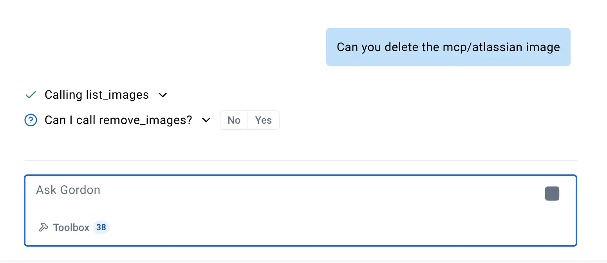

Gordon comes with an integrated toolbox providing access to various system tools
and capabilities. These tools extend Gordon's functionality by allowing it to
interact with the Docker Engine, Kubernetes, Docker Scout (security scanning),
and other developer utilities. This documentation covers the available tools,
their configuration, and usage patterns.

## Configuration

Tools can be configured globally in the toolbox, making them accessible
throughout the Gordon interfaces, including both Docker Desktop and the CLI.

Click on the `Toolbox` button in the bottom left of the input area


Choose the tools you want to make available - by clicking on each card you
   can view extra information regarding each tool and what it does.


## Usage Examples

This section provides task-oriented examples for common operations with Gordon
tools.

### Managing Docker Containers

#### List and Monitor Containers

```console
# List all running containers
$ docker ai "Show me all running containers"

# List containers using specific resources
$ docker ai "List all containers using more than 1GB of memory"

# View logs from a specific container
$ docker ai "Show me logs from my running api-container from the last hour"
```

#### Manage container lifecycle

```console
# Run a new container
$ docker ai "Run a nginx container with port 80 exposed to localhost"

# Stop a specific container
$ docker ai "Stop my database container"

# Clean up unused containers
$ docker ai "Remove all stopped containers"
```

### Working with Docker Images

```console
# List available images
$ docker ai "Show me all my local Docker images"

# Pull a specific image
$ docker ai "Pull the latest Ubuntu image"

# Build an image from a Dockerfile
$ docker ai "Build an image from my current directory and tag it as myapp:latest"

# Clean up unused images
$ docker ai "Remove all my unused images"
```

### Managing Docker Volumes

```console
# List volumes
$ docker ai "List all my Docker volumes"

# Create a new volume
$ docker ai "Create a new volume called postgres-data"

# Backup data from a container to a volume
$ docker ai "Create a backup of my postgres container data to a new volume"
```

### Kubernetes Operations

```console
# Create a deployment
$ docker ai "Create an nginx deployment and make sure it's exposed locally"

# List resources
$ docker ai "Show me all deployments in the default namespace"

# Get logs
$ docker ai "Show me logs from the auth-service pod"
```

### Security Analysis


```console
# Scan  for CVEs
$ docker ai "Scan my application for security vulnerabilities"

# Get security recommendations
$ docker ai "Give me recommendations for improving the security of my nodejs-app image"
```

### Development Workflows

```console
# Analyze and commit changes
$ docker ai "Look at my local changes, create multiple commits with sensible commit messages"

# Review branch status
$ docker ai "Show me the status of my current branch compared to main"
```

## Reference

This section provides a comprehensive listing of the built-in tools you can find
in Gordon's toolbox.

### Docker tools

Tools to interact with your Docker containers, images and volumes.

#### Container management

| Name | Description |
|------|-------------|
| `list_containers` | List all Docker containers |
| `remove_containers` | Remove one or more Docker containers |
| `stop_container` | Stop a running Docker container |
| `fetch_container_logs` | Retrieve logs from a Docker container |
| `run_container` | Run a new Docker container |

#### Volume management

| Tool | Description |
|------|-------------|
| `list_volumes` | List all Docker volumes |
| `remove_volume` | Remove a Docker volume |
| `create_volume` | Create a new Docker volume |

#### Image management

| Tool | Description |
|------|-------------|
| `list_images` | List all Docker images |
| `remove_images` | Remove Docker images |
| `pull_image` | Pull an image from a registry |
| `push_image` | Push an image to a registry |
| `build_image` | Build a Docker image |
| `tag_image` | Tag a Docker image |
| `inspect` | Inspect a Docker object |

### Kubernetes tools

Tools to interact with your Kubernetes cluster

#### Pods

| Tool | Description |
|------|-------------|
| `list_pods` | List all pods in the cluster |
| `get_pod_logs` | Get logs from a specific pod |

#### Deployment management


| Tool | Description |
|------|-------------|
| `list_deployments` | List all deployments |
| `create_deployment` | Create a new deployment |
| `expose_deployment` | Expose a deployment as a service |
| `remove_deployment` | Remove a deployment |

#### Service management

| Tool | Description |
|------|-------------|
| `list_services` | List all services |
| `remove_service` | Remove a service |

#### Cluster information

| Tool | Description |
|------|-------------|
| `list_namespaces` | List all namespaces |
| `list_nodes` | List all nodes in the cluster |

### Docker Scout tools

Security analysis tools powered by Docker Scout.

| Tool | Description |
|------|-------------|
| `search_for_cves` | Analyze a Docker image, a project directory, or other artifacts for vulnerabilities using Docker Scout CVEs.search for cves |
| `get_security_recommendations` | Analyze a Docker image, a project directory, or other artifacts for base image update recommendations using Docker Scout. |

### Developer tools

General-purpose development utilities.

| Tool | Description |
|------|-------------|
| `fetch` | Retrieve content from a URL |
| `get_command_help` | Get help for CLI commands |
| `run_command` | Execute shell commands |
| `filesystem` | Perform filesystem operations |
| `git` | Execute git commands |

### AI model tools

| Tool | Description |
|------|-------------|
| `list_models` | List all available AI models |
| `pull_model` | Download an AI model |
| `run_model` | Query a model with a prompt |
| `remove_model` | Remove an AI model |

### AI Tool Catalog

When the [AI Tool
Catalog](https://open.docker.com/extensions/marketplace?extensionId=docker/labs-ai-tools-for-devs)
Docker Desktop extension is installed, all the tools enabled in the catalog are
available for Gordon to use. After installation, you can enable the usage of the
AI Tool Catalog tools in the toolbox section of Gordon.


## Gordon as an MCP server

In addition to functioning as an MCP client, Gordon can also act as an MCP
server. This means that all the tools configured in the toolbox section of
Gordon can be exposed to another MCP client like Claude Desktop, Cursor and
others.

To use Gordon’s built-in tools in other MCP clients, configure your client of
choice to use the `docker ai mcpserver` command. This allows Gordon to serve its
built-in tools via the MCP protocol for various clients.

For example, to enable Gordon’s tools in Claude Desktop, add the following
configuration to the Claude configuration file:

```json
{
  "mcpServers": {
    "gordon": {
      "command": "docker",
      "args": ["ai", "mcpserver"]
    }
  }
}
```

This setup ensures that Claude Desktop can communicate with Gordon as an MCP
server, leveraging its built-in tools. You can follow the [Claude Desktop
documentation](https://modelcontextprotocol.io/quickstart/user) to explore
further.


---

### Tool Permissions and Security

These tools operate with the same permissions as the user running the
application.

Any potentially destructive tool call, changing files, deleting images or
stopping containers will ask for your confirmation before proceeding.


