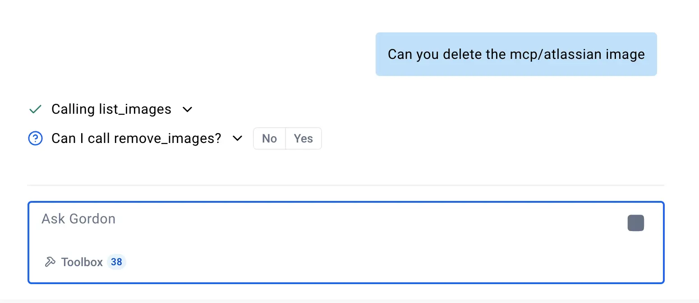

## Gordon as an MCP server

In addition to functioning as an MCP client, Gordon can also act as an MCP
server. This means that all the tools configured in the toolbox section of
Gordon can be exposed to another MCP client like Claude Desktop, Cursor and
others.

To use Gordon’s built-in tools in other MCP clients, configure your client of
choice to use the `docker ai mcpserver` command. This allows Gordon to serve its
built-in tools via the MCP protocol for various clients.

For example, to enable Gordon’s tools in Claude Desktop, add the following
configuration to the Claude configuration file:

```json
{
  "mcpServers": {
    "gordon": {
      "command": "docker",
      "args": ["ai", "mcpserver"]
    }
  }
}
```

This setup ensures that Claude Desktop can communicate with Gordon as an MCP
server, leveraging its built-in tools. You can follow the [Claude Desktop
documentation](https://modelcontextprotocol.io/quickstart/user) to explore
further.

### Tool permissions and security

These tools operate with the same permissions as the user running the
application.

Any potentially destructive tool call, changing files, deleting images or
stopping containers will ask for your confirmation before proceeding.


