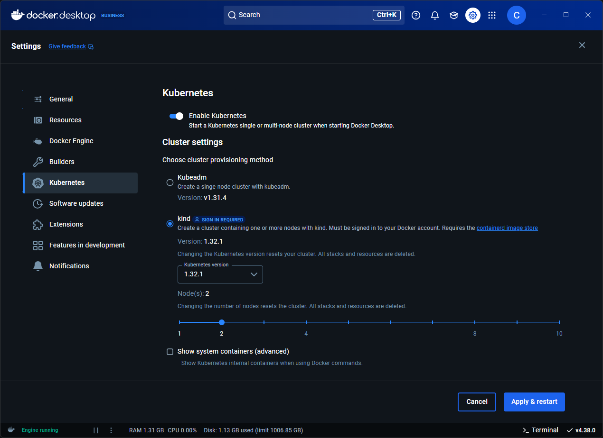

Docker Desktop includes a standalone Kubernetes server and client, as well as Docker CLI integration, enabling local Kubernetes development and testing directly on your machine.

The Kubernetes server runs as a single or multi-node cluster, within Docker container(s). This lightweight setup helps you explore Kubernetes features, test workloads, and work with container orchestration in parallel with other Docker functionalities.

Kubernetes on Docker Desktop runs alongside other workloads, including Swarm services and standalone containers.



## What happens when I enable Kubernetes in Docker Desktop?

When you enable Kubernetes in Docker Desktop, the following actions are triggered in the Docker Desktop backend and VM:

- Generation of certificates and cluster configuration
- Download and installation of Kubernetes internal components
- Cluster bootup
- Installation of additional controllers for networking and storage

Turning the Kubernetes server on or off in Docker Desktop does not affect your other workloads.

## Install and turn on Kubernetes

1. Open the Docker Desktop Dashboard and navigate to **Settings**.
2. Select the **Kubernetes** tab.
3. Toggle on **Enable Kubernetes**.
4. Choose your cluster provisioning method. You can choose either **Kubeadm** or **kind** if you are signed in and are using Docker Desktop version 4.38 or later.

   If you select **kind** you can also choose the Kubernetes version and the number of nodes.
5. Select **Apply & Restart** to save the settings. This sets up the images required to run the Kubernetes server as containers, and installs the `kubectl` command-line tool on your system at `/usr/local/bin/kubectl` (Mac) or `C:\Program Files\Docker\Docker\Resources\bin\kubectl.exe` (Windows).

   > [!NOTE]
   >
   > Docker Desktop for Linux does not include `kubectl` by default. You can install it separately by following the [Kubernetes installation guide](https://kubernetes.io/docs/tasks/tools/install-kubectl-linux/). Ensure the `kubectl` binary is installed at `/usr/local/bin/kubectl`.

When Kubernetes is enabled, its status is displayed in the Docker Desktop Dashboard footer and the Docker menu.

You can check which version of Kubernetes you're on with:

```console
$ kubectl version
```

### Additional settings

#### Kubernetes dashboard

Once Kubernetes is installed and set up, you can select the **Deploy the Kubernetes Dashboard into cluster** setting so you can manage and monitor your Kubernetes clusters and applications more easily.

#### Viewing system containers

By default, Kubernetes system containers are hidden. To inspect these containers, enable **Show system containers (advanced)**.

You can now view the running Kubernetes containers with `docker ps` or in the Docker Desktop Dashboard.

## Using the kubectl command

Kubernetes integration automatically installs the Kubernetes CLI command
at `/usr/local/bin/kubectl` on Mac and at `C:\Program Files\Docker\Docker\Resources\bin\kubectl.exe` on Windows. This location may not be in your shell's `PATH`
variable, so you may need to type the full path of the command or add it to
the `PATH`.

If you have already installed `kubectl` and it is
pointing to some other environment, such as `minikube` or a Google Kubernetes Engine cluster, ensure you change the context so that `kubectl` is pointing to `docker-desktop`:

```console
$ kubectl config get-contexts
$ kubectl config use-context docker-desktop
```

> [!TIP]
>
> If the `kubectl` config get-contexts command returns an empty result, try:
>
> - Running the command in the Command Prompt or PowerShell.
> - Setting the `KUBECONFIG` environment variable to point to your `.kube/config` file.

### Verify installation

To confirm that Kubernetes is running, list the available nodes:

```console
$ kubectl get nodes
NAME                 STATUS    ROLES            AGE       VERSION
docker-desktop       Ready     control-plane    3h        v1.29.1
```

If you installed `kubectl` using Homebrew, or by some other method, and
experience conflicts, remove `/usr/local/bin/kubectl`.

For more information about `kubectl`, see the
[`kubectl` documentation](https://kubernetes.io/docs/reference/kubectl/overview/).

## Upgrade your cluster

Kubernetes clusters are not automatically upgraded with Docker Desktop updates. To upgrade the cluster, you must manually select **Reset Kubernetes Cluster** in settings.

## Troubleshooting

- If Kubernetes fails to start, make sure Docker Desktop is running with enough allocated resources. Check **Settings** > **Resources**.
- If the `kubectl` commands return errors, confirm the context is set to `docker-desktop`
   ```console
   $ kubectl config use-context docker-desktop
   ```
   You can then try checking the logs of the [Kubernetes system containers](#viewing-system-containers) if you have enabled that setting.
- If you're experiencing cluster issues after updating, reset your Kubernetes cluster. Resetting a Kubernetes cluster can help resolve issues by essentially reverting the cluster to a clean state, and clearing out misconfigurations, corrupted data, or stuck resources that may be causing problems. If the issue still persists, you may need to clean and purge data, and then restart Docker Desktop.

## Turn off and uninstall Kubernetes

To turn off Kubernetes in Docker Desktop:

1. From the Docker Desktop Dashboard, select the **Settings** icon.
2. Select the **Kubernetes** tab.
3. Deselect the **Enable Kubernetes** checkbox.
4. Select **Apply & Restart** to save the settings. This stops and removes Kubernetes containers, and also removes the `/usr/local/bin/kubectl` command.
