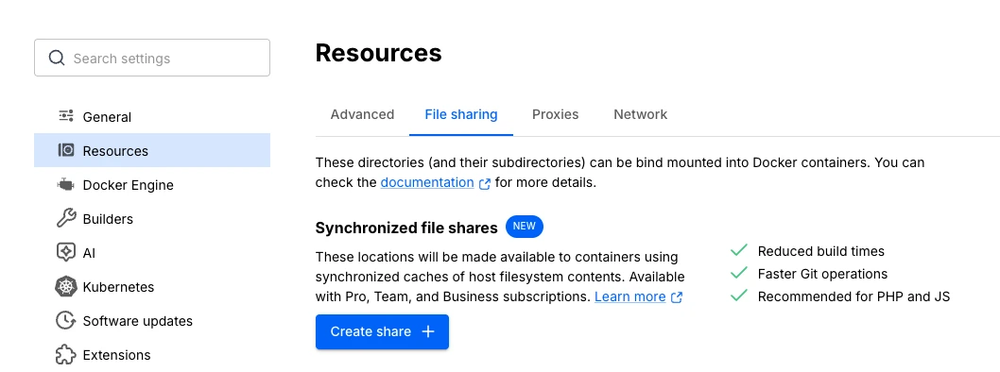



Synchronized file shares is an alternative file sharing mechanism that provides fast and flexible host-to-VM file sharing, enhancing bind mount performance through the use of synchronized filesystem caches. 

 
## Who is it for?

Synchronized file shares is ideal for developers who: 
- Have large repositories or monorepos with 100 000 files or more totaling hundreds of megabytes or even gigabytes.
- Are using virtual filesystems, such as VirtioFS, gRPC FUSE, and osxfs, which are no longer scaling well with their codebases. 
- Regularly encounter performance limitations.
- Don't want to worry about file ownership or spend time resolving conflicting file-ownership information when modifying multiple containers.

## How does Synchronized file shares work?

A Synchronized file share behaves just like a virtual file share, but takes advantage of a high-performance, low-latency code synchronization engine to create a synchronized cache of the host files on an ext4 filesystem within the Docker Desktop VM. If you make filesystem changes on the host or in the VM’s containers, it propagates via bidirectional synchronization.

After creating a file share instance, any container using a bind mount that points to a location on the host filesystem matching the specified synchronized file share location, or a subdirectory within it,  utilizes the Synchronized File Shares feature. Bind mounts that don't satisfy this condition are passed to the normal virtual filesystem [bind-mounting mechanism](/manuals/engine/storage/bind-mounts.md), for example VirtioFS or gRPC-FUSE.

> [!NOTE]
>
> Synchronized file shares is not used by Kubernetes' `hostPath` volumes in Docker Desktop.

> [!IMPORTANT]
>
> Synchronized file shares isn't available on WSL or when using Windows containers. 

## Create a file share instance 

To create a file share instance:
1. Sign in to Docker Desktop.
2. In **Settings**, navigate to the **File sharing** tab within the **Resources** section. 
3. In the **Synchronized File Shares** section, select the **Create share** icon.
4. Select a host folder to share. The synchronized file share should initialize and be usable.

File shares take a few seconds to initialize as files are copied into the Docker Desktop VM. During this time, the status indicator displays **Preparing**. There is also a status icon in the footer of the Docker Desktop Dashboard that keeps you updated.

When the status indicator displays **Watching for filesystem changes**, your files are available to the VM through all the standard bind mount mechanisms, whether that's `-v` in the command line or specified in your `compose.yml` file.

> [!NOTE]
>
> When you create a new service, setting the [bind mount option consistency](/reference/cli/docker/service/create.md#options-for-bind-mounts) to `:consistent` bypasses Synchronized file shares. 

> [!TIP]
>
> Compose can now automatically create file shares for bind mounts. 
> Ensure you're signed in to Docker with a paid subscription and have enabled both **Access experimental features** and **Manage Synchronized file shares with Compose** in Docker Desktop's settings.

## Explore your file share instance

The **Synchronized file shares** section displays all your file share instances and provides useful information about each instance including:
- The origin of the file share content
- A status update
- How much space each file share is using
- The number of filesystem entry counts
- The number of symbolic links
- Which container(s) is using the file share instance

Selecting a file share instance expands the dropdown and exposes this information.

## Use `.syncignore`

You can use a `.syncignore` file at the root of each file share, to exclude local files from your file share instance. It supports the same syntax as `.dockerignore` files and excludes, and/or re-includes, paths from synchronization. `.syncignore` files are ignored at any location other than the root of the file share.
 
Some example of things you might want to add to your `.syncignore` file are:
- Large dependency directories, for example `node_modules` and `composer` directories (unless you rely on accessing them via a bind mount)
- `.git` directories (again, unless you need them)

In general, use your `.syncignore` file to exclude items that aren't critical to your workflow, especially those that would be slow to sync or use significant storage.

## Known issues

- Changes made to `.syncignore` don't lead to immediate deletions unless the file share is recreated. In other words, files that are newly ignored due to modifications in the `.syncignore` file remain in their current location, but are no longer updated during synchronization.

- File share instances are currently limited to approximately 2 million files per share. For best performance, if you have a file share instance of this size, try to decompose it into multiple shares corresponding to individual bind mount locations.

- Case conflicts, due to Linux being case-sensitive and macOS/Windows only being case-preserving, display as **File exists** problems in the GUI. These can be ignored. However, if they persist, you can report the issue.

- Synchronized file shares proactively reports temporary issues, which can result in occasional **Conflict** and **Problem** indicators appearing in the GUI during synchronization. These can be ignored. However, if they persist, you can report the issue.

- If you switch from WSL2 to Hyper-V on Windows, Docker Desktop needs to be fully restarted.

- POSIX-style Windows paths are not supported. Avoid setting the [`COMPOSE_CONVERT_WINDOWS_PATHS`](/manuals/compose/how-tos/environment-variables/envvars.md#compose_convert_windows_paths) environment variable in Docker Compose.

- If you don't have the correct permissions to create symbolic links and your container attempts to create symbolic links in your file share instance, an **unable to create symbolic link** error message displays. For Windows users, see Microsoft's [Create symbolic links documentation](https://learn.microsoft.com/en-us/previous-versions/windows/it-pro/windows-10/security/threat-protection/security-policy-settings/create-symbolic-links) for best practices and location of the **Create symbolic links** security policy setting. For Mac and Linux users, check that you have write permissions on the folder.

## Feedback and support

To give feedback or report bugs, visit:

- [Docker Desktop for Mac issues on GitHub](https://github.com/docker/for-mac/issues)
- [Docker Desktop for Windows issues on GitHub](https://github.com/docker/for-win/issues)
- [Docker Desktop for Linux issues on GitHub](https://github.com/docker/desktop-linux/issues)
