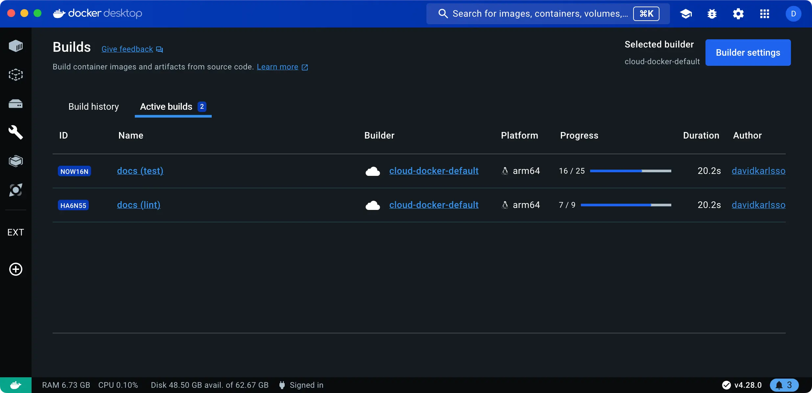
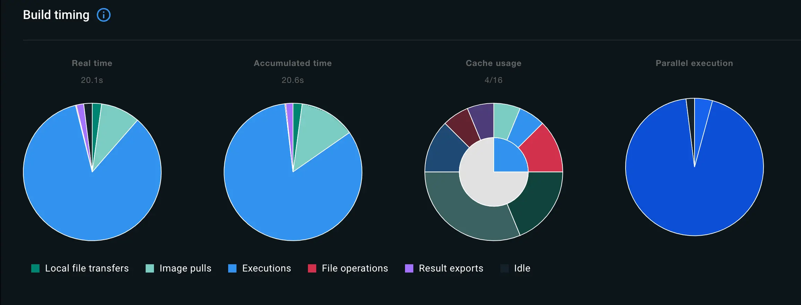
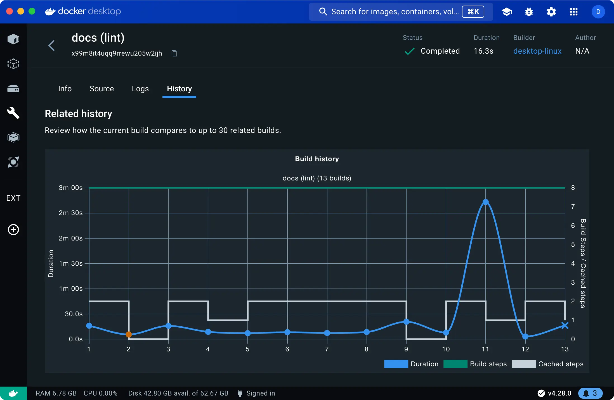

The **Builds** view is a simple interface that lets you inspect your build
history and manage builders using Docker Desktop.

Opening the **Builds** view in Docker Desktop displays a list of completed builds.
By default, the list is sorted by date, showing the most recent builds at the top.
You can switch to **Active builds** to view any ongoing builds.



If you're connected to a cloud builder through [Docker Build Cloud](../../build-cloud/_index.md),
the Builds view also lists any active or completed cloud builds by other team members
connected to the same cloud builder.

## Show build list

Select the **Builds** view in the Docker Desktop Dashboard to open the build list.

The build list shows your completed and ongoing builds. The **Build history**
tab shows completed historical builds, and from here you can inspect the build
logs, dependencies, traces, and more. The **Active builds** tab shows builds
that are currently running.

The list shows builds for your active, running builders. It doesn't list builds
for inactive builders: builders that you've removed from your system, or
builders that have been stopped.

### Builder settings

The top-right corner shows the name of your currently selected builder, and the
**Builder settings** button lets you [manage builders](#manage-builders) in the
Docker Desktop settings.

### Import builds



The **Import builds** button lets you import build records for builds by other
people, or builds in a CI environment. When you've imported a build record, it
gives you full access to the logs, traces, and other data for that build,
directly in Docker Desktop. The [build summary](/manuals/build/ci/github-actions/build-summary.md)
for the `docker/build-push-action` and `docker/bake-action` GitHub Actions
includes a link to download the build records, for inspecting CI jobs with
Docker Desktop.

## Inspect builds

To inspect a build, select the build that you want to view in the list.
The inspection view contains a number of tabs.

The **Info** tab displays details about the build.

If you're inspecting a multi-platform build, the drop-down menu in the
top-right of this tab lets you filter the information down to a specific
platform:


The **Source details** section shows information about the frontend
[frontend](/manuals/build/buildkit/frontend.md) and, if available,
the source code repository used for the build.

### Build timing

The **Build timing** section of the Info tab contains charts
showing a breakdown of the build execution from various angles.

- **Real time** refers to the wall-clock time that it took to complete the build.
- **Accumulated time** shows the total CPU time for all steps.
- **Cache usage** shows the extent to which build operations were cached.
- **Parallel execution** shows how much of the build execution time was spent running steps in parallel.



The chart colors and legend keys describe the different build operations. Build
operations are defined as follows:

| Build operation      | Description                                                                                                                                                                     |
| :------------------- | :------------------------------------------------------------------------------------------------------------------------------------------------------------------------------ |
| Local file transfers | Time spent transferring local files from the client to the builder.                                                                                                             |
| File operations      | Any operations that involve creating and copying files in the build. For example, the `COPY`, `WORKDIR`, `ADD` instructions in a Dockerfile frontend all incur file operations. |
| Image pulls          | Time spent pulling images.                                                                                                                                                      |
| Executions           | Container executions, for example commands defined as `RUN` instructions in a Dockerfile frontend.                                                                              |
| HTTP                 | Remote artifact downloads using `ADD`.                                                                                                                                          |
| Git                  | Same as **HTTP** but for Git URLs.                                                                                                                                              |
| Result exports       | Time spent exporting the build results.                                                                                                                                         |
| SBOM                 | Time spent generating the [SBOM attestation](/manuals/build/metadata/attestations/sbom.md).                                                                                                 |
| Idle                 | Idle time for build workers, which can happen if you have configured a [max parallelism limit](/manuals/build/buildkit/configure.md#max-parallelism).                              |

### Build dependencies

The **Dependencies** section shows images and remote resources used during
the build. Resources listed here include:

- Container images used during the build
- Git repositories included using the `ADD` Dockerfile instruction
- Remote HTTPS resources included using the `ADD` Dockerfile instruction

### Arguments, secrets, and other parameters

The **Configuration** section of the Info tab shows parameters passed to the build:

- Build arguments, including the resolved value
- Secrets, including their IDs (but not their values)
- SSH sockets
- Labels
- [Additional contexts](/reference/cli/docker/buildx/build/#build-context)

### Outputs and artifacts

The **Build results** section shows a summary of the generated build artifacts,
including image manifest details, attestations, and build traces.

Attestations are metadata records attached to a container image.
The metadata describes something about the image,
for example how it was built or what packages it contains.
For more information about attestations, see [Build attestations](/manuals/build/metadata/attestations/_index.md).

Build traces capture information about the build execution steps in Buildx and
BuildKit. The traces are available in two formats: OTLP and Jaeger. You can
download build traces from Docker Desktop by opening the actions menu and
selecting the format you want to download.

#### Inspect build traces with Jaeger

Using a Jaeger client, you can import and inspect build traces from Docker
Desktop. The following steps show you how to export a trace from Docker Desktop
and view it in [Jaeger](https://www.jaegertracing.io/):

1. Start Jaeger UI:

   ```console
   $ docker run -d --name jaeger -p "16686:16686" jaegertracing/all-in-one
   ```

2. Open the Builds view in Docker Desktop, and select a completed build.

3. Navigate to the **Build results** section, open the actions menu and select **Download as Jaeger format**.

   <video controls>
     <source src="/assets/video/build-jaeger-export.mp4" type="video/mp4" />
   </video>

4. Go to <http://localhost:16686> in your browser to open Jaeger UI.

5. Select the **Upload** tab and open the Jaeger build trace you just exported.

Now you can analyze the build trace using the Jaeger UI:


### Dockerfile source and errors

When inspecting a successful completed build or an ongoing active build,
the **Source** tab shows the [frontend](/manuals/build/buildkit/frontend.md)
used to create the build.

If the build failed, an **Error** tab displays instead of the **Source** tab.
The error message is inlined in the Dockerfile source,
indicating where the failure happened and why.


### Build logs

The **Logs** tab displays the build logs.
For active builds, the logs are updated in real-time.

You can toggle between a **List view** and a **Plain-text view** of a build log.

- The **List view** presents all build steps in a collapsible format,
  with a timeline for navigating the log along a time axis.

- The **Plain-text view** displays the log as plain text.

The **Copy** button lets you copy the plain-text version of the log to your clipboard.

### Build history

The **History** tab displays statistics data about completed builds.

The time series chart illustrates trends in duration, build steps, and cache usage for related builds,
helping you identify patterns and shifts in build operations over time.
For instance, significant spikes in build duration or a high number of cache misses
could signal opportunities for optimizing the Dockerfile.



You can navigate to and inspect a related build by selecting it in the chart,
or using the **Past builds** list below the chart.

## Manage builders

The **Builder settings** view in the Docker Desktop settings lets you:

- Inspect the state and configuration of active builders
- Start and stop a builder
- Delete build history
- Add or remove builders (or connect and disconnect, in the case of cloud builders)


For more information about managing builders, see [Change settings](/manuals/desktop/settings-and-maintenance/settings.md#builders)
