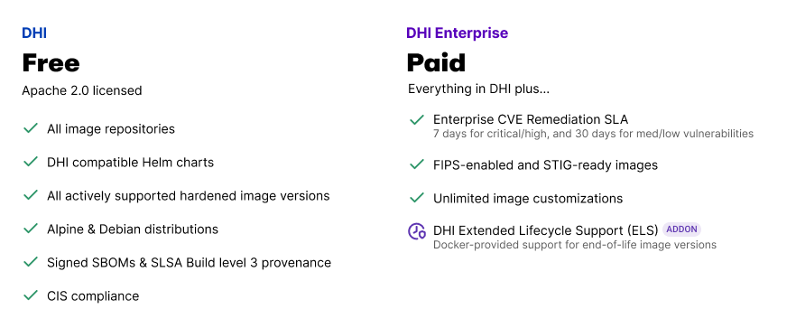

Docker Hardened Images (DHI) are minimal, secure, and production-ready container
base and application images maintained by Docker. Designed to reduce
vulnerabilities and simplify compliance, DHI integrates easily into your
existing Docker-based workflows with little to no retooling required.

DHI is available in two tiers: **DHI Free** provides core security features at
no cost, while **DHI Enterprise** adds SLA-backed support, compliance variants,
customization, and Extended Lifecycle Support for organizations with advanced
requirements.

Explore the sections below to get started with Docker Hardened Images, integrate
them into your workflow, and learn what makes them secure and enterprise-ready.


