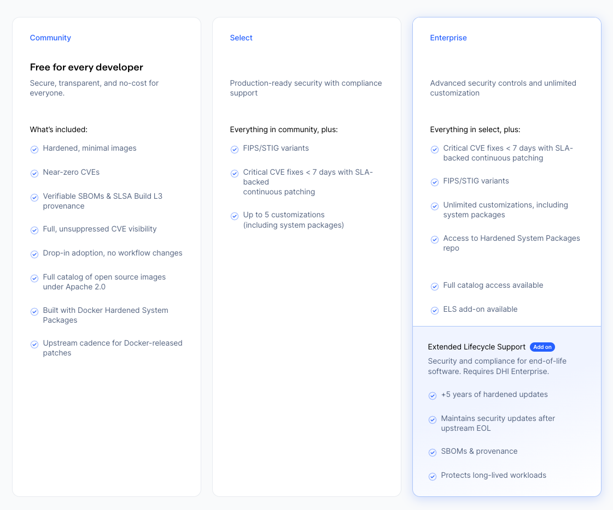

Docker Hardened Images (DHI) provide minimal, secure, and production-ready
container images, Helm charts, and system packages maintained by Docker.
Designed to reduce vulnerabilities and simplify compliance, DHI integrates
easily into your existing Docker-based workflows with little to no retooling
required.

DHI is available in the following three subscriptions.

For more details see the [Docker Hardened Images subscription
comparison](https://www.docker.com/products/hardened-images/#compare).

Explore the sections below to get started with Docker Hardened Images, integrate
them into your workflow, and learn what makes them secure and enterprise-ready.


