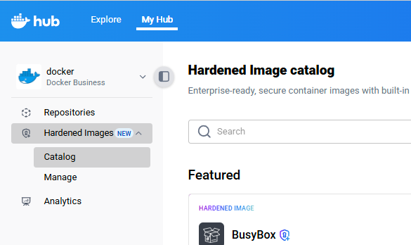
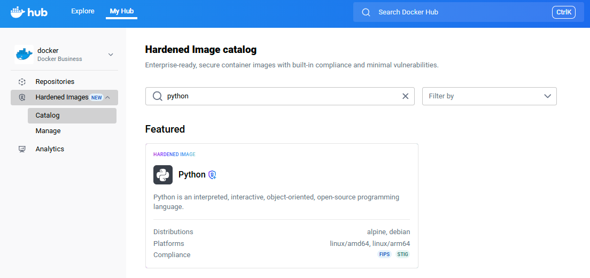



This guide shows you how to go from zero to running a Docker Hardened Image
(DHI) using a real example. While the steps use a specific image as an
example, they can be applied to any DHI.

> [!TIP]
>
> You can keep using the same tools and workflows you already know when moving
> to DHI from other images on Docker Hub, such as Bitnami public catalog images.
> Note that [Bitnami announced](https://github.com/bitnami/charts/issues/35164)
> that its public catalog images will no longer be available after September 29,
> 2025.
>
> In most cases, migrating is as simple as updating the image reference in your
> configuration or commands. Start with this guide, then see the [migration
> guide](./how-to/migrate.md) for more details and examples.

## Step 1: Start a free trial to access DHI

You can browse the Docker Hardened Images catalog without a subscription, but to
use an image, you must either [contact sales to
subscribe](https://www.docker.com/products/hardened-images/#getstarted) or start
a free trial for an [organization](/admin/organization/). This guide walks you
through starting a free trial.

To start a free trial:

1. Go to the Hardened Images catalog in [Docker
   Hub](https://hub.docker.com/hardened-images/catalog) and sign in.
2. Select **Start trial** and follow the on-screen instructions.

## Step 2: Find an image to use

1. Go to the Hardened Images catalog in [Docker
   Hub](https://hub.docker.com/hardened-images/catalog) and sign in.
2. In the left sidebar, choose your organization that has DHI access.
3. In the left sidebar, select **Hardened Images** > **Catalog**.

   

4. Use the search bar or filters to find an image (e.g., `python`, `node`,
   `golang`). For this guide, use the Python image as an example.

    

5. Select the Python repository to view its details.

Continue to the next step to mirror the image. To dive deeper into exploring
images see [Explore Docker Hardened Images](./how-to/explore.md).

## Step 3: Mirror the image

To use a Docker Hardened Image, you must mirror it to your organization. Only
organization owners can perform this action. Mirroring creates a copy of the
image in your organization's namespace, allowing team members to pull and use
it.

1. In the image repository page, select **Mirror to repository**.
   
   

   > [!NOTE]
   >
   > If you don't see the **Mirror to repository** button, the repository may
   > already be mirrored to your organization. In this case, you can select
   > **View in repository** to see the mirrored image's location or mirror it to
   > another repository.
  
2. Follow the on-screen instructions to choose a name. For this guide, the
   example uses the name `dhi-python`. Note that the name must start with
   `dhi-`.

   

3. Select **Create repository** to start the mirroring process.

It may take a few minutes for all the tags to finish mirroring. Once
mirrored, the image repository appears in your organization's namespace. For
example, in [Docker Hub](https://hub.docker.com), go to **My Hub** > ***YOUR_ORG*** > **Repositories**,
and you should see `dhi-python` listed. You can now pull it
like any other image.


Continue to the next step to pull and run the image. To dive deeper into
mirroring images see [Mirror a Docker Hardened Image
repository](./how-to/mirror.md).

## Step 4: Pull and run the image

Once you've mirrored the image to your organization, you can pull and run it
like any other Docker image. Note that Docker Hardened Images are designed to be
minimal and secure, so they may not include all the tools or libraries you
expect in a typical image. You can view the typical differences in
[Considerations when adopting
DHIs](./how-to/use.md#considerations-when-adopting-dhis).

The following example demonstrates that you can run the Python image and execute
a simple Python command just like you would with any other Docker image:

1. Pull the mirrored image. Open a terminal and run the following command,
   replacing `<your-namespace>` with your organization's namespace:

   ```console
   $ docker pull <your-namespace>/dhi-python:3.13
   ```

2. Run the image to confirm everything works:

    ```console
    $ docker run --rm <your-namespace>/dhi-python:3.13 python -c "print('Hello from DHI')"
    ```
  
    This starts a container from the `dhi-python:3.13` image and runs a simple
    Python script that prints `Hello from DHI`.

To dive deeper into using images see [Use a Docker Hardened Image](./how-to/use.md).

## What's next

You've pulled and run your first Docker Hardened Image. Here are a few ways to keep going:

- [Migrate existing applications to DHIs](./how-to/migrate.md): Learn how to
  update your Dockerfiles to use Docker Hardened Images as the base.

- [Verify DHIs](./how-to/verify.md): Use tools like [Docker Scout](/scout/) or
  Cosign to inspect and verify signed attestations, like SBOMs and provenance.

- [Scan DHIs](./how-to/scan.md): Analyze the image with Docker
  Scout or other scanners to identify known CVEs.