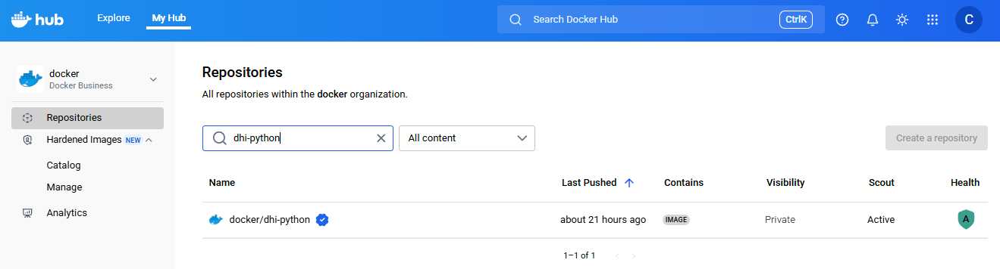



Before you can use a Docker Hardened Image (DHI), you must mirror its repository
to your organization. Only organization owners can perform this action. Once
mirrored, the image becomes available in your organization's namespace, and
users with access can begin pulling and using it.

Mirrored repositories automatically stay up to date. Docker continues to sync
new tags and image updates from the upstream DHI catalog, so you always have
access to the latest secure version.

## Prerequisites

- To manage mirroring, you must be an [organization owner](/admin/).
- Your organization must be [signed
  up](https://www.docker.com/products/hardened-images/#getstarted) to use
  Docker Hardened Images.

## Mirror an image repository

To mirror a Docker Hardened Image repository:

1. Go to [Docker Hub](https://hub.docker.com) and sign in.
2. Select **My Hub**.
3. In the namespace drop-down, select your organization that has access to DHI.
4. Select **Hardened Images** > **Catalog**.
5. Select a DHI repository to view its details.
6. Select **Mirror to repository** and follow the on-screen instructions.


It may take a few minutes for all the tags to finish mirroring. Once an image
has been mirrored, the **Mirror to repository** button changes to **View in
repository**. Selecting **View in repository** opens a drop-down list of
repositories that the image has already been mirrored to. From this drop-down,
you can:

 - Select an existing mirrored repository to view its details
 - Select **Mirror to repository** again to mirror the image to an additional
   repository

After mirroring a repository, the repository appears in your organization's
repository list under the name you specified, prefixed by `dhi-`. It will
continue to receive updated images.



> [!IMPORTANT]
>
> The mirrored repository's visibility must remain private. Changing its
> visibility to public will stop updates from being mirrored.

Once mirrored, the image repository works like any other private repository on
Docker Hub. Team members with access to the repository can now pull and use the
image. To learn how to manage access, view tags, or configure settings, see
[Repositories](/manuals/docker-hub/repos.md).

### Webhook integration for syncing and alerts

To keep external registries or systems in sync with your mirrored Docker
Hardened Images, and to receive notifications when updates occur, you can
configure a [webhook](/docker-hub/repos/manage/webhooks/) on the mirrored
repository in Docker Hub. A webhook sends a `POST` request to a URL you define
whenever a new image tag is pushed or updated.

For example, you might configure a webhook to call a CI/CD system at
`https://ci.example.com/hooks/dhi-sync` whenever a new tag is mirrored. The
automation triggered by this webhook can pull the updated image from Docker Hub
and push it to an internal registry such as Amazon ECR, Google Artifact
Registry, or GitHub Container Registry.

Other common webhook use cases include:

- Triggering validation or vulnerability scanning workflows
- Signing or promoting images
- Sending notifications to downstream systems

#### Example webhook payload

When a webhook is triggered, Docker Hub sends a JSON payload like the following:

```json
{
  "callback_url": "https://registry.hub.docker.com/u/exampleorg/dhi-python/hook/abc123/",
  "push_data": {
    "pushed_at": 1712345678,
    "pusher": "trustedbuilder",
    "tag": "3.13-alpine3.21"
  },
  "repository": {
    "name": "dhi-python",
    "namespace": "exampleorg",
    "repo_name": "exampleorg/dhi-python",
    "repo_url": "https://hub.docker.com/r/exampleorg/dhi-python",
    "is_private": true,
    "status": "Active",
    ...
  }
}
```

## Stop mirroring an image repository

Only organization owners can stop mirroring a repository. After you stop
mirroring, the repository remains, but it will
no longer receive updates. You can still pull the last image that was mirrored,
but the repository will not receive new tags or updates from the original
repository.

 To stop mirroring an image repository:

1. Go to [Docker Hub](https://hub.docker.com) and sign in.
2. Select **My Hub**.
3. In the namespace drop-down, select your organization that has access to DHI.
4. Select **Hardened Images** > **Management**.
5. In the far right column of the repository you want to stop mirroring, select the menu icon.
6. Select **Stop mirroring**.

Once you have stopped mirroring a repository, you can choose another DHI
repository to mirror.

## Mirror from Docker Hub to another registry

After you've mirrored a Docker Hardened Image repository to your organization's
namespace on Docker Hub, you can optionally mirror it to another container
registry, such as Amazon ECR, Google Artifact Registry, GitHub Container
Registry, or a private Harbor instance.

You can use any standard workflow, including:

- [The Docker CLI](/reference/cli/docker/_index.md)
- [The Docker Hub Registry API](/reference/api/registry/latest/)
- Third-party registry tools or CI/CD automation

The following example shows how to use the Docker CLI to pull a mirrored DHI and
push it to another registry:

```console
# Authenticate to Docker Hub (if not already signed in)
$ docker login

# Pull the image from your organization's namespace on Docker Hub
$ docker pull <your-namespace>/dhi-<image>:<tag>

# Tag the image for your destination registry
$ docker tag <your-namespace>/dhi-<image>:<tag> registry.example.com/my-project/<image>:<tag>

# Push the image to the destination registry
# You will need to authenticate to the third-party registry before pushing
$ docker push registry.example.com/my-project/<image>:<tag>
```

> [!IMPORTANT]
>
> To continue receiving image updates and preserve access to Docker Hardened
> Images, ensure that any copies pushed to other registries remain private.

### Include attestations when mirroring images

Docker Hardened Images are signed and include associated attestations that
provide metadata such as build provenance and vulnerability scan results. These
attestations are stored as OCI artifacts and are not included by default when
using the Docker CLI to mirror images.

To preserve the full security context when copying DHIs to another registry, you
must explicitly include the attestations. One tool is `regctl`, which supports
copying both images and their associated artifacts.

For more details on how to use `regctl` to copy images and their associated
artifacts, see the [regclient
documentation](https://regclient.org/cli/regctl/image/copy/).

## What's next

After mirroring an image repository, you can you can start [using the
image](./use.md).