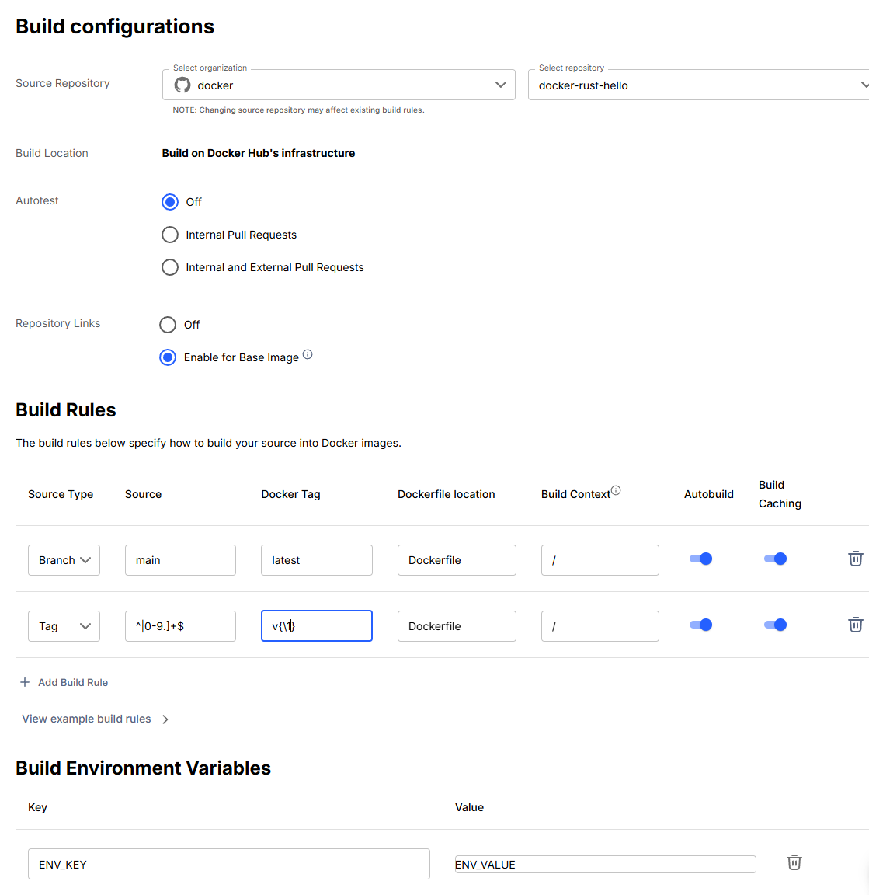

This guide explains how to migrate your Docker Hub Autobuilds setup to
Continuous Integration (CI) workflows, focusing on GitHub Actions and Bitbucket
Pipelines as these are the built-in CI services for the two version control
services supported via Autobuilds.

## Step 1: Create access tokens

To grant your CI workflows the ability to pull and push images to and from
Docker Hub, you first need to create access tokens:

- For a personal repository: Create a [Personal
  AccessToken](../../../../security/access-tokens.md) with **Read & Write**
  permissions.

- For an organization repository: Create an [Organization Access
  Token](../../../../enterprise/security/access-tokens.md) with the following
  permissions:
  - **Read public repositories**
  - **Image Pull** on any private repositories that the build needs to pull from
  - **Image Push** on the repository that the built image will be pushed to

The same token can be used for all CI workflows under the account's namespace
provided it has adequate permissions to all relevant Docker Hub repositories.

Make sure to save the generated token in a safe location for use when setting up
the CI workflows.

## Step 2: Extract your Autobuilds configuration

For each Docker Hub repository currently configured to use Autobuilds, you need
to extract its configuration to set up your CI workflows to duplicate the
existing functionality. The only way to extract the configuration is via the
Docker Hub web interface.

1. Sign in to [Docker Hub](https://hub.docker.com).

2. Navigate to your repository by going to **My Hub** > ***Your namespace*** >
   **Repositories** > ***Your Repository***.

3. Go to the **Builds** tab and select **Configure automated builds**.

   If there is no existing build configuration, then this repository is not
   configured for Autobuilds.

4. Note the following configuration details:

   - **Source Repository**: The GitHub or Bitbucket repository. The organization
     is the namespace and the repository is the repository name. This is where
     you need to add your workflow.

   - **Autotest**: If Autotest is enabled for Pull Requests (either internal
     only or internal and external), then extra steps are needed in your
     workflow to run the Autotest step.

   - **Repository Links**: Not supported and can be ignored. If chain builds are
     required, see the documentation for your CI service on how to chain builds
     together.

   - **Build Rules**: Specify the triggers, tags, and paths of your builds.
     Ignore any entry where **Autobuild** is toggled off.

   - **Build Environment Variables**: User-defined variables injected as
     environment variables into your build. You need to add these to your
     workflow. If the environment variables are secret, add them as secrets in
     the CI service and change your build instructions to read the data from the
     secrets. See your CI service documentation on how to handle secrets.

### Example configuration

The following image shows an example Autobuilds configuration.

Based on the pictured example, you would note the following items for this
Autobuilds configuration:

- Source code repository: GitHub repository `docker/docker-rust-hello`
- Autotest: Disabled
- Build rule 1: Build and push the image with tag `latest` when a new commit to
  the `main` branch is detected. The Dockerfile is at `./Dockerfile` and the
  build context is the root of the cloned code.
- Build rule 2: Build and push the image with tag `v{\1}` when a new commit
  to a tag matching the regex `^v([0-9.]+)$` is detected. The Dockerfile is at
  `./Dockerfile` and the build context is the root of the cloned code.
- Environment variable: Key `ENV_KEY` with value `ENV_VALUE`

## Step 3: Migrate to your CI/CD platform

Select the tab that matches your source code repository hosting platform.




If your source code repository is hosted on GitHub, see the [Docker
test-autobuilds example repository](https://github.com/docker/test-autobuilds).

All files except those under the `.github/workflows` directory are for example
purposes only.

The repository's readme details how to migrate from Autobuilds to GitHub Actions
using one of the two provided workflows:

- The `simple-build` workflow builds and pushes a Docker image to your Docker
  Hub repository.
- The `full-autobuilds` workflow contains all the steps commonly used within an
  Autobuilds run, including building, tagging, running Docker Compose tests, and
  running optional bash hook files.

### Steps to migrate

1. Follow the instructions in the [example repository
   readme](https://github.com/docker/test-autobuilds) to configure a CI GitHub
   Action workflow in your GitHub repository.

2. The workflows contain comments on what each step does and where changes
   should be made. Important changes to make include:

   - Set the `DOCKER_REPOSITORY_NAME` environment variable to the full name of your Docker Hub repository
   - Set your image tagging policy
   - Set the workflow triggers

   Links to relevant documentation are provided in the readme and the workflow comments.

3. After you have completed migrating to GitHub Actions, delete the build
   configuration from your Docker Hub repository:

   1. Navigate to the repository's **Builds** tab.

   2. Select **Configure automated builds**.

   3. Select **Delete Build Configuration**.




If your source code repository is hosted on Bitbucket, see the [Docker
test-autobuilds-bitbucket example
repository](https://bitbucket.org/docker/test-autobuilds-bitbucket).

All files except the `bitbucket-pipelines.yml` file are for example purposes only.

The repository's readme details how to migrate from Autobuilds to Bitbucket
Pipelines using the provided example `bitbucket-pipelines.yml` configuration
file.

The pipeline example contains three separate pipelines:

- `branches/main`: Shows how to build, test, and push an image on changes to a specific branch
- `tags/*`: Shows how to build, test, and push an image on tag pushes, including
  tagging the image the same as the Git tag
- `pull-requests/*`: Shows how to build and test, but not push, an image from a pull request

### Steps to migrate

1. Follow the instructions in the [example repository
   readme](https://bitbucket.org/docker/test-autobuilds-bitbucket) to configure
   a Bitbucket Pipeline in your Bitbucket repository.

2. Comments in the pipeline configuration explain what each part does and where
   changes need to be made. Important changes to make include:

   - Set the `DOCKER_REPOSITORY_NAME` environment variable to the full name of
     your Docker Hub repository
   - Set your image tagging policy (see where the `DOCKER_TAG` variable is set in each pipeline)
   - Set the pipeline triggers for branches, tags, and/or pull-requests

   Links to relevant documentation are provided in the readme and the workflow comments.

3. After you have completed migrating to Bitbucket Pipelines, delete the Build
   configuration from your Docker Hub repository:

   1. Navigate to the repository's **Builds** tab.

   2. Select **Configure automated builds**.

   3. Select **Delete Build Configuration**.



