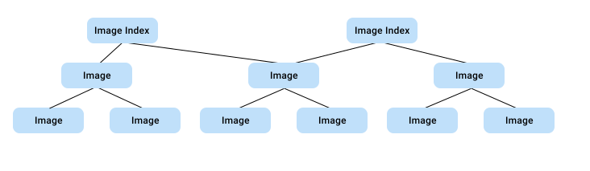



Images and image indexes are the foundation of container images within a
repository. The following diagram shows the relationship between images and
image indexes.

  

This structure enables multi-architecture support through a single reference. It
is important to note that images are not always referenced by an image index.
The following objects are shown in the diagram.

- Image index: An image that points to multiple architecture-specific images
  (like AMD and ARM), letting a single reference work across different
  platforms.
- Image: Individual container images that contain the actual configuration and
  layers for a specific architecture and operating system.

## Manage repository images and image indexes

Use the following steps to delete one or more items via the graphical user
interface. To delete in bulk, see the [deletion API
endpoint](/reference/api/registry/latest/#tag/delete).

1. Sign in to [Docker Hub](https://hub.docker.com).
2. Select **My Hub** > **Repositories**.
3. In the list, select a repository.
4. Select **Image Management**.
5. Search, filter, or sort the items.
   - Search: In the search box above the list, specify your search.
   - Filter: In the **Filter by** drop-down, select **Tagged**, **Image index**,
     or **Image**.
   - Sort: Select the column title for **Size**, **Last pushed**, or **Last
     pulled**.

   > [!NOTE]
   >
   > Images that haven't been pulled in over 6 months are marked as **Stale** in
   > the **Status** column.

6. Optional. Delete one or more items.
   1. Select the checkboxes next to the items in the list. Selecting any
      top-level index also removes any underlying images that aren't referenced
      elsewhere.
   2. Select **Preview and delete**.
   3. In the window that appears, verify the items that will be deleted and the
      amount of storage you will reclaim.
   4. Select **Delete forever**.

   > [!NOTE]
   >
   > Deletion operations may take some time to complete. In rare cases, you may
   > see a time-out error during the deletion process. If this occurs, the system will
   > automatically retry the deletion in the background, and the items will be
   > removed without requiring any action from you.
