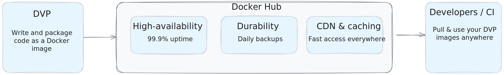

[The Docker Verified Publisher
Program](https://hub.docker.com/search?q=&image_filter=store) provides
high-quality images from commercial publishers verified by Docker.

These images help development teams build secure software supply chains,
minimizing exposure to malicious content early in the process to save time and
money later.

## Who's eligible to become a verified publisher?

Any independent software vendor who distributes software on Docker Hub can join
the Verified Publisher Program. Find out more by heading to the [Docker Verified
Publisher Program](https://www.docker.com/partners/programs) page.

> [!NOTE]
>
> DVP entitlements are applied per namespace (organization). If you operate
> multiple Docker Hub namespaces, each requires a separate DVP application and
> verification process.

## Program benefits

The Docker Verified Publisher Program (DVP) provides several features and
benefits to Docker Hub publishers. The program grants the following perks based
on participation tier:

- [Enterprise-grade infrastructure](#enterprise-grade-infrastructure): High
  availability hosting with 99.9% uptime
- [Verified publisher badge](#verified-publisher-badge): Special badge
  identifying high-quality commercial publishers
- [Repository logo](#repository-logo): Upload custom logos for individual
  repositories
- [Insights and analytics](#insights-and-analytics): Detailed usage metrics and
  community engagement data
- [Vulnerability analysis](#vulnerability-analysis): Automated security scanning
  with Docker Scout
- [Priority search ranking](#priority-search-ranking): Enhanced discoverability
  in Docker Hub search results
- [Additional Docker Business seats](#additional-docker-business-seats): Extra
  team collaboration capabilities
- [Removal of rate limiting](#removal-of-rate-limiting): Unrestricted pulls for
  development teams
- [Co-marketing opportunities](#co-marketing-opportunities): Joint promotional
  activities with Docker

### Enterprise-grade infrastructure

The Docker Verified Publisher Program runs on Docker Hub's enterprise-scale
infrastructure, serving millions of developers globally. Your published content
benefits from:

- High availability and uptime: Docker's systems are designed for failover
  across multiple availability zones, with load-balanced autoscaling, enabling
  99.9% uptime.
- Global delivery and fast downloads: Docker leverages Cloudflare's CDN and
  caching (with Cache Reserve) to achieve cache hit ratios more than 99%,
  reducing reliance on origin traffic and ensuring fast access for developers
  everywhere.
- Durability: Docker maintains a documented backup policy and performs full
  daily, backups of production data.

You simply push your images to Docker Hub as usual, and Docker takes care of the
rest, serving your image to millions of developers worldwide.

To learn more, see [Availability at
Docker](https://www.docker.com/trust/availability/).

### Verified publisher badge

Images that are part of this program have a special badge on Docker Hub making
it easier for users to identify projects that Docker has verified as
high-quality commercial publishers.

### Repository logo

DVP organizations can upload custom images for individual repositories on Docker
Hub. This lets you override the default organization-level logo on a
per-repository basis.

Only a user with administrative access (owner or team member with administrator
permission) over the repository can change the repository logo. To manage the
repository logo, see [Manage repository logo](#manage-repository-logo).

### Vulnerability analysis

[Docker Scout](/scout/) provides automatic vulnerability analysis
for DVP images published to Docker Hub.
Scanning images ensures that the published content is secure, and proves to
developers that they can trust the image.

You can enable analysis on a per-repository basis. For more about using this
feature, see [Basic vulnerability
scanning](/docker-hub/repos/manage/vulnerability-scanning/).

### Priority search ranking

Verified publisher images receive enhanced visibility in Docker Hub search
results, making it easier for developers to discover your content. This improved
discoverability helps drive adoption of your images within the developer
community.

### Additional Docker Business seats

DVP participants receive additional Docker Business seats as part of their
program benefits, enabling expanded team collaboration and access to premium
Docker features for your organization.

### Removal of rate limiting

Verified publisher images are exempt from standard [Docker Hub rate
limits](../../../usage/_index.md), ensuring developers can pull your images
without restrictions. **This applies to all users, including unauthenticated users**,
who get unlimited pulls for DVP images. This eliminates potential barriers to adoption and
provides a seamless experience for users of your content.

DVP partners can verify this unlimited access by checking the absence of rate
limiting headers when pulling their images. When pulling DVP images, users won't
see `ratelimit-limit` or `ratelimit-remaining` headers, indicating unlimited
access. For more details on checking rate limits, see [View pull rate and
limit](../../../usage/pulls.md#view-pull-rate-and-limit).

### Co-marketing opportunities

Docker collaborates with verified publishers on joint marketing initiatives,
including blog posts, case studies, webinars, and conference presentations.
These opportunities help amplify your brand visibility within the Docker
ecosystem.

### Insights and analytics

The insights and analytics service provides usage metrics for how
the community uses Docker images, granting insight into user behavior.

There is both a [web interface](./insights-analytics.md) and an
[API](/reference/api/dvp/latest/) for accessing the analytics data.

The usage metrics show the number of image pulls by tag or by digest,
geolocation, cloud provider, client, and more.

## Manage repository logo

After joining the Docker Verified Publisher Program, you can set a custom logo
for each repository in your organization. The following requirements apply:

- The supported filetypes for the logo image are JPEG and PNG.
- The minimum allowed image size in pixels is 120×120.
- The maximum allowed image size in pixels is 1000×1000.
- The maximum allowed image file size is 5MB.

### Set the repository logo

1. Sign in to [Docker Hub](https://hub.docker.com).
2. Go to the page of the repository that you want to change the logo for.
3. Select the upload logo button, represented by a camera icon () overlaying the
current repository logo.
4. In the dialog that opens, select the PNG image that you want to upload to
   set it as the logo for the repository.

### Remove the logo

Select the **Clear** button () to remove a logo.

Removing the logo makes the repository default to using the organization logo,
if set, or the following default logo if not.

