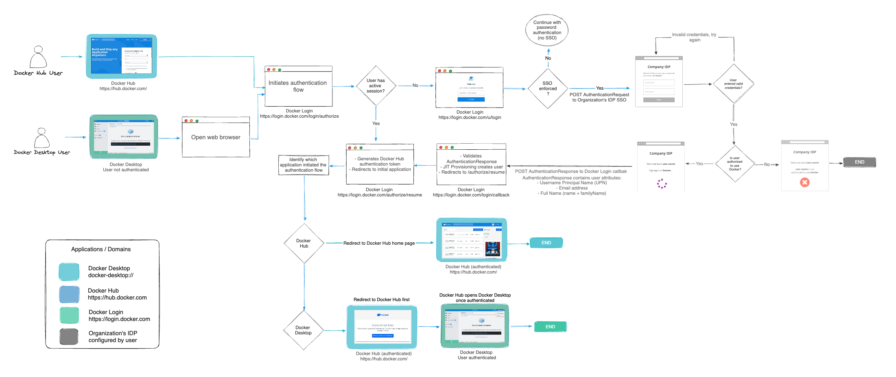



Single sign-on (SSO) lets users access Docker by authenticating through their
identity providers (IdPs). SSO can be configured for an entire company,
including all associated organizations, or for a single organization that has a
Docker Business subscription.

## How SSO works

When SSO is enabled, Docker supports a non-IdP-initiated flow for user sign-in.
Instead of signing in with a Docker username and password, users are redirected
to your IdP’s sign-in page. Users must initiate the SSO authentication process
by signing in to Docker Hub or Docker Desktop.

The following diagram illustrates how SSO operates and is managed between
Docker Hub, Docker Desktop, and your IdP.

## Set up SSO

To configure SSO in Docker, follow these steps:

1. [Configure your domain](connect.md) by creating and verifying it.
1. [Create your SSO connection](connect.md) in Docker and your IdP.
1. Link Docker to your identity provider.
1. Test your SSO connection.
1. Provision users in Docker.
1. Optional. [Enforce sign-in](../enforce-sign-in/_index.md).
1. [Manage your SSO configuration](manage.md).

Once configuration is complete, users can sign in to Docker services using
their company email address. After signing in, users are added to your company,
assigned to an organization, and added to a team.

> [!IMPORTANT]
>
> Docker plans to deprecate CLI password-based sign-in in future releases.
Using a PAT ensures continued CLI access. For more information, see the
[security announcement](/manuals/security/security-announcements.md#deprecation-of-password-logins-on-cli-when-sso-enforced).

## Next steps

- Start [configuring SSO](connect.md).
- Read the [FAQs](/manuals/enterprise/security/single-sign-on/faqs/general.md).
- [Troubleshoot](/manuals/enterprise/troubleshoot/troubleshoot-sso.md) SSO issues.
