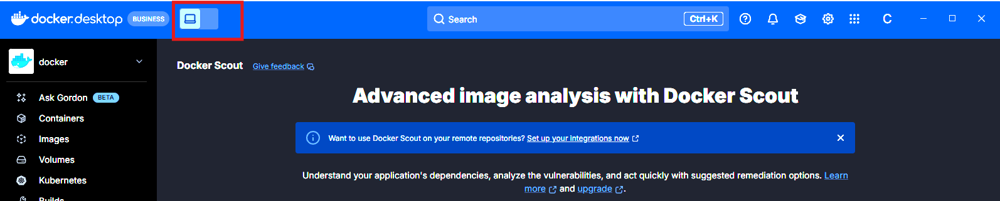



This quickstart covers the steps developers need to get started with [Docker Offload](./about.md). If you're an
organization owner, see [Manage Docker products](../admin/organization/manage-products.md) to learn how to manage access
for the developers in your organization.

## Prerequisites

- You must have [Docker Desktop](/desktop/) installed. Docker Offload works with Docker Desktop version 4.50.0 or later.

## Step 1: Verify access to Docker Offload

To access Docker Offload, you must be part of an organization that has subscribed to Docker Offload. As a developer, you
can verify this by checking if the Docker Offload toggle appears in the Docker Desktop Dashboard header.

1. Start Docker Desktop and sign in.
2. In the Docker Desktop Dashboard header, look for the Docker Offload toggle.



If you see the Docker Offload toggle, you have access to Docker Offload and can proceed to the next step. If you don't
see the Docker Offload toggle, contact your administrator to verify that your organization has subscribed to Docker
Offload.

## Step 2: Start Docker Offload

You can start Docker Offload from the CLI or in the header of the Docker Desktop Dashboard. The following steps describe
how to start Docker Offload using the CLI.

1. Start Docker Desktop and sign in.
2. Open a terminal and run the following command to start Docker Offload:

   ```console
   $ docker offload start
   ```

When Docker Offload is started, you'll see a cloud icon
()
in the Docker Desktop Dashboard header, and the Docker Desktop Dashboard appears purple. You can run
`docker offload status` in a terminal to check the status of Docker Offload.

## Step 3: Run a container with Docker Offload

After starting Docker Offload, Docker Desktop connects to a secure cloud environment
that mirrors your local experience. When you run builds or containers, they
execute remotely, but behave just like local ones.

To verify that Docker Offload is working, run a container:

```console
$ docker run --rm hello-world
```

If Docker Offload is working, you'll see `Hello from Docker!` in the terminal output.

## Step 4: Monitor your Offload usage

You can see your current Offload session duration in the Docker Desktop Dashboard footer. To view detailed information,
in the Docker Desktop Dashboard left navigation select **Offload** > **Insights** when Docker Offload is running.

## Step 5: Stop Docker Offload

Docker Offload automatically idles after a period of inactivity. You can stop it at any time. To stop Docker Offload:

```console
$ docker offload stop
```

To start Docker Offload again, run the `docker offload start` command.

## What's next

Configure Docker Offload settings in Docker Desktop. For more information, see [Configure Docker
Offload](/offload/configuration/).