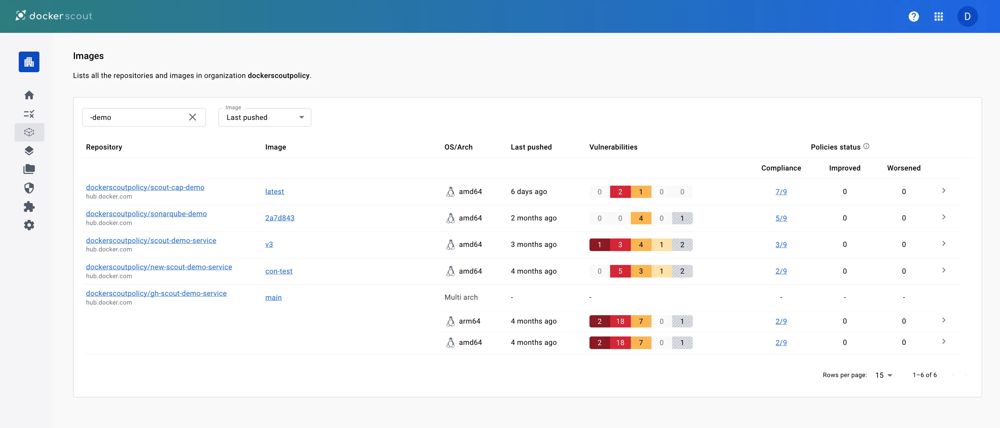

The [Docker Scout Dashboard](https://scout.docker.com/) helps you share the
analysis of images in an organization with your team. Developers can see an
overview of their security status across all their images from Docker Hub, and
get remediation advice at their fingertips. It helps team members in roles such
as security, compliance, and operations to know what vulnerabilities and issues
they need to focus on.

## Overview

The **Overview** tab provides a summary for the repositories in the selected
organization.

At the top of this page, you can select which **Environment** to view.
By default, the most recently pushed images are shown. To learn more about
environments, see [Environment monitoring](/manuals/scout/integrations/environment/_index.md).

The vulnerability chart shows the total number of vulnerabilities for images in
the selected environment over time. You can configure the timescale for the
chart using the drop-down menu.

Use the header menu at the top of the website to access the different main
sections of the Docker Scout Dashboard:

- **Images**: lists all Docker Scout-enabled repositories in the organization, see [Images](#images)
- **Base images**: lists all base images used by repositories in an organization
- **Packages**: lists all packages across repositories in the organization
- **Vulnerabilities**: lists all CVEs in the organization's images, see [Vulnerabilities](#vulnerabilities)
- **Settings**: manage repository settings, see [Settings](#settings)

## Images

The **Images** view shows all images in Scout-enabled repositories for the selected environment.
You can filter the list by selecting a different environment, or by repository name using the text filter.

For each repository, the list displays the following details:

- The repository name (image reference without the tag or digest)
- The most recent tag of the image in the selected environment
- Operating systems and architectures for the most recent tag
- Vulnerabilities status for the most recent tag

Selecting a repository link takes you to a list of all images in that repository that have been analyzed.
From here you can view the full analysis results for a specific image,
and compare tags to view the differences in packages and vulnerabilities

Selecting an image link takes you to a details view for the selected tag or digest.
The **Image layers** tab shows a breakdown of the image analysis results.
You can get a complete view of the vulnerabilities your image contains
and understand how they got in.

## Vulnerabilities

The **Vulnerabilities** view shows a list of all vulnerabilities for images in the organization.
This list includes details about CVE such as the severity and Common Vulnerability Scoring System (CVSS) score,
as well as whether there's a fix version available.
The CVSS score displayed here is the highest score out of all available [sources](/manuals/scout/deep-dive/advisory-db-sources.md).

Selecting the links on this page opens the vulnerability details page,
This page is a publicly visible page, and shows detailed information about a CVE.
You can share the link to a particular CVE description with other people
even if they're not a member of your Docker organization or signed in to Docker Scout.

If you are signed in, the **My images** tab on this page lists all of your images
affected by the CVE.

## Settings

The settings menu in the Docker Scout Dashboard contains:

- [**Repository settings**](#repository-settings) for enabling and disabling repositories.
- [**Notifications**](#notification-settings) for managing your notification preferences.

### Repository settings

When you enable Docker Scout for a repository,
Docker Scout analyzes new tags automatically when you push to that repository.
To enable repositories in Amazon ECR, Azure ACR, or other third-party registries,
you first need to integrate them.
See [Container registry integrations](/manuals/scout/integrations/_index.md#container-registries)

### Notification settings

> [!IMPORTANT]
>
> Docker Scout notifications are deprecated and will be retired on
> July 30, 2026. To surface CVE and policy results without push notifications,
> integrate `docker scout cves` or `docker scout policy` into your CI pipeline.
> See [CI integrations](/manuals/scout/integrations/_index.md#continuous-integration).
> For details, see the
> [Scout platform release notes](/manuals/scout/release-notes/platform.md).

The [Notification settings](https://scout.docker.com/settings/notifications)
page is where you can change the preferences for receiving notifications from
Docker Scout. Notification settings are personal, and changing notification
settings only affects your personal account, not the entire organization.

Docker Scout notifies you when a new vulnerability is disclosed in a security
advisory and it affects one or more of your images. Notifications are only
triggered for the _last pushed_ image tags for each repository.

The available notification settings are:

- **Repository scope**: select whether you want notifications for all
  repositories or only specific ones.
- **Delivery preferences**: choose between in-product notification pop-ups
  and OS-level browser notifications.

You can also configure your notification settings in Docker Desktop by going
to **Settings** > **Notifications**.

From this page, you can also go to the settings for
[Team collaboration integrations](/manuals/scout/integrations/team-collaboration/slack.md).

