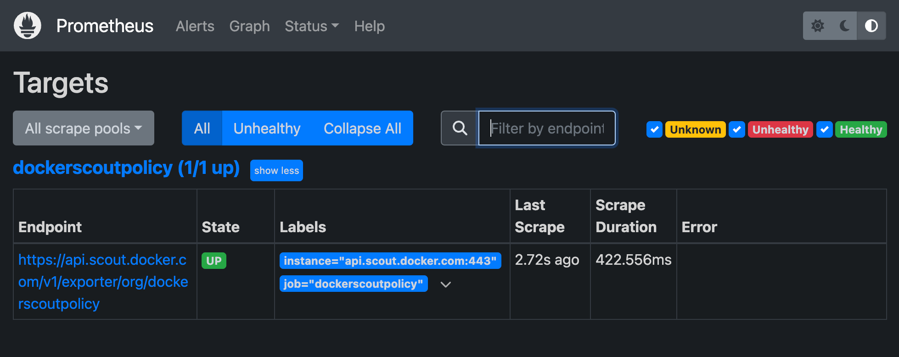
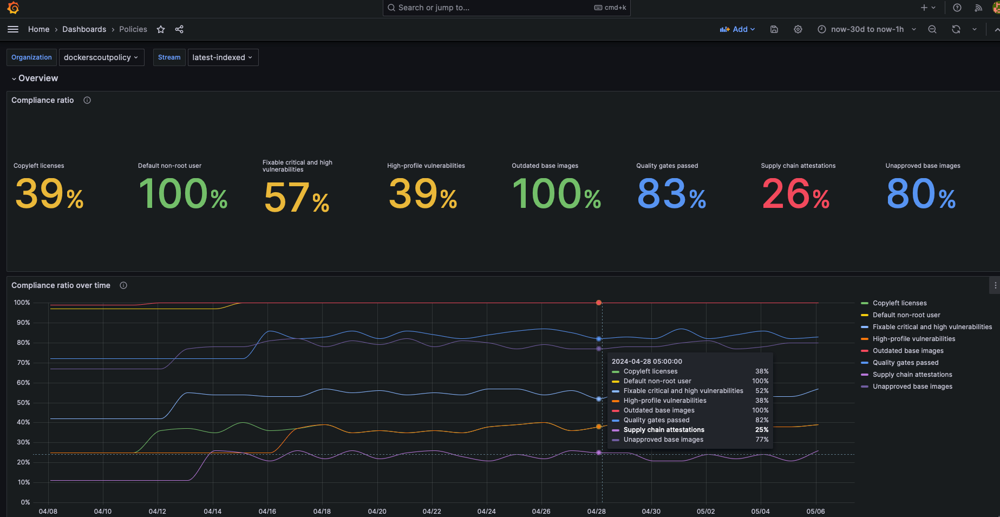

Docker Scout exposes a metrics HTTP endpoint that lets you scrape vulnerability
and policy data from Docker Scout, using Prometheus or Datadog. With this you
can create your own, self-hosted Docker Scout dashboards for visualizing supply
chain metrics.

## Metrics

The metrics endpoint exposes the following metrics:

| Metric                          | Description                                         | Labels                            | Type  |
| ------------------------------- | --------------------------------------------------- | --------------------------------- | ----- |
| `scout_stream_vulnerabilities`  | Vulnerabilities in a stream                         | `streamName`, `severity`          | Gauge |
| `scout_policy_compliant_images` | Compliant images for a policy in a stream           | `id`, `displayName`, `streamName` | Gauge |
| `scout_policy_evaluated_images` | Total images evaluated against a policy in a stream | `id`, `displayName`, `streamName` | Gauge |

> **Streams**
>
> In Docker Scout, the streams concept is a superset of [environments](/manuals/scout/integrations/environment/_index.md).
> Streams include all runtime environments that you've defined,
> as well as the special `latest-indexed` stream.
> The `latest-indexed` stream contains the most recently pushed (and analyzed) tag for each repository.
>
> Streams is mostly an internal concept in Docker Scout,
> with the exception of the data exposed through this metrics endpoint.
{ #stream }

## Creating an access token

To export metrics from your organization, first make sure your organization is enrolled in Docker Scout.
Then, create a Personal Access Token (PAT) - a secret token that allows the exporter to authenticate with the Docker Scout API.

The PAT does not require any specific permissions, but it must be created by a user who is an owner of the Docker organization.
To create a PAT, follow the steps in [Create an access token](/security/for-developers/access-tokens/#create-an-access-token).

Once you have created the PAT, store it in a secure location.
You will need to provide this token to the exporter when scraping metrics.

## Prometheus

This section describes how to scrape the metrics endpoint using Prometheus.

### Add a job for your organization

In the Prometheus configuration file, add a new job for your organization.
The job should include the following configuration;
replace `ORG` with your organization name:

```yaml
scrape_configs:
  - job_name: <ORG>
    metrics_path: /v1/exporter/org/<ORG>/metrics
    scheme: https
    static_configs:
      - targets:
          - api.scout.docker.com
```

The address in the `targets` field is set to the domain name of the Docker Scout API, `api.scout.docker.com`.
Make sure that there's no firewall rule in place preventing the server from communicating with this endpoint.

### Add bearer token authentication

To scrape metrics from the Docker Scout Exporter endpoint using Prometheus, you need to configure Prometheus to use the PAT as a bearer token.
The exporter requires the PAT to be passed in the `Authorization` header of the request.

Update the Prometheus configuration file to include the `authorization` configuration block.
This block defines the PAT as a bearer token stored in a file:

```yaml
scrape_configs:
  - job_name: $ORG
    authorization:
      type: Bearer
      credentials_file: /etc/prometheus/token
```

The content of the file should be the PAT in plain text:

```console
dckr_pat_...
```

If you are running Prometheus in a Docker container or Kubernetes pod, mount the file into the container using a volume or secret.

Finally, restart Prometheus to apply the changes.

### Prometheus sample project

If you don't have a Prometheus server set up, you can run a [sample project](https://github.com/dockersamples/scout-metrics-exporter) using Docker Compose.
The sample includes a Prometheus server that scrapes metrics for a Docker organization enrolled in Docker Scout,
alongside Grafana with a pre-configured dashboard to visualize the vulnerability and policy metrics.

1. Clone the starter template for bootstrapping a set of Compose services
   for scraping and visualizing the Docker Scout metrics endpoint:

   ```console
   $ git clone git@github.com:dockersamples/scout-metrics-exporter.git
   $ cd scout-metrics-exporter/prometheus
   ```

2. [Create a Docker access token](/security/for-developers/access-tokens/#create-an-access-token)
   and store it in a plain text file at `/prometheus/prometheus/token` under the template directory.

   ```plaintext {title=token}
   $ echo $DOCKER_PAT > ./prometheus/token
   ```

3. In the Prometheus configuration file at `/prometheus/prometheus/prometheus.yml`,
   replace `ORG` in the `metrics_path` property on line 6 with the namespace of your Docker organization.

   ```yaml {title="prometheus/prometheus.yml",hl_lines="6",linenos=1}
   global:
     scrape_interval: 60s
     scrape_timeout: 40s
   scrape_configs:
     - job_name: Docker Scout policy
       metrics_path: /v1/exporter/org/<ORG>/metrics
       scheme: https
       static_configs:
         - targets:
             - api.scout.docker.com
       authorization:
         type: Bearer
         credentials_file: /etc/prometheus/token
   ```

4. Start the compose services.

   ```console
   docker compose up -d
   ```

   This command starts two services: the Prometheus server and Grafana.
   Prometheus scrapes metrics from the Docker Scout endpoint,
   and Grafana visualizes the metrics using a pre-configured dashboard.

To stop the demo and clean up any resources created, run:

```console
docker compose down -v
```

### Access to Prometheus

After starting the services, you can access the Prometheus expression browser by visiting <http://localhost:9090>.
The Prometheus server runs in a Docker container and is accessible on port 9090.

After a few seconds, you should see the metrics endpoint as a target in the
Prometheus UI at <http://localhost:9090/targets>.



### Viewing the metrics in Grafana

To view the Grafana dashboards, go to <http://localhost:3000/dashboards>,
and sign in using the credentials defined in the Docker Compose file (username: `admin`, password: `grafana`).




The dashboards are pre-configured to visualize the vulnerability and policy metrics scraped by Prometheus.

## Datadog

This section describes how to scrape the metrics endpoint using Datadog.
Datadog pulls data for monitoring by running a customizable
[agent](https://docs.datadoghq.com/agent/?tab=Linux) that scrapes available
endpoints for any exposed metrics. The OpenMetrics and Prometheus checks are
included in the agent, so you don’t need to install anything else on your
containers or hosts.

This guide assumes you have a Datadog account and a Datadog API Key. Refer to
the [Datadog documentation](https://docs.datadoghq.com/agent) to get started.

### Configure the Datadog agent

To start collecting the metrics, you will need to edit the agent’s
configuration file for the OpenMetrics check. If you're running the agent as a
container, such file must be mounted at
`/etc/datadog-agent/conf.d/openmetrics.d/conf.yaml`.

The following example shows a Datadog configuration that:

- Specifies the OpenMetrics endpoint targeting the `dockerscoutpolicy` Docker organization
- A `namespace` that all collected metrics will be prefixed with
- The [`metrics`](#metrics) you want the agent to scrape (`scout_*`)
- An `auth_token` section for the Datadog agent to authenticate to the Metrics
  endpoint, using a Docker PAT as a Bearer token.

```yaml
instances:
  - openmetrics_endpoint: "https://api.scout.docker.com/v1/exporter/org/dockerscoutpolicy/metrics"
    namespace: "scout-metrics-exporter"
    metrics:
      - scout_*
    auth_token:
      reader:
        type: file
        path: /var/run/secrets/scout-metrics-exporter/token
      writer:
        type: header
        name: Authorization
        value: Bearer <TOKEN>
```

> [!IMPORTANT]
>
> Do not replace the `<TOKEN>` placeholder in the previous configuration
> example. It must stay as it is. Only make sure the Docker PAT is correctly
> mounted into the Datadog agent in the specified filesystem path. Save the
> file as `conf.yaml` and restart the agent.

When creating a Datadog agent configuration of your own, make sure to edit the
`openmetrics_endpoint` property to target your organization, by replacing
`dockerscoutpolicy` with the namespace of your Docker organization.

### Datadog sample project

If you don't have a Datadog server set up, you can run a [sample project](https://github.com/dockersamples/scout-metrics-exporter)
using Docker Compose. The sample includes a Datadog agent, running as a
container, that scrapes metrics for a Docker organization enrolled in Docker
Scout. This sample project assumes that you have a Datadog account, an API key,
and a Datadog site.

1. Clone the starter template for bootstrapping a Datadog Compose service for
   scraping the Docker Scout metrics endpoint:

   ```console
   $ git clone git@github.com:dockersamples/scout-metrics-exporter.git
   $ cd scout-metrics-exporter/datadog
   ```

2. [Create a Docker access token](/security/for-developers/access-tokens/#create-an-access-token)
   and store it in a plain text file at `/datadog/token` under the template directory.

   ```plaintext {title=token}
   $ echo $DOCKER_PAT > ./token
   ```

3. In the `/datadog/compose.yaml` file, update the `DD_API_KEY` and `DD_SITE` environment variables
   with the values for your Datadog deployment.

   ```yaml {hl_lines="5-6"}
     datadog-agent:
       container_name: datadog-agent
       image: gcr.io/datadoghq/agent:7
       environment:
         - DD_API_KEY=${DD_API_KEY} # e.g. 1b6b3a42...
         - DD_SITE=${DD_SITE} # e.g. datadoghq.com
         - DD_DOGSTATSD_NON_LOCAL_TRAFFIC=true
       volumes:
         - /var/run/docker.sock:/var/run/docker.sock:ro
         - ./conf.yaml:/etc/datadog-agent/conf.d/openmetrics.d/conf.yaml:ro
         - ./token:/var/run/secrets/scout-metrics-exporter/token:ro
   ```

   The `volumes` section mounts the Docker socket from the host to the
   container. This is required to obtain an accurate hostname when running as a
   container ([more details here](https://docs.datadoghq.com/agent/troubleshooting/hostname_containers/)).

   It also mounts the agent's config file and the Docker access token.

4. Edit the `/datadog/config.yaml` file by replacing the placeholder `<ORG>` in
   the `openmetrics_endpoint` property with the namespace of the Docker
   organization that you want to collect metrics for.

   ```yaml {hl_lines=2}
   instances:
     - openmetrics_endpoint: "https://api.scout.docker.com/v1/exporter/org/<<ORG>>/metrics"
       namespace: "scout-metrics-exporter"
   # ...
   ```

5. Start the Compose services.

   ```console
   docker compose up -d
   ```

If configured properly, you should see the OpenMetrics check under Running
Checks when you run the agent’s status command whose output should look similar
to:

```text
openmetrics (4.2.0)
-------------------
  Instance ID: openmetrics:scout-prometheus-exporter:6393910f4d92f7c2 [OK]
  Configuration Source: file:/etc/datadog-agent/conf.d/openmetrics.d/conf.yaml
  Total Runs: 1
  Metric Samples: Last Run: 236, Total: 236
  Events: Last Run: 0, Total: 0
  Service Checks: Last Run: 1, Total: 1
  Average Execution Time : 2.537s
  Last Execution Date : 2024-05-08 10:41:07 UTC (1715164867000)
  Last Successful Execution Date : 2024-05-08 10:41:07 UTC (1715164867000)
```

For a comprehensive list of options, take a look at this [example config file](https://github.com/DataDog/integrations-core/blob/master/openmetrics/datadog_checks/openmetrics/data/conf.yaml.example) for the generic OpenMetrics check.

### Visualizing your data

Once the agent is configured to grab Prometheus metrics, you can use them to build comprehensive Datadog graphs, dashboards, and alerts.

Go into your [Metric summary page](https://app.datadoghq.com/metric/summary?filter=scout_prometheus_exporter)
to see the metrics collected from this example. This configuration will collect
all exposed metrics starting with `scout_` under the namespace
`scout_metrics_exporter`.


The following screenshots show examples of a Datadog dashboard containing
graphs about vulnerability and policy compliance for a specific [stream](#stream).


> The reason why the lines in the graphs look flat is due to the own nature of
> vulnerabilities (they don't change too often) and the short time interval
> selected in the date picker.

## Scrape interval

By default, Prometheus and Datadog scrape metrics at a 15 second interval.
Because of the own nature of vulnerability data, the metrics exposed through this API are unlikely to change at a high frequency.
For this reason, the metrics endpoint has a 60-minute cache by default,
which means a scraping interval of 60 minutes or higher is recommended.
If you set the scrape interval to less than 60 minutes, you will see the same data in the metrics for multiple scrapes during that time window.

To change the scrape interval:

- Prometheus: set the `scrape_interval` field in the Prometheus configuration
  file at the global or job level.
- Datadog: set the `min_collection_interval` property in the Datadog agent
  configuration file, see [Datadog documentation](https://docs.datadoghq.com/developers/custom_checks/write_agent_check/#updating-the-collection-interval).

## Revoke an access token

If you suspect that your PAT has been compromised or is no longer needed, you can revoke it at any time.
To revoke a PAT, follow the steps in the [Create and manage access tokens](/security/for-developers/access-tokens/#modify-existing-tokens).

Revoking a PAT immediately invalidates the token, and prevents Prometheus from scraping metrics using that token.
You will need to create a new PAT and update the Prometheus configuration to use the new token.
